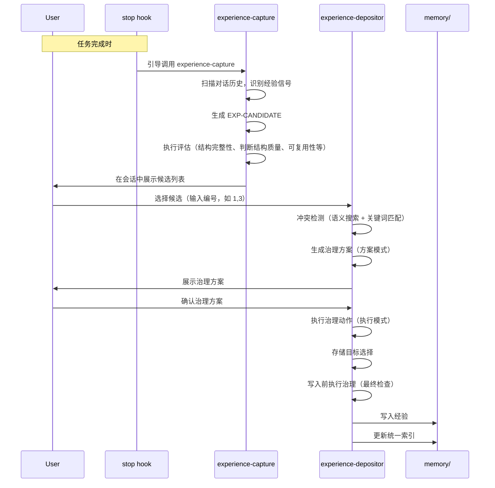

# 知识沉淀机制设计

## 概述

知识沉淀机制是 cursor-workflow 的核心能力，它通过"即时捕获 → 暂存 → 确认沉淀 → 治理"的流程，将工作过程中的判断和决策沉淀为可复用的长期资产。

## 流程概览



## 即时捕获机制

### EXP-CANDIDATE 格式

在工作过程中，当出现以下情况时，Skills 应输出结构化 EXP-CANDIDATE 注释：

- 纠正了实现方向、接口契约、数据结构、边界处理
- 排查找到 root cause，或放弃/替换某实现方案
- 测试失败暴露新坑点或隐含假设
- 重要文件/模块的关键指针或交互契约被确认/修订

**格式**：

```html
<!-- EXP-CANDIDATE
{
  "stage": "work",
  "trigger": "当发现 root cause 并更换方案",
  "decision": "实现/修复/接口/边界的取舍",
  "alternatives": ["原方案A（放弃，因为...）"],
  "signal": "判断依据/风险信号/失败证据",
  "solution": "新的实现/修复方案",
  "verify": "测试/验证步骤与结果期望",
  "pointers": ["path/to/file"],
  "notes": "可选补充"
}
-->
```

### 触发时机

EXP-CANDIDATE 应在以下阶段输出：

- **req**：需求澄清过程中的关键决策
- **plan**：计划制定过程中的取舍
- **work**：实现过程中的纠正和根因发现
- **review**：审查过程中发现的问题和风险

### 自动收集

`experience-capture` Skill 由 stop hook 触发，自动处理：

1. **触发时机**：任务完成时，stop hook 引导调用 `experience-capture` skill
2. **识别经验信号**：扫描整个对话历史，识别经验信号（判断、取舍、边界、约束等）
3. **生成 EXP-CANDIDATE**：基于语义理解生成结构化 EXP-CANDIDATE JSON
4. **执行评估**：执行评估（结构完整性、判断结构质量、可复用性、知识可获得性、经验类型、Level 判断）
5. **过滤明显不通过的候选**：静默过滤结构不完整、判断结构质量不通过、知识可获得性高且不需要规则约束的候选
6. **会话展示**：在会话中展示候选列表，供用户选择

**特点**：
- 任务完成时统一处理，不打断用户流程
- 候选直接在会话中展示，无需文件暂存
- 用户即时选择，体验更流畅
- 评估结果包含在候选对象中

## 成长过滤器

### 核心问题

在决定"写入经验文档（长期）"之前，对每条候选先回答一个问题：

> **如果我一年后在完全不同的项目里再遇到类似局面，这条信息还能帮我提前做出正确判断吗？**

### 判断标准

- **否**：不写入 experience，改为沉淀到 workspace/worklog（项目记录）
- **是**：允许写入 experience（长期判断资产）

### 知识可获得性评估

在成长过滤器之前，先评估知识可获得性：

- **高可获得性**（0.0-0.3）：框架官方约定、标准实践
  - 如果不需要规则约束 → 过滤（模型知识库应包含）
  - 如果需要规则约束 → 是经验（标准类）
- **中可获得性**（0.4-0.6）：社区最佳实践、常见但需要判断的场景
  - 是经验（判断模式）
- **低可获得性**（0.7-1.0）：团队/项目特定决策
  - 是经验（团队/项目决策模式）

### 应用时机

成长过滤器在两个时机应用：

1. **experience-capture**：在评估阶段初步过滤，避免暂存无价值的候选（包括知识可获得性过滤）
2. **experience-depositor**：再次确认，确保只有长期资产进入 experience

### 目的

避免 experience 退化为"事实堆叠/案例百科"，把长期资产留给"可迁移的判断结构"。

## 沉淀分流

`experience-depositor` 的核心不是"只写经验文档"，而是先做**沉淀分流**，将知识与改进点放到最合适的载体。

### 分流目标

| 目标 | 适用场景 | 位置 |
|------|---------|------|
| **经验文档**（默认） | 容易忘、下次会遇到、需要提醒/指针 | `.cursor/.lingxi/memory/experience/` |
| **规则/自动拦截** | 高频且可自动判定 | hook/lint/CI |
| **Skill/流程升级** | 可复用流程或重复步骤 | `.cursor/skills/` |
| **长期上下文补齐** | 考古/服务边界/配置规范 | `.cursor/.lingxi/memory/tech/services/` 或 `.cursor/.lingxi/memory/business/` |

### 分流原则

- **ROI 优先**：默认只选 ROI 最高的一个
- **可多选**：如果候选适合多个目标，可以多选
- **输出要求**：对每条候选给出"落点选择 + 理由 + 预期收益（下次如何变快/变稳）"

## Decision Shape 与 Judgment Capsule

### 为什么需要这两个结构？

**核心思想**：把经验主语从【事】换成【判断】。

经验不应该只是"做过什么/怎么做"的文档，而应该是"如何判断"的结构。

### Decision Shape（判断结构）

每条经验必须包含：

- **Decision being made**：我当时在判断什么
- **Alternatives rejected**：我拒绝了哪些备选方案（至少 1 个）
- **Discriminating signal**：我靠什么可观测信号做出分叉

**示例**：

```markdown
## Decision Shape（判断结构）

- Decision being made: 选择使用哪个状态管理方案
- Alternatives rejected:
  - Redux（过于复杂，项目规模不需要）
  - Context API（性能问题，频繁更新会导致全量重渲染）
- Discriminating signal: 组件更新频率、状态共享范围、团队熟悉度
```

### Judgment Capsule（认知蒸馏）

每条经验必须包含：

- **I used to think**：我之前的认知
- **Now I believe**：我现在的认知
- **Because the decisive variable is**：决定性变量是什么

**示例**：

```markdown
## Judgment Capsule（认知蒸馏）

- I used to think: 所有异步操作都应该用 async/await
- Now I believe: 并发场景下 Promise.all 更合适
- Because the decisive variable is: 操作的依赖关系和性能要求
```

### 目的

确保经验一定能上升为"判断结构"，而不是仅成为"做过什么/怎么做"的文档。

## 经验模板

### 标准模板（standard）

适用于团队级标准（强约束、执行底线）：

- **触发条件（When to load）**：在什么场景下需要加载此标准
- **标准内容**：执行底线、预设通行方案
- **判断结构（Decision Shape）**：必须
- **认知蒸馏（Judgment Capsule）**：必须
- **校验方式（How to verify）**：如何验证此标准的有效性
- **关联指针（Pointers）**：相关文件路径、函数名、配置项等

### 经验模板（knowledge）

适用于团队级经验和项目级经验（复杂判断、认知触发）：

- **触发条件（When to load）**：在什么场景下需要加载此经验
- **表层信号（Surface signal）**：我闻到了熟悉的风险味道
- **隐含风险（Hidden risk）**：真正会出问题的点
- **问题现象（Symptom）**：用户看到/遇到的具体表现
- **根因（Root cause）**：为什么会出现这个问题
- **解决方案（Fix）**：如何解决/规避
- **判断结构（Decision Shape）**：必须
- **认知蒸馏（Judgment Capsule）**：必须
- **校验方式（How to verify）**：如何验证问题已被解决/规避，必须可复现
- **关联指针（Pointers）**：相关文件路径、函数名、配置项等

### 可选字段

- **替代关系（Replaced by / Replaces）**：如有冲突则必须

## 冲突检测

在沉淀新经验前，必须执行冲突检测：

1. **读取统一索引**：读取 `memory/INDEX.md`，根据候选的 Level 和 Type 匹配对应的记忆条目
2. **冲突检测**：检查新经验是否与现有经验冲突（触发条件相同/相似且解决方案矛盾）
3. **自动剔除矛盾旧经验**：如果检测到冲突，删除旧经验文件，并从新经验的 `Replaces` 字段中移除已删除记忆的 Tag（如果存在）
4. **经验合并/去重**：如果检测到重复或高度相似的经验（而非冲突），提供合并选项

## 确认沉淀流程

### 用户操作

1. **查看候选**：stop hook 在对话结束时提醒有待沉淀候选
2. **选择沉淀**：
   - `/remember 1,3`：沉淀第 1 和第 3 条
   - `/remember 全部`：沉淀全部
   - `/remember 忽略沉淀（如不需要沉淀）`：忽略并清空候选

### experience-depositor 处理

1. **获取候选**：从会话上下文获取候选（由 experience-capture 传递，包含评估结果）
2. **冲突检测（语义搜索 + 关键词匹配）**：读取统一索引 `memory/INDEX.md`，使用语义搜索和关键词匹配双重验证，检查与现有经验的冲突
3. **生成治理方案（方案模式）**：使用语义搜索查找相似经验，结合关键词匹配进行综合判断，生成治理方案，供用户确认
4. **展示治理方案**：向用户展示治理方案，请求确认
5. **执行治理动作（执行模式）**：备份索引、执行合并/替代、更新统一索引、清理备份
6. **存储目标选择**：用户选择存储目标（团队级标准/经验或项目级经验）
7. **写入前执行治理（最终检查）**：再次执行治理动作，确保知识库质量
8. **写入**：按模板写入对应目录，更新统一索引 `memory/INDEX.md`：
   - 团队级标准：`memory/experience/team/standards/<tag>-<title>.md`，更新 `memory/INDEX.md`
   - 团队级经验：`memory/experience/team/knowledge/<tag>-<title>.md`，更新 `memory/INDEX.md`
   - 项目级经验：`memory/experience/project/<tag>-<title>.md`，更新 `memory/INDEX.md`

## 与 /remember 的区别

- **`/remember`**：即时沉淀**单条经验**，不需要 REQ-xxx，最低摩擦

两者互补，不冲突。

## 总结

知识沉淀机制通过以下设计保证了知识的质量和可复用性：

- **即时捕获**：不依赖人的记忆，自动识别可沉淀点
- **成长过滤器**：确保只有长期资产进入知识库
- **沉淀分流**：将知识放到最合适的载体
- **判断结构**：确保经验是"如何判断"而非"怎么做"
- **冲突检测**：避免矛盾经验污染知识库
- **确认机制**：人工确认保证质量

参考：
- [experience-capture 实现](../../skills/experience-capture/SKILL.md)
- [experience-depositor 实现](../03-implementation/subagents/experience-depositor.md)
- [经验治理机制设计](./experience-governance.md)
