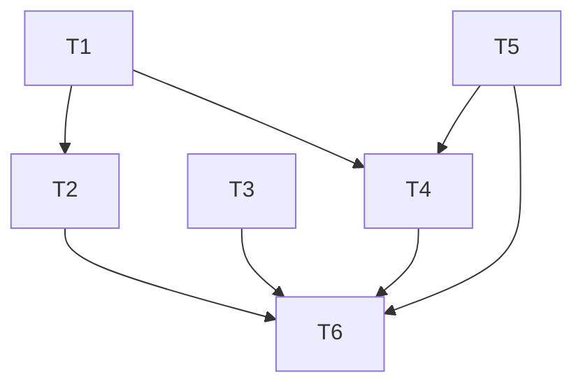

# 001.plan.灵犀审计系统

| 属性     | 值                      |
| -------- | ----------------------- |
| 关联需求 | 001.req.灵犀审计系统.md |
| 创建日期 | 2025-02-04              |

---

## 1. 目标回放

- **背景**：灵犀需隐形、少打扰，同时能事后追溯「谁在何时做了什么」；主 Agent 行为与记忆库演变需会话级关联。
- **核心目标**：主审计（8 类 Hook 事件）与记忆库审计（note/INDEX 写入后事件）写入统一 NDJSON 日志；会话级关联（conversation_id）；审计不调用大模型、不增加用户操作；INDEX/note 扩展 CreatedAt、UpdatedAt、Source、Session。
- **成功标准**：各 Hook 触发后 audit 有对应行；记忆写入后 audit 有 memory\_\* 行；主/记忆行均含 conversation_id；sessionStart 约定含「调用 lingxi-memory 时传入 conversation_id」；INDEX 与 note Meta 含新字段；脚本异常时主流程放行。

---

## 2. 任务清单

| 序号 | 任务描述                                                                                                                                                                      | 依赖任务 | 预估耗时 | 状态   |
| ---- | ----------------------------------------------------------------------------------------------------------------------------------------------------------------------------- | -------- | -------- | ------ |
| T1   | 实现主审计脚本 lingxi-audit.mjs：读 stdin、按 Hook 事件生成 NDJSON、appendFileSync 到 `.cursor/.lingxi/workspace/audit.log`，异常时返回放行 JSON；确保 workspace 目录存在     | -        | 45min    | 待开始 |
| T2   | hooks.json 注册 8 个事件（beforeSubmitPrompt、afterAgentResponse、postToolUse、postToolUseFailure、subagentStart、subagentStop、sessionEnd、stop）指向 lingxi-audit.mjs       | T1       | 15min    | 待开始 |
| T3   | session-init.mjs 的 ADDITIONAL_CONTEXT 增加「当前会话 ID；调用 lingxi-memory 时请在 input 中传入 conversation_id（及可选 generation_id）」；session_id 来自 sessionStart 入参 | -        | 20min    | 待开始 |
| T4   | 记忆审计：lingxi-memory.md 约定从 input 解析 conversation_id、generation_id；约定写 note/INDEX 后追加记忆审计行；实现写入后追加逻辑（脚本或子代理直接追加，见下）             | T1       | 1h       | 待开始 |
| T5   | INDEX 与 note Meta 扩展：CreatedAt、UpdatedAt、Source、Session；更新 memory/INDEX.md 表头、memory-note-template、memory-system；写入/更新 note 时更新上述字段                 | -        | 40min    | 待开始 |
| T6   | 验收测试：按 req §7 验收检查清单执行（8 类 Hook 写入、记忆审计行、sessionStart 约定、INDEX/note 新字段、conversation_id 过滤、异常放行）                                      | T1–T5    | 30min    | 待开始 |

**状态说明**：待开始 / 进行中 / 已完成 / 已跳过

---

## 3. 依赖关系图

---

## 4. 执行顺序

1. **T1**：实现主审计脚本（F1、F3、F8）。复用 `_hook-utils.mjs` 的 readStdinJson；按 req §8.2 主审计字段约定生成 payload；使用 `fs.appendFileSync` 追加一行 NDJSON；若 `.cursor/.lingxi/workspace` 不存在则先 `mkdirSync(..., { recursive: true })`；try/catch 内 catch 时 writeStdoutJson 放行（continue: true / decision: "allow"）。
2. **T2**：在 hooks.json 的 hooks 下增加上述 8 个 key，每个 command 指向 `node .cursor/hooks/lingxi-audit.mjs`（或与 sessionStart 同风格）。
3. **T3**：修改 session-init.mjs，在 ADDITIONAL_CONTEXT 中追加会话 ID 与 lingxi-memory 传入约定；从 readStdinJson() 得到的 sessionStart 入参中取会话标识（以 Cursor 文档为准，若无则用占位说明「会话 ID 由运行时提供」）。
4. **T5**：更新 memory/INDEX.md 表头（增加 CreatedAt、UpdatedAt、Source、Session）；更新 memory-note-template.md 与 memory-system 中 Meta/索引字段说明；不在本任务内改子代理写入逻辑，仅文档与表结构。
5. **T4**：在 lingxi-memory.md 中约定 input 解析 conversation_id、generation_id；约定「每次写 note 或更新 INDEX 后，向同一 audit 文件追加一条记忆审计 NDJSON」；实现方式二选一：**A)** 子代理写入后调用项目内脚本（如 `.cursor/hooks/append-memory-audit.mjs`）传入 event、note_id、operation、source、file 等，脚本仅 append 一行；**B)** 子代理写入后通过工具追加一行到 audit。推荐 A，便于格式与原子性统一。req §8.2 记忆审计字段约定为准。
6. **T6**：按验收清单逐项验证（主审计 8 类、记忆审计行、约定内容、INDEX/note 字段、conversation_id 过滤、异常放行）。

---

## 5. 技术调研结果

- **Cursor Hooks**：以官方文档 https://cursor.com/docs/agent/hooks 为准；sessionStart 入参是否包含 session_id/conversation_id 需在实现时确认，若无则约定中写「由主 Agent 从上下文获取会话 ID 并传入 lingxi-memory」。
- **Node appendFileSync**：单行追加在常见平台上可视为原子；NDJSON 每行独立，无需锁。
- **现有代码**：`_hook-utils.mjs` 提供 readStdinJson、writeStdoutJson，为异步；lingxi-audit.mjs 可用 async main + 同步 append（node:fs 的 appendFileSync）。

---

## 6. 文档同步清单

| 文档路径                                                    | 变更类型 | 变更说明                                                                                    |
| ----------------------------------------------------------- | -------- | ------------------------------------------------------------------------------------------- |
| `.cursor/.lingxi/memory/INDEX.md`                           | 更新     | 表头增加 CreatedAt、UpdatedAt、Source、Session（或等价列名）                                |
| `.cursor/.lingxi/memory/references/memory-note-template.md` | 更新     | Meta 增加 CreatedAt、UpdatedAt、Source、Session（或 CreatedInSession/UpdatedInSession）说明 |
| `.cursor/skills/about-lingxi/references/memory-system.md`   | 更新     | 索引与 note 结构增加新字段说明                                                              |
| `.cursor/hooks/session-init.mjs`                            | 修改     | ADDITIONAL_CONTEXT 增加会话 ID 与 lingxi-memory 传入约定                                    |
| `.cursor/agents/lingxi-memory.md`                           | 更新     | 输入约定增加 conversation_id、generation_id；写入流程增加「写入后追加记忆审计行」           |

---

## 7. 测试策略

- **集成/手工**：主审计 8 类 Hook 触发后检查 audit 文件；记忆审计在 /remember 或 auto 写入后检查 memory\_\* 行；sessionStart 约定内容；INDEX/note 新字段；按 conversation_id 过滤；脚本异常时主流程放行。详见 `001.testcase.灵犀审计系统.md`。
- **单元测试**（可选）：若将 payload 生成抽成纯函数，可单测「Hook 名 → event 与字段」映射；当前以集成验证为主。
