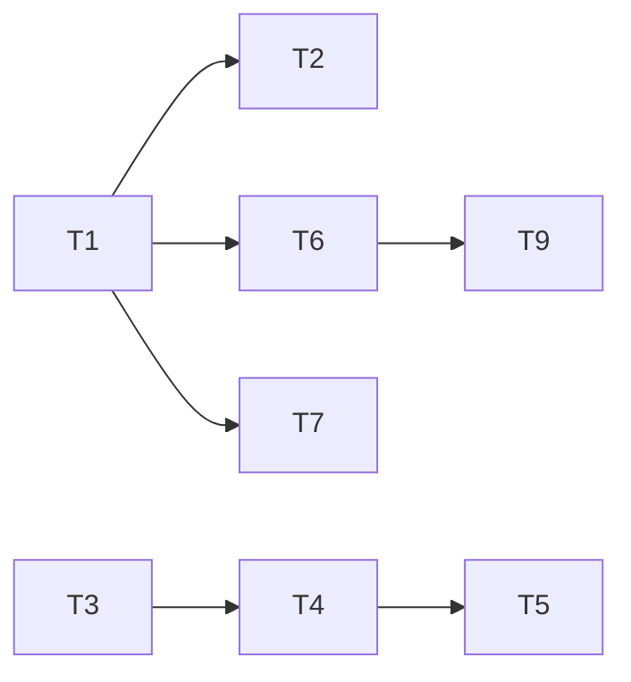

# 003.plan.灵犀插件化改造

| 属性     | 值                            |
| -------- | ----------------------------- |
| 关联需求 | 003.task.灵犀插件化改造.md      |
| 创建日期 | 2026-02-21                    |

---

## 1. 目标回放

- **背景**：Cursor 官方插件可打包 commands/skills/agents/hooks；灵犀当前用 install 脚本拷贝骨架，与官方能力重叠且维护成本高。
- **目标**：灵犀以 Cursor 插件安装；项目内 `.cursor/.lingxi/` 由 `/init` 或首次使用时创建；下线安装脚本；提供 plugin.json 示例、Logo prompt、提交前检查清单；README 与 about-lingxi 改为「插件安装」叙事。
- **非目标**：不包含 marketplace.json、市场审核对接、MCP 打包、对现有 Skills/Commands 业务逻辑重构。
- **成功标准**：S1–S5（清单存在、命令可用、/init 创建骨架、README 无 curl/irm、附录含外部资料）。

---

## 2. 任务清单

| 序号 | 任务描述 | 依赖任务 | 预估耗时 | 状态   |
| ---- | -------- | -------- | -------- | ------ |
| T1   | 新增 `.cursor-plugin/plugin.json`（name、commands、skills、agents、hooks 路径；参考 req 附录 7.1） | -        | 20min    | 已完成 |
| T2   | Hook 路径：确认 Cursor 插件下 hook 的 command 工作目录，必要时适配或文档说明（F2） | T1       | 30min    | 已完成 |
| T3   | 将 workflow 骨架 SSoT 迁至 .cursor（workflow-skeleton.json + 模板/INDEX 默认内容） | -        | 25min    | 已完成 |
| T4   | init-executor 增加 Step 0：若 `.cursor/.lingxi/` 或关键子目录不存在则创建；更新 SKILL.md | T3       | 45min    | 已完成 |
| T5   | 删除自研安装程序（bash.sh、powershell.ps1、install-manifest.json、test-install.sh）；install/README.md 改为废弃说明 | T4       | 15min    | 已完成 |
| T6   | README：安装改为「从 Cursor 插件市场安装」；快速开始补充「首次建议运行 /init 初始化项目」（F5） | T1       | 20min    | 已完成 |
| T7   | 可选：提供 assets/logo.svg 与 plugin.json 的 logo 字段（F6） | T1       | 20min    | 已完成 |
| T8   | 为所有 Skills、Commands、Agents 补全 frontmatter（F7） | -        | 40min    | 已完成 |
| T9   | about-lingxi 与架构文档：architecture.md、core-values.md、README 中「安装」「开箱即用」改为插件安装（F8） | T6       | 25min    | 已完成 |

**状态说明**：待开始 / 进行中 / 已完成 / 已跳过

---

## 3. 依赖关系图

---

## 4. 执行顺序

1. T1：新增 .cursor-plugin/plugin.json
2. T2：Hook 路径文档（plugin-hooks.md）
3. T3：workflow-skeleton.json + memory-note-template.default.md + INDEX.default.md
4. T4：init-executor SKILL 增加 Step 0
5. T5：删除 install 脚本，install/README 废弃说明
6. T6：README 安装与快速开始
7. T7：assets/logo.svg + plugin.json logo
8. T8：commands/skills/agents frontmatter
9. T9：architecture、core-values 插件叙事

---

## 5. 技术调研与风险

- **F2 Hook 路径**：Cursor 执行 plugin hooks 时的 cwd 以官方文档为准；已增加 `.cursor/skills/about-lingxi/references/plugin-hooks.md` 说明。
- **SSoT 位置**：workflow 目录与模板列表已迁至 `.cursor/skills/init-executor/references/`。

---

## 6. 文档同步清单

| 文档路径 | 变更类型 | 变更说明 |
| -------- | -------- | -------- |
| README.md | 更新 | 安装改为插件市场；快速开始补充 /init |
| .cursor/skills/about-lingxi/references/architecture.md | 更新 | 「安装」「开箱即用」改为插件叙事 |
| .cursor/skills/about-lingxi/references/core-values.md | 更新 | 同上（若有安装相关表述） |
| .cursor/skills/init-executor/SKILL.md | 更新 | 新增 Step 0 与 workflow 骨架 SSoT 引用 |
| install/README.md | 更新 | 废弃说明 |

---

## 7. 测试策略

- 单元测试：本需求以配置与文档为主，不强制新增单元测试。
- 集成/手工验证：见 003.testcase.灵犀插件化改造.md（安装插件、/init 创建骨架、命令可用、README 与文档表述）。
