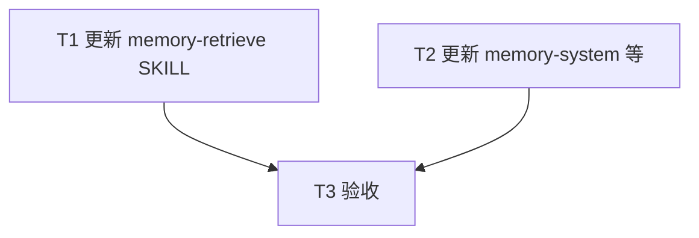

# 004.plan.记忆库混合检索改进

| 属性     | 值                              |
| -------- | ------------------------------- |
| 关联需求 | 004.task.记忆库混合检索改进.md   |
| 创建日期 | 2026-02-23                      |

---

## 1. 目标回放

- **背景**：灵犀记忆库当前仅用 Cursor 语义搜索检索 `memory/notes/`，开发场景下技术名词、错误码等需精确命中的内容易漏或排序靠后，影响用户对工作流信任。参考 OpenClaw 混合检索与召回优先策略，在不引入自建索引、不分块、无大文档的前提下改进检索。
- **核心目标**：在 memory-retrieve 中增加关键词路径（与语义并行）、并集加权合并（召回优先）、语义失败时降级为仅关键词路径且仍无匹配则静默、候选放大再裁剪（每路多取、合并后取 top 0–3）；同步更新记忆系统文档中的检索机制描述。
- **成功标准**：SKILL 与 memory-system 文档中检索策略与降级约定明确可读；Agent 能按新策略执行；含技术词/错误码的笔记在以该词触发的检索中能被命中并参与注入。
- **非目标**：自建索引、分块、QMD、可配置权重首版、每日日志层。

---

## 2. 任务清单

| 序号 | 任务描述 | 依赖任务 | 预估耗时 | 状态   |
| ---- | -------- | -------- | -------- | ------ |
| T1   | 更新 memory-retrieve SKILL：检索策略增加关键词路径、并集加权合并、候选放大再裁剪、失败降级 | -        | 40min    | 待开始 |
| T2   | 更新 memory-system.md（及必要时 architecture.md）中检索/提取/注入描述，与新策略一致 | -        | 20min    | 待开始 |
| T3   | 验收：文档检查 + 至少 1 次技术词命中手工验证 | T1, T2   | 20min    | 待开始 |

**状态说明**：待开始 / 进行中 / 已完成 / 已跳过

---

## 3. 依赖关系图

---

## 4. 执行顺序

1. **T1**：更新 `.cursor/skills/memory-retrieve/SKILL.md`  
   - 在「本 Skill 会用到的能力」中增加：对 `memory/notes/`（及必要时 INDEX）的 **Grep/关键词搜索**（与语义搜索并列）。  
   - 重写「检索策略」小节：  
     - 双路径：语义路径（对 notes/ 语义搜索，取 Top N，如 8–10）+ 关键词路径（对 notes/ 用 Cursor Grep 或 Search 能力，以用户消息中的技术词/错误码/配置项等为查询，取 Top N）。  
     - 并集合并：两路结果按并集去重；对每条候选赋予综合分（0.7×语义分 + 0.3×关键词分；关键词排名可映射为 1/(1+rank) 到 0–1）；按综合分排序后取 **top 0–3** 做最小注入；召回优先，不做交集。  
     - 候选数：语义路径取 Top 8–10，关键词路径取 Top 8–10，合并后再取 top 0–3。  
   - 更新「失败降级」：优先语义；若语义不可用或失败，则**仅执行关键词路径**；若仍无匹配则静默，不输出「检索失败」。  
   - 在文档中注明：关键词路径依赖 Cursor Agent 的 **Grep** 或 **Search files and folders / 工作区内容搜索** 等能做文本匹配的能力；若仅有路径/文件名搜索，可约定用 INDEX 或 notes 内容做文本匹配作为退路。

2. **T2**：更新 about-lingxi 文档  
   - 修改 `.cursor/skills/about-lingxi/references/memory-system.md` 中「提取/注入」或检索相关段落：说明 memory-retrieve 采用**语义 + 关键词双路径**、**并集加权合并**、**召回优先**及**降级策略**（语义不可用 → 仅关键词；仍无匹配 → 静默）。  
   - 若 `architecture.md` 中有对记忆检索的一句描述，同步改为「双路径、并集加权、降级」。

3. **T3**：验收  
   - 按 004.testcase 执行文档检查与手工验证。

---

## 5. 技术调研结果

- **Cursor Agent 能力**：灵犀 `cursor-agent-tools.md` 已写明 Semantic search 与「与 grep 配合使用」；关键词路径以 Cursor 提供的 **Grep** 或 **Search files and folders**（及工作区内容搜索）为准，build 时若发现仅支持路径/文件名，则在 SKILL 中约定退化为对 INDEX/notes 内容做文本匹配。
- **分数归一化**：关键词侧采用 1/(1+rank) 将排名映射到 (0,1]，与 OpenClaw 对 BM25 rank 的处理一致，便于与语义侧 0.7/0.3 加权合并。

---

## 6. 文档同步清单

| 文档路径 | 变更类型 | 变更说明 |
| -------- | -------- | -------- |
| `.cursor/skills/memory-retrieve/SKILL.md` | 更新 | 检索策略：双路径、并集加权、候选放大再裁剪；失败降级：语义失败→仅关键词→静默 |
| `.cursor/skills/about-lingxi/references/memory-system.md` | 更新 | 提取/注入或检索小节：memory-retrieve 采用语义+关键词双路径、并集加权、召回优先、降级策略 |
| `.cursor/skills/about-lingxi/references/architecture.md` | 按需更新 | 若存在对记忆检索的一句描述，改为双路径与降级 |

---

## 7. 测试策略

- **文档检查**：通过 grep 或人工阅读确认 SKILL 中含「关键词」「并集」「加权」「0.7」「0.3」「降级」「top 0–3」「8–10」等关键表述；memory-system 中含「双路径」「并集」「降级」。
- **手工验证**：在 `memory/notes/` 中放置一条含特定技术词或错误码的笔记，用含该词的用户消息触发 memory-retrieve，观察该记忆是否被命中并出现在注入或优先候选中。
- 详见：004.testcase.记忆库混合检索改进.md
