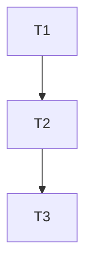

# /plan - 任务规划

## 命令用途

基于 req 文档中的需求做进一步的任务规划，通过澄清细节问题，规划具体的执行步骤等，辅助提高任务执行质量。

**定位**：该步骤可跳过，仅复杂任务建议在 build 之前执行规划。取决于使用者对任务复杂度以及 agent 的执行能力的判断。

## 前置要求

- **Cursor Nightly**：本工作流依赖 Agent Skills（仅 Nightly 渠道可用）
- req 文档已存在：`.workflow/requirements/<taskId>.req.*.md`

## 使用方式

```
/plan <taskId>
```

**示例**：

```
/plan 001
```

命令会自动查找 `.workflow/requirements/001.req.*.md` 文件。

## 依赖的 Agent Skills

- `experience-index`：自动匹配历史经验提醒
- `service-loader`：如适用，生成服务上下文
- `context-engineering`：上下文工程指导

## 产物（必须写入）

- `.workflow/requirements/001.plan.<标题>.md`（任务规划文档）
- `.workflow/requirements/001.testcase.<标题>.md`（测试用例文档）

**输出规则（静默成功原则）**：

- 文件写入成功：静默，不输出确认信息（如"已写入 001.plan.xxx.md"）
- 文件写入失败：输出错误信息

## 执行流程

### 1. 读取输入

- 扫描 `.workflow/requirements/` 目录
- 查找 `<taskId>.req.*.md` 文件（如 `001.req.*.md`）
- 如果找不到文件，提示用户并提供解决方案
- 识别需求类型（前端/后端/全栈）和复杂度

### 2. 从 req 提取内容

使用 `PLAN-EXTRACT:*` 标记从 req 文件中提取内容：

- **目标回放**：提取 `<!-- PLAN-EXTRACT:GOAL-START -->` 到 `<!-- PLAN-EXTRACT:GOAL-END -->` 之间的内容
- **任务清单**：提取 `<!-- PLAN-EXTRACT:TASKS-START -->` 到 `<!-- PLAN-EXTRACT:TASKS-END -->` 之间的表格（功能需求表格）
- **验收检查清单**：提取 `<!-- PLAN-EXTRACT:VALIDATION-START -->` 到 `<!-- PLAN-EXTRACT:VALIDATION-END -->` 之间的内容

**提取规则**（文件操作，不使用 LLM）：

| req 标记                  | plan 用途    | 提取方式                                   |
| ------------------------- | ------------ | ------------------------------------------ |
| `PLAN-EXTRACT:GOAL`       | 目标回放     | 直接复制标记间的内容                       |
| `PLAN-EXTRACT:TASKS`      | 任务拆解基础 | 复制表格，作为任务拆解的基础               |
| `PLAN-EXTRACT:VALIDATION` | 测试用例基础 | 复制清单，作为测试用例的基础               |
| 功能需求表格"实现方案"列  | 文件变更清单 | 正则提取文件路径                           |

**向后兼容处理**：

- 如果 req 文件中没有 `PLAN-EXTRACT:*` 标记（旧格式），回退到当前的 LLM 生成方式（向后兼容）
- 如果功能需求表格缺少"实现方案"列，文件变更清单显示为空并标记"待补充"

### 3. 代码库分析（复杂需求必选）

在任务拆解前，分析代码库获取相关上下文：

**触发条件**（满足任一）：

- 需求涉及存量系统/多服务协作
- 需要修改多个模块
- 涉及与现有代码的集成

**分析内容**：

- 使用 `service-loader` 补齐服务上下文
- 使用 SemanticSearch/Grep 定位相关代码
- 识别需要修改的现有文件和模块
- 分析依赖关系和影响范围

**输出要求**：

- 将分析结果融入"文件变更清单"
- 在任务描述中引用具体文件路径
- 复杂需求必须执行此步骤，简单需求可静默跳过

### 4. 补齐服务上下文（推荐，复杂需求必选）

如果需求涉及存量系统/多服务协作，参考 `service-loader` 补齐服务上下文：

- 生成/更新 `.workflow/context/tech/services/<service>.md`
- 只写"概要 + 指针 + 常见坑"，避免长文档膨胀

### 5. 澄清性问题（复杂需求必选）

在开始任务拆解前，分析 req 是否存在以下不清晰点：

| 检查维度 | 检查内容              | 示例问题                                   |
| -------- | --------------------- | ------------------------------------------ |
| 边界不清 | 功能边界、影响范围    | "这个功能是否需要支持移动端？"             |
| 方案未定 | 存在多个可行方案      | "用 A 方案还是 B 方案？各有什么优劣？"     |
| 依赖不明 | 与其他模块/系统的依赖 | "这个功能需要调用哪些现有服务？"           |
| 约束缺失 | 性能/安全/兼容性约束  | "对响应时间有要求吗？需要支持哪些浏览器？" |
| 验收模糊 | 成功标准不明确        | "什么样的结果算成功？"                     |

**输出格式**：

如有澄清性问题，先输出问题列表，等待用户回答后再继续任务拆解。

**静默跳过**：如果 req 已经足够清晰（简单需求），则静默跳过此步骤。

### 6. 外部知识放大（推荐）

在生成任务拆解前，针对具体技术实现进行深入调研：

**触发条件**（满足任一即触发）：

- 任务涉及第三方库/API 的使用
- 需要选择多个技术方案中的一个
- 实现细节存在不确定性

**调研工具分工**：

| 场景            | 工具         | 调研内容                                    |
| --------------- | ------------ | ------------------------------------------- |
| 方案选型/对比   | WebSearch    | "X vs Y 2024/2025"、"best practice for X"   |
| 具体库用法      | MCP context7 | 获取库的最新文档、API 说明、代码示例        |
| 常见报错/兼容性 | WebSearch    | "X common issues"、"X with Y compatibility" |

**输出要求**：

- 调研结果不单独写入
- 将最佳实践融入"任务清单"的具体步骤描述
- 将已知坑点融入"复利候选"或直接规避

**注意**：req 阶段做广度调研，plan 阶段做深度调研。

### 7. 规范引用

生成任务时，检查项目是否有相关规范（如 `.cursor/rules/`），在任务描述中明确引用。

### 8. 任务拆解

#### 8.1 任务分类

根据需求类型组织任务（测试任务必选）：

| 需求类型 | 任务分类                                   |
| -------- | ------------------------------------------ |
| 纯前端   | 组件任务、状态任务、样式任务、**测试任务** |
| 纯后端   | API 任务、服务任务、数据任务、**测试任务** |
| 全栈     | 后端任务、前端任务、集成任务、**测试任务** |

#### 8.2 任务依赖

- 标注任务间的依赖关系（如 `依赖: T1, T2`）
- 确定执行顺序：优先实现被依赖项

#### 8.3 文件变更清单

每个任务明确列出需要创建/修改的文件：

```markdown
- [ ] T1: 实现用户服务
  - 创建: `src/services/user.ts`
  - 修改: `src/services/index.ts`
```

### 9. 测试设计（强化）

#### 9.1 行为提取

从需求中提取可测试行为：

- 只提取适合单元测试的行为（纯逻辑、服务层、工具函数）
- 过滤掉 UI 交互、API 集成、视觉效果等（留给集成测试/手工验证）
- 不发明或推断未明确说明的行为

#### 9.2 测试规格

对每个可测试行为，定义结构化规格：

| 行为         | 输入                    | 预期输出 | 边界/错误条件      |
| ------------ | ----------------------- | -------- | ------------------ |
| B1: 计算折扣 | price=100, discount=0.1 | 90       | discount<0 抛错    |
| B2: 验证邮箱 | "test@example.com"      | true     | 空字符串返回 false |

#### 9.3 测试类型选择

| 验证类型 | 适用场景                    | 内容要求                         |
| -------- | --------------------------- | -------------------------------- |
| 单元测试 | 纯函数、服务逻辑、工具函数  | 测试文件路径、输入/输出/边界条件 |
| 集成测试 | API、多模块协作、数据库操作 | 测试场景、预期结果、Mock 范围    |
| 手工验证 | UI 交互、视觉效果、用户体验 | 操作步骤、预期行为               |

### 10. 测试框架检测与安装

**多层检测策略**：

1. 检查 `package.json` 的 `devDependencies`（jest, vitest, mocha, jasmine 等）
2. 检查项目根目录的测试配置文件（`jest.config.js`, `vitest.config.ts`, `mocha.opts` 等）
3. 检查测试目录结构（`tests/`, `__tests__/`, `test/`, `spec/` 等）
4. 检查测试文件模式（`*.test.js`, `*.spec.ts`, `*.test.tsx` 等）

**检测结果处理**：

- 如果检测到现有框架：记录框架类型和配置，在 plan 中说明将使用该框架
- 如果未检测到框架：
  - 检查依赖冲突：检查 `package.json` 是否有冲突依赖
  - 安装 vitest：`yarn add -D vitest` 或 `npm install -D vitest`
  - 创建配置文件：`vitest.config.ts`（按最佳实践）
  - 创建测试目录：`tests/unit/`, `tests/integration/`
  - 更新 `package.json` 的 `scripts.test`
  - 验证安装：执行 `yarn test` 或 `npm test` 验证框架是否正常工作

**冲突处理**：

- 如果检测到依赖冲突：提示用户，不自动安装，在 plan 中标记需要手动处理

### 11. 经验候选捕获（即时捕获）

在任务拆解/测试设计过程中，如发生以下情况，立即输出经验候选（HTML 注释包裹，不干扰对话）：

| 触发场景     | 描述                               | 典型信号                           |
| ------------ | ---------------------------------- | ---------------------------------- |
| **任务调整** | 用户调整任务拆解（合并/拆分/重排） | "这两个合成一个"、"这个要拆开"     |
| **依赖变更** | 用户调整任务依赖关系               | "不需要先做 A"、"B 要等 C 完成"    |
| **技术选型** | 用户选择/拒绝某个技术方案          | "用 React"、"不用 Redux"           |
| **测试策略** | 用户调整测试方式（单测/集成/手工） | "这个手工验就行"、"必须有单测"     |
| **任务增删** | 用户新增/删除任务项                | "还需要加一个..."、"这个不用做"    |
| **行为调整** | 用户调整可测试行为定义             | "这个行为不对"、"还要测这种情况"   |
| **风险识别** | 识别到 req 中未显式写出的风险      | "这里可能有坑"、"要注意 X"         |
| **约束明确** | 用户明确技术约束或依赖选择         | "必须用这个版本"、"不能引入新依赖" |
| **交付调整** | 用户调整交付物清单                 | "不用改文档"、"要加个配置文件"     |
| **验证变更** | 用户调整验证方式或标准             | "用这种方式验证"、"这个指标要达到" |

**输出格式**：

```html
<!-- EXP-CANDIDATE
{
  "taskId": "001",
  "stage": "plan",
  "trigger": "当任务 T2 依赖从A改为B",
  "decision": "任务/验收/测试策略的取舍",
  "alternatives": ["原方案A（放弃，因为...）"],
  "signal": "判断依据/风险信号",
  "solution": "新的任务拆解/验收/测试策略",
  "verify": "后续如何验证该决策",
  "pointers": ["path/to/plan-file 或相关模块"],
  "reqFile": ".workflow/requirements/001.req.<标题>.md",
  "notes": "可选补充"
}
-->
```

**关键字段**：

- `taskId`：任务编号（001, 002, ...）
- `stage`：当前阶段（plan）
- `reqFile`：关联的 req 文件路径（用于后续匹配和追溯）

### 12. Plan 文档写入

#### Plan 文档模板

```markdown
# 001.plan.<标题>

| 属性     | 值                |
| -------- | ----------------- |
| 关联需求 | 001.req.<标题>.md |
| 创建日期 | {DATE}            |

---

## 1. 目标回放

<!-- 从 req 的 PLAN-EXTRACT:GOAL 区域提取 -->

---

## 2. 任务清单

| 序号 | 任务描述 | 依赖任务 | 预估耗时 | 状态   |
| ---- | -------- | -------- | -------- | ------ |
| T1   | ...      | -        | 30min    | 待开始 |
| T2   | ...      | T1       | 1h       | 待开始 |

**状态说明**：待开始 / 进行中 / 已完成 / 已跳过

---

## 3. 依赖关系图



---

## 4. 执行顺序

1. T1: ...
2. T2: ...（依赖 T1）
3. T3: ...（依赖 T2）

---

## 5. 技术调研结果

<!-- 深度调研结果，补充 req 中的广度调研 -->

---

## 6. 文档同步清单

| 文档路径    | 变更类型 | 变更说明       |
| ----------- | -------- | -------------- |
| docs/api.md | 更新     | 添加新接口说明 |

---

## 7. 测试策略

- 单元测试覆盖：T1, T2
- 集成测试覆盖：T3
- 详见：001.testcase.<标题>.md
```

#### 文档命名约定

- Plan 文档：`001.plan.<标题>.md`（标题 10 字以内，从 req 文档标题提取）

### 13. Testcase 文档写入

#### Testcase 文档模板

```markdown
# 001.testcase.<标题>

| 属性     | 值                |
| -------- | ----------------- |
| 关联需求 | 001.req.<标题>.md |
| 关联规划 | 001.plan.<标题>.md |
| 创建日期 | {DATE}            |

---

## 1. 测试范围

### 1.1 覆盖的功能需求

| 需求编号 | 需求描述 | 测试用例编号 |
|---------|---------|-------------|
| F1      | ...     | TC-001, TC-002 |

### 1.2 不覆盖的范围

- ...

---

## 2. 单元测试用例

### TC-001: <测试场景名称>

**前置条件**：
- ...

**测试数据**：
```json
{
  "input": ...,
  "expected": ...
}
```

**测试步骤**：

1. ...
2. ...

**预期结果**：

- ...

**边界条件**：

- 空输入：...
- 超大输入：...
- 特殊字符：...

---

## 3. 集成测试用例

### TC-010: <集成场景名称>

**前置条件**：

- ...

**测试步骤**：

1. ...

**预期结果**：

- ...

---

## 4. 测试数据准备

| 数据名称  | 数据内容 | 用途        |
| --------- | -------- | ----------- |
| mock_user | {...}    | 用于 TC-001 |
```

#### 文档命名约定

- Testcase 文档：`001.testcase.<标题>.md`（标题 10 字以内，从 req 文档标题提取）

### 14. Plan 质量自检

写入前检查：

- [ ] 覆盖 req 中的所有功能需求
- [ ] 每个验收标准有对应的验证方式
- [ ] 任务可独立执行，依赖关系明确
- [ ] 文件变更清单完整（包含测试文件）
- [ ] 测试任务作为独立分类存在
- [ ] 可测试行为已从需求中提取
- [ ] 单元测试规格包含输入/输出/边界条件
- [ ] 复杂任务有规范引用

### 15. 文档同步清单检测

检测项目中现有的技术方案文档、设计文档：

- 扫描项目目录（`docs/`, `design/`, `architecture/` 等）
- 识别可能受本次改动影响的文档
- 在 plan 中列出需同步的文档列表，作为任务的一部分

---

## 与 1.0 的主要区别

1. **文件命名**：从 `REQ-xxx.plan.md` 改为 `001.plan.<标题>.md` 和 `001.testcase.<标题>.md`
2. **文件位置**：从 `.workflow/requirements/in-progress/` 改为 `.workflow/requirements/`
3. **索引管理**：不再更新 INDEX.md（2.0 废弃）
4. **内容提取**：使用 `PLAN-EXTRACT:*` 标记从 req 提取内容（文件操作，不使用 LLM）
5. **测试用例文档**：独立的 `testcase` 文档，而非在 plan 中内嵌
