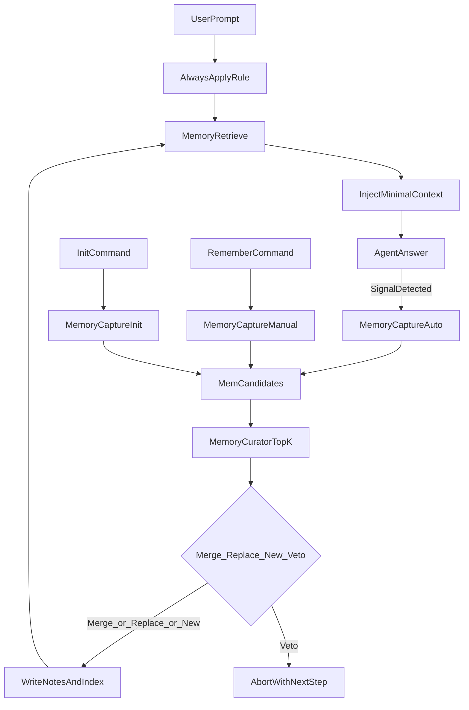

# Memory 库重设计（语义检索优先）

## 目标

- **概念升级**：把“经验（Experience）”全面升级为“记忆（Memory）”，相关 skills、commands、文档与目录命名同步改写。
- **三生命周期**：
  - **捕获**：尽力而为自动捕获 + `/remember` 手动捕获 + `/init` 手动捕获
  - **治理**：每次写入新记忆，基于语义检索做全库治理（工程实现为 TopK 近邻治理），合并优先于新增；冲突检测与否决机制
  - **提取/注入**：每次用户输入 prompt **强保证**触发检索与最小注入（通过 Always Apply Rule）
- **不考虑兼容**：允许推倒重做，减少历史包袱。

## Cursor 能力边界（关键结论）

- **Skills**：自动应用由 Agent 基于 `description` 决定，无法严格保证“每轮必触发”。（[`https://cursor.com/docs/context/skills`](https://cursor.com/docs/context/skills)）
- **Rules**：可作为“每轮强保证触发器”（Always Apply），用最短指令强制先执行“检索→最小注入”再回答。
- **Semantic Search**：索引离线向量化、约每 5 分钟增量同步；删除文件会从索引移除；大/复杂文件可能跳过。要求 memory 文件“短、小、结构清晰”。（语义搜索文档页面）

## 新的记忆库结构（扁平 + LLM 友好）

- `.cursor/.lingxi/memory/INDEX.md`
  - **SSoT manifest**（最小字段，LLM/人可读）
  - 每行对应一个记忆文件（稳定 ID + 指针 + 状态 + 少量 LLM 判定元数据）
- `.cursor/.lingxi/memory/notes/`
  - 扁平存放记忆文件：`MEM-<ulid>.md`（或 `MEM-YYYYMMDD-xxxx.md`）
- `.cursor/.lingxi/memory/references/`
  - 模板与规范（如何写得更利于语义检索、治理决策矩阵等）

> 说明：不再预置“固化 tag”。ID 是稳定锚点；分类（kind/type）允许 LLM 自行判定，目的是提升检索与注入质量。

## 三条链路的算法设计

### 1) 提取/注入（强保证）

- 新建 `.cursor/rules/memory-injection.mdc`（Always Apply，极短）：
  - 每轮回答前：执行一次 MemoryRetrieve（语义检索 TopN → LLM 重排）
  - 注入形式：最多 3-5 条“最小高信号”（一句可执行提醒 + 指针）
  - 无匹配：静默
  - 失败：允许降级继续回答（你选的是 `rule_enforce_call`）

### 2) 捕获（尽力而为 + 手动入口）

- 将现有 [`experience-capture`](c:\Workspace\tower1229\LingXi\.cursor\skills\experience-capture\SKILL.md) 重写为 `memory-capture`：
  - 统一候选模型 `MEM-CANDIDATE`
  - 保留“Decision Shape / Judgment Capsule”作为核心内容（提升检索命中）
  - 去重继续用 `.cursor/.lingxi/workspace/processed-sessions.json`
- 更新 `/remember` 与 `/init`：产出/传递 `MEM-CANDIDATE` 给治理写入。

### 3) 治理（每次写入自动治理，合并优先）

- 将现有 [`experience-depositor`](c:\Workspace\tower1229\LingXi\.cursor\skills\experience-depositor\SKILL.md) 重写为 `memory-curator`：
  - 写入前：对新候选做语义检索 TopK（notes/）
  - 对 TopK：LLM 评估
    - **merge**：同概念同结论 → 合并到信息更完整的版本
    - **replace**：同场景结论矛盾/升级替代 → 取代（删除旧文件）
    - **veto**：冲突且无法判断更优 → 否决写入，提示用户补“决定性变量”或明确选择
  - 写入：生成/更新 `notes/*.md` + 更新 `INDEX.md`

## 与现有灵犀代码的对应改造点（推倒重做）

- **Commands**：
  - 更新 `.cursor/commands/remember.md`、`.cursor/commands/init.md` 描述与委托对象（指向 memory-* skills）。
- **Skills**：
  - 新增/重写：
    - `.cursor/skills/memory-retrieve/SKILL.md`（提取与最小注入）
    - `.cursor/skills/memory-capture/SKILL.md`（捕获候选）
    - `.cursor/skills/memory-curator/SKILL.md`（治理与写入）
  - 退役或改名：`experience-capture`、`experience-depositor`、`memory-index`（由新三件套替代）。
- **索引脚本**：重写 `scripts/validate-memory-index.js` 为 `scripts/validate-memory-index.js`（保留文件名亦可）但 schema 适配新目录（notes/ + INDEX.md 新表头）。
- **文档**：更新 `.cursor/skills/about-lingxi/references/memory-system.md`、`.cursor/.lingxi/memory/INDEX.md` 模板说明等。

## 交付验收指标（用于判断方案是否真的更好）

- **注入噪声率**：被注入但无用的比例（目标持续下降）
- **命中率**：关键场景是否能稳定注入正确记忆（目标持续上升）
- **治理成本**：单次写入的平均耗时与 token（TopK 控制上限）
- **库健康度**：重复率、冲突率、index 一致性（脚本校验）

## 图：每轮强保证注入 + 捕获治理闭环

