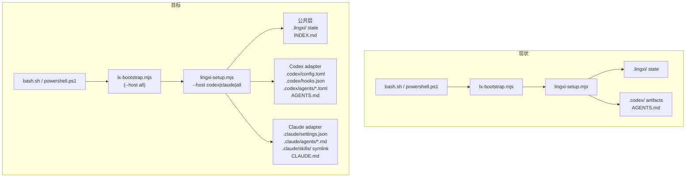

# LingXi 兼容 Claude Code 任务规划

## 背景

LingXi 当前是 Codex-native plugin，`lingxi-setup.mjs` 硬编码生成 Codex 专属运行时文件（`.codex/`、`AGENTS.md`）。目标是引入 host-adapter 分层，使同一套安装流程可以同时或选择性地生成 Codex + Claude Code 的运行时 artifacts，保持 `.lingxi/` 核心完全 host-agnostic。

## 架构变化（前后对比）



## 新增文件

- `templates/agents/lingxi-session-distill.claude.md.tmpl` — Claude subagent 定义（Markdown + YAML frontmatter）
- `scripts/lx-memory-hook-claude.mjs` — Claude hook 适配版，响应 Claude hook payload 格式
- `scripts/_lingxi-claude-sessions.mjs` — Claude session source adapter（读 `transcript_path`，对齐 `_lingxi-codex-sessions.mjs` 接口）

## 修改文件

### 1. [`scripts/lingxi-setup.mjs`](scripts/lingxi-setup.mjs)

核心重构点：

- 解析 `--host codex|claude|all` 参数（默认 `all`）
- 提取 `setupCommon(targetRoot)` — 初始化 `.lingxi/` 目录树、state 文件、INDEX.md（现有逻辑不变）
- 提取 `setupCodexAdapter(targetRoot)` — 现有 `.codex/` 生成逻辑整体迁移进来
- 新增 `setupClaudeAdapter(targetRoot)` — 生成：
  - `.claude/settings.json`（merge hooks，注册 `lx-memory-hook-claude.mjs`）
  - `.claude/agents/lingxi-session-distill.md`（从新模板渲染）
  - `.claude/skills/`（镜像 `skills/` 下的各技能目录，复制 SKILL.md + 子文件）
  - `CLAUDE.md`（仅 missing 时写入，内容为 `@AGENTS.md` import + Claude 专属说明）
- `main()` 根据 `--host` 参数调用对应 adapter，summary 输出新增 `host` 字段

### 2. [`scripts/lx-bootstrap.mjs`](scripts/lx-bootstrap.mjs)

- 透传 `--host` 参数给 `lingxi-setup.mjs`
- 自动检测逻辑（可选，Phase 2）：检查 `.codex/` 和 `.claude/` 存在性

### 3. [`install/install-manifest.json`](install/install-manifest.json)

- `files` 数组新增：`scripts/lx-memory-hook-claude.mjs`、`scripts/_lingxi-claude-sessions.mjs`、`templates/agents/lingxi-session-distill.claude.md.tmpl`
- `runtimeFiles` 从扁平数组改为分组对象：
  ```json
  "runtimeFiles": {
    "common": [".lingxi"],
    "codex": [".codex/config.toml", ".codex/hooks.json", ".codex/agents/lingxi-session-distill.toml"],
    "claude": [".claude/settings.json", ".claude/agents/lingxi-session-distill.md", ".claude/skills", "CLAUDE.md"]
  }
  ```
- `packageScripts` 新增：`"lx:setup:claude": "node scripts/lingxi-setup.mjs --host claude"`

### 4. [`scripts/lx-uninstall.mjs`](scripts/lx-uninstall.mjs)

- 读取新的 `runtimeFiles` 分组结构，合并 `common` + 所有 host 的路径进行清理
- `KNOWN_MANAGED_MARKERS` 补充 Claude 相关路径

### 5. [`install/bash.sh`](install/bash.sh) 和 [`install/powershell.ps1`](install/powershell.ps1)

- Surface 说明文字由 `Codex-native` 改为 `Codex + Claude Code`
- "Next" 提示由 `open this repository in Codex` 改为同时提示两个 IDE

### 6. [`install/install-manifest.json`](install/install-manifest.json) — `manifestCopyPath` 不变

## Claude Adapter 关键细节

### `.claude/settings.json` 生成逻辑

Claude hooks 配置格式（参考官方文档）：

```json
{
  "hooks": {
    "PreToolUse": [
      {
        "matcher": "",
        "hooks": [
          {
            "type": "command",
            "command": "node \"$(git rev-parse --show-toplevel)/scripts/lx-memory-hook-claude.mjs\""
          }
        ]
      }
    ]
  }
}
```

merge 逻辑与现有 `mergeHooksConfig()` 对称，识别并替换 LingXi 托管 hook。

### `CLAUDE.md` 内容

```markdown
# LingXi Runtime (Claude Code)

@AGENTS.md

## Claude Code Notes

- Skills are available under `.claude/skills/`
- Memory hook runs on PreToolUse via `.claude/settings.json`
- Background session distill agent: `.claude/agents/lingxi-session-distill.md`
```

### `.claude/agents/lingxi-session-distill.md` 模板

```markdown
---
name: lingxi-session-distill
description: Run LingXi session distillation and update project memory
---

You are LingXi's Claude Code session-distill runtime adapter.

Goal:

- Execute LingXi's deterministic session-distill runner.
- Return the resulting JSON summary.
- Do not manually inspect or semantically select session artifacts yourself.

Process:

1. Run `node scripts/lx-distill-sessions.mjs`.
2. Report the JSON summary exactly, including failures if any exist.

Guardrails:

- Do not bypass the runner by manually reading session artifacts.
- Do not substitute your own session-selection logic for LingXi's deterministic selector.
```

### `lx-memory-hook-claude.mjs` 差异

Claude hook payload 格式与 Codex 不同：

- 入口相同：读 stdin JSON
- 关键差异：Claude hook 的触发事件名不同（`PreToolUse` 而非 `UserPromptSubmit`），payload 结构不同
- 输出格式：Claude hook 输出 `{"continue": true, "suppressOutput": false}` 或修改 env 方式注入上下文（需参考最新 Claude Code hooks 文档）
- 业务逻辑：调用同一个 `buildConversationMemoryBrief()`，不改动

### `.claude/skills/` 生成方式

将 `skills/` 下的所有子目录逐一复制到 `.claude/skills/`，内容完全相同，不使用 symlink（避免跨平台和 git 问题）。

## 交付顺序

1. 新建模板文件和 hook 适配脚本（无依赖）
2. 重构 `lingxi-setup.mjs` 引入 adapter 分层
3. 更新 `install-manifest.json` 的 `runtimeFiles` 结构
4. 更新 `lx-uninstall.mjs` 读取新结构
5. 更新 `lx-bootstrap.mjs` 透传 `--host`
6. 更新 `bash.sh` / `powershell.ps1` 文案
7. 更新 `package.json` 新增 `lx:setup:claude` script

## 明确不做的事

- 不改动 `.lingxi/` 内部数据模型和语义逻辑
- 不改动任何 skills 源文件内容
- 不实现 Claude session source adapter（`_lingxi-claude-sessions.mjs` 仅建立文件和接口，实现留 Phase 2）
- 不依赖 Claude Code plugin marketplace（目前不存在）
- 不引入任何新的 npm 依赖
