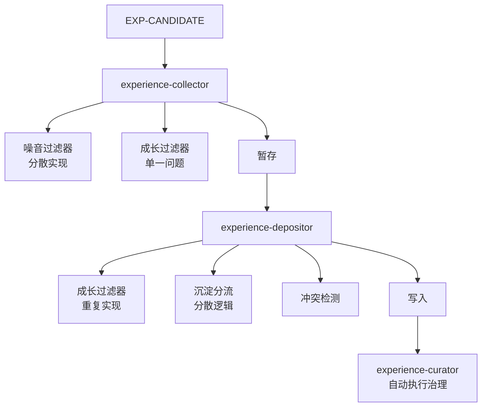

# 知识沉淀机制优化方案

## 目标

1. **统一候选评估机制**：创建 `candidate-evaluator` Skill，替代分散的噪音过滤器、成长过滤器和沉淀分流逻辑
2. **优化流程顺序**：将评估前置到用户选择之前，治理方案在写入前确认
3. **提升设计严谨性**：从单一问题升级为多维度评估框架
4. **消除重复实现**：统一评估逻辑，遵循 DRY 原则

## 架构变更

### 当前架构问题



### 优化后架构


## 实施步骤

### Phase 1: 创建统一候选评估机制

#### 1.1 创建 candidate-evaluator Skill

**文件**：`.cursor/skills/candidate-evaluator/SKILL.md`

**职责**：

- 结构完整性评估（检查必要字段）
- 判断结构质量评估（是否包含 Decision Shape）
- 可复用性评估（时间维度、空间维度、抽象层次）
- 沉淀载体适配性评估（推荐最适合的载体）

**输入**：EXP-CANDIDATE JSON

**输出**：评估结果 JSON（包含各维度评估结果、推荐载体、理由）

**参考**：[候选评估机制设计](docs/02-design/candidate-evaluation.md)

#### 1.2 定义评估结果数据结构

在 `candidate-evaluator` Skill 中定义标准化的评估结果格式：

```json
{
  "structuralIntegrity": { "passed": true, "missingFields": [], "reason": "" },
  "decisionShapeQuality": { "passed": true, "reason": "" },
  "reusability": {
    "temporalDimension": { "passed": true, "score": 0.9, "reason": "" },
    "spatialDimension": { "passed": true, "score": 0.8, "reason": "" },
    "abstractionLevel": { "passed": true, "score": 0.85, "reason": "" },
    "overall": "high" | "medium" | "low",
    "confidence": 0.85
  },
  "depositionTarget": {
    "recommended": ["experience"],
    "alternatives": ["session"],
    "reason": "",
    "expectedBenefit": ""
  },
  "requiresHumanJudgment": false,
  "filterReason": ""
}
```

### Phase 2: 更新 experience-collector

#### 2.1 更新 experience-collector subagent

**文件**：`.cursor/agents/experience-collector.md`

**变更**：

- 移除步骤 2（噪音过滤器）和步骤 3（成长过滤器）的分散实现
- 改为调用 `candidate-evaluator` Skill 执行统一评估
- 更新暂存数据结构，包含评估结果

**新流程**：

1. 解析候选
2. 调用 `candidate-evaluator` 执行阶段 1 评估（自动评估）
3. 根据评估结果决定是否暂存（不通过的过滤，通过的暂存并记录评估结果）
4. 最小上下文包
5. 暂存（包含评估结果）

#### 2.2 更新暂存数据结构

**文件**：`.cursor/.lingxi/context/session/pending-compounding-candidates.json`

在候选对象中添加 `evaluation` 字段，存储阶段 1 的评估结果。

### Phase 3: 优化 experience-depositor 流程

#### 3.1 更新 experience-depositor subagent

**文件**：`.cursor/agents/experience-depositor.md`

**新流程**：

1. 读取暂存
2. **调用 candidate-evaluator 执行阶段 2 评估**（详细评估，对暂存的候选进行二次评估）
3. **展示候选**：展示候选及评估结果（包括推荐载体），请求用户选择
4. 用户选择
5. 冲突检测
6. **调用 curator 方案模式**：生成治理方案（不执行）
7. **展示治理方案**：请求用户确认
8. **用户确认治理方案**
9. **调用 curator 执行模式**：执行治理（更新 INDEX）
10. 写入经验文件
11. 清理

**关键变更**：

- 评估前置到展示之前（避免用户选择后再被过滤）
- 治理方案在写入前展示并确认
- 先执行治理再写入（保证一致性）

#### 3.2 更新 experience-depositor Skill

**文件**：`.cursor/skills/experience-depositor/SKILL.md`

**变更**：

- 移除步骤 0.0（成长过滤器）的重复实现
- 移除步骤 0（沉淀分流）的分散逻辑
- 改为调用 `candidate-evaluator` Skill
- 更新流程步骤顺序，与 subagent 保持一致
- 更新步骤 0.2（成长循环），改为先展示治理方案再执行

### Phase 4: 优化 experience-curator

#### 4.1 更新 experience-curator Skill

**文件**：`.cursor/skills/experience-curator/SKILL.md`

**新增**：支持两种模式

**方案模式**（新增）：

- 输入：新增经验的 Tag 列表
- 输出：治理方案（建议的合并/取代动作，不执行）
- 用途：在 depositor 中调用，生成方案供用户确认

**执行模式**（保留）：

- 输入：新增经验的 Tag 列表 + 用户确认的治理方案
- 输出：执行治理动作，更新 INDEX
- 用途：用户确认后执行

**变更**：

- 在步骤 2（合并/取代判断）后，如果是方案模式，输出方案并返回
- 如果是执行模式，继续执行步骤 3（自动执行治理动作）

### Phase 5: 更新文档

#### 5.1 更新知识沉淀机制设计文档

**文件**：`docs/02-design/knowledge-compounding.md`

**变更**：

- 更新流程概览图，反映新的评估机制和流程顺序
- 移除"成长过滤器"独立章节，改为引用候选评估机制
- 更新"确认沉淀流程"，反映新的流程顺序
- 更新总结部分，提及统一候选评估机制

#### 5.2 更新实现文档

**文件**：

- `docs/03-implementation/subagents/experience-collector.md`
- `docs/03-implementation/subagents/experience-depositor.md`

**变更**：

- 更新流程描述，反映新的评估机制
- 移除成长过滤器的独立描述
- 添加对 `candidate-evaluator` 的引用

#### 5.3 更新噪音过滤器文档

**文件**：`docs/02-design/noise-filter.md`

**变更**：

- 在文档开头说明已整合到候选评估机制
- 保留内容作为参考，但标注"已整合"

#### 5.4 创建 candidate-evaluator 实现文档

**文件**：`docs/03-implementation/skills/candidate-evaluator.md`

**内容**：

- 概述
- 评估维度详细说明
- 输入输出格式
- 使用场景
- 与旧设计的对比

#### 5.5 更新架构概览

**文件**：`docs/01-concepts/architecture-overview.md`

**变更**：

- 更新经验沉淀流程图
- 在 Execution Layer 中添加 `candidate-evaluator` Skill
- 更新 experience-collector 和 experience-depositor 的职责描述

## 实施顺序

1. **Phase 1**：创建 candidate-evaluator Skill（基础）
2. **Phase 2**：更新 experience-collector（使用新评估机制）
3. **Phase 3**：优化 experience-depositor（流程优化）
4. **Phase 4**：优化 experience-curator（支持方案模式）
5. **Phase 5**：更新文档（保持文档同步）

## 验证点

1. **评估机制统一性**：所有评估逻辑都通过 candidate-evaluator 执行
2. **流程顺序正确性**：评估前置，治理方案在写入前确认
3. **用户体验**：用户选择后不再被过滤，治理方案可预览和确认
4. **文档一致性**：所有文档反映新的设计和实现

## 风险与注意事项

1. **向后兼容**：暂存文件格式变更，需要兼容处理
2. **评估准确性**：新评估机制需要验证准确性，避免误判
3. **性能影响**：统一评估可能增加调用次数，需要验证性能
4. **用户习惯**：流程变更可能影响用户习惯，需要清晰的文档和提示

## 参考文档

- [候选评估机制设计](docs/02-design/candidate-evaluation.md)
- [知识沉淀机制设计](docs/02-design/knowledge-compounding.md)
- [经验治理机制设计](docs/02-design/experience-governance.md)
- [噪音过滤器设计](docs/02-design/noise-filter.md)（已整合）
