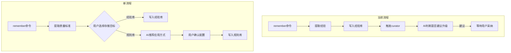

# 统一质量标准沉淀机制重构

## 背景

当前质量标准提取机制存在设计缺陷：

- "长期稳定性"只能由用户判断，无法自动化
- 自动触发条件（Strength=enforced、相似经验>=2 条、可抽象）都依赖不可靠的 AI 主观判断
- 导致"经验 -> 规则"的升级路径几乎不可用

## 核心变更



## 任务拆解

### Task 1: 修改 experience-depositor skill

文件：[.cursor/skills/experience-depositor/SKILL.md](.cursor/skills/experience-depositor/SKILL.md)

修改内容：

- 在预览确认阶段，增加"存储目标选择"
- 选项 A：存入经验库（.workflow/context/experience/）
- 选项 B：存入规则库（.cursor/rules/qs-\*/）
- **优化**：在预览阶段同时展示规则配置预览（如果选择 B），减少交互步骤
- 删除"0.1) 成长循环"中自动触发 curator 建议质量准则的逻辑
- 保留经验库的合并/取代治理逻辑（仅限经验库内部）

预览输出格式调整：

```markdown
## 质量标准预览

### 内容摘要

- **标题**：...
- **触发条件**：...
- **核心判断**：...

### 存储目标选择

- **A) 存入经验库**：写入 .workflow/context/experience/，下次匹配时作为提醒

- **B) 存入规则库**：写入 .cursor/rules/，作为 Cursor 规则自动加载

  **规则配置预览**（如果选择 B）：

- **推荐应用方式**：文件匹配（上下文成本最低）
- **推荐配置**：
- Type: fs (file-scoped)
- Scope: frontend
- Globs: `**/components/**/*.tsx`（根据项目实际结构调整）
- 理由：内容明确涉及"组件"，适合文件匹配方式

请选择 A 或 B：
```

### Task 2: 增加规则配置推荐逻辑

**设计原则**：AI 根据质量标准内容和项目实际情况灵活判断，关键词映射表仅作为推荐参考，不硬编码判断逻辑。

当用户选择 B（存入规则库）时，AI 需要：

1. 分析质量标准内容，结合项目实际情况，推荐应用方式（按优先级）：

   - 文件匹配（globs）：如果内容明确关联某类文件，且项目中有明确的文件结构
   - 智能判断（description）：如果内容是某领域的通用原则，或文件分布较散
   - 始终应用（alwaysApply）：仅限安全红线/合规底线

2. **推荐逻辑**（AI 灵活判断，参考以下映射表）：

AI 应根据以下因素综合判断：

- 质量标准内容的核心主题和适用场景
- **项目实际目录结构**（必须分析项目结构，不能套用固定模式）
- 内容是否与特定文件类型/路径强绑定
- 是否符合 Cursor Rules 的最佳实践（参考 `rules-guide.md`）

**推荐参考表**（仅供参考，AI 应灵活判断）：

| 关键词/主题 | 可能的推荐方式 | 可能的 globs 示例（需根据项目实际调整） |

| --------------- | ------------ | ------------------------------ |

| 组件/Component | fs（如果组件集中）或 i（如果分散） | `**/components/**/*.tsx`（需验证项目结构） |

| API/接口/路由 | fs（如果 API 集中）或 i（如果分散） | `**/api/**`, `**/routes/**`（需验证项目结构） |

| SQL/数据库/迁移 | fs | `**/*.sql`, `**/migrations/**`（需验证项目结构） |

| 安全/密钥/权限 | always（红线）或 i（建议） | - |

| 设计/UI/样式 | fs（如果设计文件集中） | `**/design/**`, `**/styles/**`（需验证项目结构） |

| 通用/架构/原则 | i | - |

**重要**：

- 必须先分析项目实际目录结构，再推荐 globs
- 不能套用固定模式，必须根据项目实际情况调整
- 如果无法确定，优先推荐 i（智能判断）而非 fs（文件匹配）

3. 输出推荐格式（在预览阶段展示，见 Task 1）：

如果用户选择 B，在预览阶段已展示规则配置预览。如果用户确认选择 B，则直接进入规则创建流程（调用 rules-creator），无需再次确认配置。

### Task 3: 整合 rules-creator skill

文件：[.cursor/skills/rules-creator/SKILL.md](.cursor/skills/rules-creator/SKILL.md)

修改内容：

- 支持从 experience-depositor 流程直接调用
- 接收预处理的配置（type/scope/globs/description）
- 简化交互确认（配置已在上一步确认）

### Task 4: 更新 /remember 命令

文件：[.cursor/commands/remember.md](.cursor/commands/remember.md)

修改内容：

- 更新命令描述：从"经验沉淀"改为"质量标准沉淀"
- 更新示例场景，展示存储目标选择流程
- 更新产物说明

### Task 5: 简化 experience-curator

文件：[.cursor/skills/experience-curator/SKILL.md](.cursor/skills/experience-curator/SKILL.md)

修改内容：

- 删除"5) 输出质量准则建议"整个章节
- 删除触发条件中"升级为规则触发"的逻辑
- 保留经验库内部的合并/取代治理功能

### Task 6: 更新相关文档

- 更新 [.cursor/rules/quality-standards-schema.md](.cursor/rules/quality-standards-schema.md) 说明
- 更新 [.cursor/rules/quality-standards-index.md](.cursor/rules/quality-standards-index.md) 变更记录

## 关键设计决策

1. **用户判断优先**：是否"长期稳定"只有用户能判断，不再尝试自动化
2. **AI 推荐辅助**：AI 根据内容推荐应用方式，降低用户配置成本
3. **应用方式优先级**：globs > description > alwaysApply（减少上下文压力）
4. **保留经验库价值**：经验库仍然有用（低成本提醒），只是不再尝试自动升级为规则
