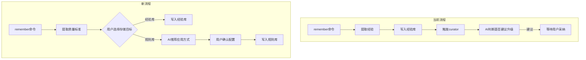

# 统一质量标准沉淀机制重构

## 背景

当前质量标准提取机制存在设计缺陷：

- "长期稳定性"只能由用户判断，无法自动化
- 自动触发条件（Strength=enforced、相似经验>=2 条、可抽象）都依赖不可靠的 AI 主观判断
- 导致"经验 -> 规则"的升级路径几乎不可用

## 核心变更



## 任务拆解

### Task 1: 修改 experience-depositor skill

文件：[.cursor/skills/experience-depositor/SKILL.md](.cursor/skills/experience-depositor/SKILL.md)

修改内容：

- 在预览确认阶段，增加"存储目标选择"
- 选项 A：存入经验库（.workflow/context/experience/）
- 选项 B：存入规则库（.cursor/rules/qs-\*/）
- 删除"0.1) 成长循环"中自动触发 curator 建议质量准则的逻辑
- 保留经验库的合并/取代治理逻辑（仅限经验库内部）

预览输出格式调整：

```markdown
## 质量标准预览

### 内容摘要

- **标题**：...
- **触发条件**：...
- **核心判断**：...

### 存储目标选择

- **A) 存入经验库**：写入 .workflow/context/experience/，下次匹配时作为提醒
- **B) 存入规则库**：写入 .cursor/rules/，作为 Cursor 规则自动加载

请选择 A 或 B：
```

### Task 2: 增加规则配置推荐逻辑

当用户选择 B（存入规则库）时，AI 需要：

1. 分析质量标准内容，推荐应用方式（按优先级）：

   - 文件匹配（globs）：如果内容明确关联某类文件
   - 智能判断（description）：如果内容是某领域的通用原则
   - 始终应用（alwaysApply）：仅限安全红线/合规底线

2. 输出推荐格式：

```markdown
## 规则配置推荐

**内容主题**：React 组件必须定义 Props 类型

**推荐应用方式**：文件匹配（上下文成本最低）

| 选项 | 类型     | 配置                                                              | 理由                 |
| ---- | -------- | ----------------------------------------------------------------- | -------------------- |
| A    | 文件匹配 | globs: ["**/components/**/*.tsx"]                                 | 内容明确涉及"组件"   |
| B    | 智能判断 | description: "Frontend standards for React component type safety" | 如果组件分布多处     |
| C    | 始终应用 | alwaysApply: true                                                 | 不推荐（非安全红线） |

请选择 A/B/C，或输入自定义配置：
```

3. 推荐逻辑（关键词 -> 应用方式）：

| 关键词/主题 | 推荐应用方式 | 推荐 globs |

| --------------- | ------------ | ------------------------------ |

| 组件/Component | fs | `**/components/**/*.tsx` |

| API/接口/路由 | fs | `**/api/**`, `**/routes/**` |

| SQL/数据库/迁移 | fs | `**/*.sql`, `**/migrations/**` |

| 安全/密钥/权限 | always 或 i | - |

| 设计/UI/样式 | fs | `**/design/**`, `**/styles/**` |

| 通用/架构/原则 | i | - |

### Task 3: 整合 rules-creator skill

文件：[.cursor/skills/rules-creator/SKILL.md](.cursor/skills/rules-creator/SKILL.md)

修改内容：

- 支持从 experience-depositor 流程直接调用
- 接收预处理的配置（type/scope/globs/description）
- 简化交互确认（配置已在上一步确认）

### Task 4: 更新 /remember 命令

文件：[.cursor/commands/remember.md](.cursor/commands/remember.md)

修改内容：

- 更新命令描述：从"经验沉淀"改为"质量标准沉淀"
- 更新示例场景，展示存储目标选择流程
- 更新产物说明

### Task 5: 简化 experience-curator

文件：[.cursor/skills/experience-curator/SKILL.md](.cursor/skills/experience-curator/SKILL.md)

修改内容：

- 删除"5) 输出质量准则建议"整个章节
- 删除触发条件中"升级为规则触发"的逻辑
- 保留经验库内部的合并/取代治理功能

### Task 6: 更新相关文档

- 更新 [.cursor/rules/quality-standards-schema.md](.cursor/rules/quality-standards-schema.md) 说明
- 更新 [.cursor/rules/quality-standards-index.md](.cursor/rules/quality-standards-index.md) 变更记录

## 关键设计决策

1. **用户判断优先**：是否"长期稳定"只有用户能判断，不再尝试自动化
2. **AI 推荐辅助**：AI 根据内容推荐应用方式，降低用户配置成本
3. **应用方式优先级**：globs > description > alwaysApply（减少上下文压力）
4. **保留经验库价值**：经验库仍然有用（低成本提醒），只是不再尝试自动升级为规则
