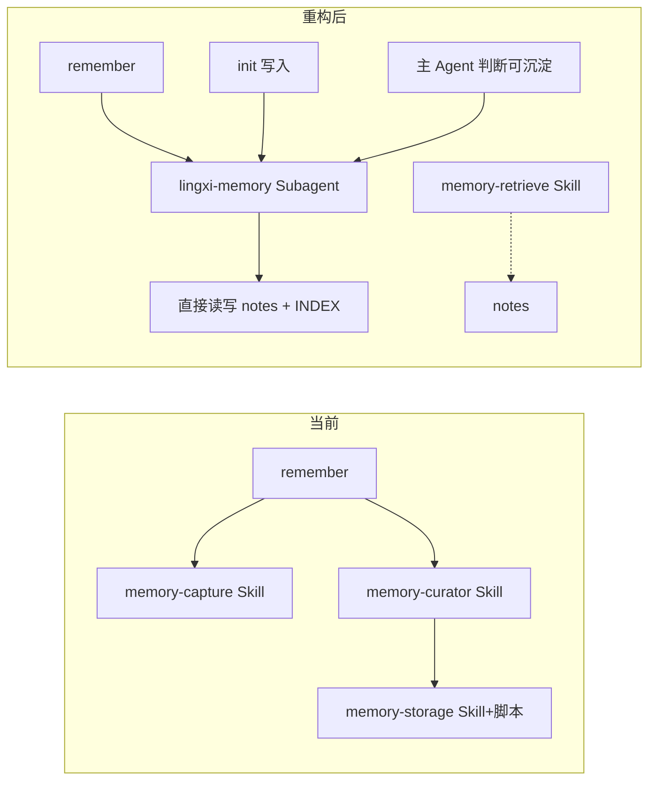

# 记忆库 Subagent 重构计划

## 1. 目标与约束

- **目标**：记忆写入链路（捕获/提取 + 治理 + 门控 + 写入）全部由 **Subagent lingxi-memory** 在独立上下文中执行，主对话仅委派并收一句结果；写入方式改为 **Agent 直接读写文件**，不再通过 memory-storage 脚本。
- **约束**：不保留向后兼容；同一逻辑只保留一处（Subagent 或 Skill 二选一）；删除不再需要的 Skills 与脚本；重构后同步所有引用文档。

## 2. 架构变更概览

- **保留**：`memory-retrieve` Skill、`memory-injection.mdc` Rule、`memory/notes/` 与 `INDEX.md` 格式、[memory-note-template.md](.cursor/.lingxi/memory/references/memory-note-template.md)。
- **删除**：`memory-capture`、`memory-curator`、`memory-storage` 三个 Skills 及其脚本（含 `.cursor/skills/memory-storage/scripts/memory-storage.js` 与 `validate-index.js`）。
- **新增/改写**：Subagent [.cursor/agents/lingxi-memory-curator.md](.cursor/agents/lingxi-memory-curator.md) 改为完整的“产候选 + 治理 + 门控 + **直接文件操作**”的单一实现，不再引用已删除的 Skills 或 memory-storage。

## 3. 删除清单（无向后兼容）

| 删除项                      | 路径                                                             | 说明                                                                     |
| --------------------------- | ---------------------------------------------------------------- | ------------------------------------------------------------------------ |
| memory-storage Skill 及脚本 | [.cursor/skills/memory-storage/](.cursor/skills/memory-storage/) | 整个目录：SKILL.md、scripts/memory-storage.js、scripts/validate-index.js |
| memory-curator Skill        | [.cursor/skills/memory-curator/](.cursor/skills/memory-curator/) | 整个目录；逻辑迁移到 Subagent 内                                         |
| memory-capture Skill        | [.cursor/skills/memory-capture/](.cursor/skills/memory-capture/) | 整个目录；提取与展示由 Subagent 双入口覆盖                               |

**根目录脚本**：保留 [scripts/validate-memory-index.js](scripts/validate-memory-index.js) 及 [scripts/**tests**/validate-memory-index.test.js](scripts/__tests__/validate-memory-index.test.js) 作为独立的 INDEX/notes 一致性校验工具（不依赖 memory-storage）。[package.json](package.json) 中 `memory-sync` / `memory-check` 改为调用该脚本（例如 `node scripts/validate-memory-index.js --update` 与 `--check`），不再引用已删除的 `memory-storage/scripts/validate-index.js`。

## 4. Subagent 定义（唯一写入逻辑来源）

**文件**：沿用 [.cursor/agents/lingxi-memory-curator.md](.cursor/agents/lingxi-memory-curator.md)，或重命名为 `lingxi-memory.md` 后统一引用。

**必须完成的改写**：

1. **YAML**：`description` 明确委派时机与输入约定（用户执行 /remember 或主 Agent 判断存在可沉淀并决定写入时使用；父代理传入 mode: auto | remember、input、必要 context）。
2. **职责**：单一职责——在给定 mode 与 input 下完成「产候选（无则静默）→ 治理（TopK）→ 门控（如需）→ **直接文件写入**」并仅向主对话返回一句结果。
3. **写入方式**：删除所有对 memory-storage 脚本的引用。改为使用 Cursor 提供的**文件读写能力**：

- 新建/更新记忆：直接写入 `.cursor/.lingxi/memory/notes/MEM-<id>.md`（内容结构遵循 [memory-note-template.md](.cursor/.lingxi/memory/references/memory-note-template.md)）。
- 索引：读取 `.cursor/.lingxi/memory/INDEX.md`，按现有表格格式增删改行后写回（表头与字段约定见当前 [INDEX.md](.cursor/.lingxi/memory/INDEX.md)）。
- 删除：删除对应 note 文件，并从 INDEX 中移除该行。

1. **规范内聚**：治理规则（TopK、merge/replace/veto/new）、门控格式（治理方案待确认、A/B/C/D）、MEM-CANDIDATE 与 note 结构、INDEX 表头与字段——全部写在 Subagent 的 prompt 或其所引用的 **.cursor/.lingxi/memory/references/** 内，**不再引用已删除的 memory-curator / memory-capture**。可选：在 [.cursor/.lingxi/memory/references/](.cursor/.lingxi/memory/references/) 下新增 `index-format.md` 或于现有文档中补充 INDEX 表格格式说明，供 Subagent 与人工维护参考。
2. **双入口**：auto（父传本轮消息+上下文+“存在可沉淀”）与 remember（父传 /remember 内容或编号）；门控在 Subagent 对话内完成，前台运行。

## 5. 命令与 Skill 调用方修改

| 文件                                                                               | 修改要点                                                                                                                                                                                                                                |
| ---------------------------------------------------------------------------------- | --------------------------------------------------------------------------------------------------------------------------------------------------------------------------------------------------------------------------------------- |
| [.cursor/commands/remember.md](.cursor/commands/remember.md)                       | 委托对象改为 Subagent lingxi-memory（或 lingxi-memory-curator）；删除对 memory-curator、memory-capture 的引用；执行流程改为「解析用户输入 → 委派 Subagent（mode=remember + input + 必要 context）」；输出要求为主对话仅一句结果或静默。 |
| [.cursor/commands/init.md](.cursor/commands/init.md)                               | 依赖的 Agent Skills 中删除 memory-capture、memory-curator；写入门控路径改为「委派 Subagent 执行写入」，并说明由 Subagent 在独立上下文中完成。                                                                                           |
| [.cursor/skills/init-executor/SKILL.md](.cursor/skills/init-executor/SKILL.md)     | 用户确认写入时：改为将待写入候选委派给 Subagent（mode=remember 或专用 mode=init），删除「委托给 memory-curator」的表述。                                                                                                                |
| [.cursor/skills/memory-retrieve/SKILL.md](.cursor/skills/memory-retrieve/SKILL.md) | 若有对 memory-curator 的引用（如 MEM-memory-curator）可保留为“记忆写入须用户门控”的提醒，或改为“记忆写入由 Subagent 在独立上下文中执行”；不改变检索与注入逻辑。                                                                         |

## 6. 其他引用 memory-capture / memory-curator 的更新

以下文件仅做引用与说明性更新，不改变业务逻辑：

- **[.cursor/commands/req.md](.cursor/commands/req.md)**、**[.cursor/commands/plan.md](.cursor/commands/plan.md)**、**[.cursor/commands/build.md](.cursor/commands/build.md)**、**[.cursor/commands/review.md](.cursor/commands/review.md)**：将“记忆捕获由 memory-capture Skill 统一处理”等表述改为“记忆写入由 lingxi-memory Subagent 在独立上下文中执行；主对话在需要时委派，不包含捕获与写入逻辑”，并删除对 `.cursor/skills/memory-capture/SKILL.md` 的链接。
- **Executor Skills**：[req-executor](.cursor/skills/req-executor/SKILL.md)、[plan-executor](.cursor/skills/plan-executor/SKILL.md)、[build-executor](.cursor/skills/build-executor/SKILL.md)、[review-executor](.cursor/skills/review-executor/SKILL.md)：将“记忆捕获由 memory-capture Skill 尽力而为处理”及对 memory-capture 的引用改为“记忆写入由 lingxi-memory Subagent 处理；本 Skill 不包含捕获与写入逻辑”，并删除指向已删除 Skill 的路径。

## 7. 文档同步（about-lingxi 与设计文档）

| 文档                                                                                                                     | 更新内容                                                                                                                                                                                                                                                                                                                                              |
| ------------------------------------------------------------------------------------------------------------------------ | ----------------------------------------------------------------------------------------------------------------------------------------------------------------------------------------------------------------------------------------------------------------------------------------------------------------------------------------------------- |
| [.cursor/skills/about-lingxi/references/memory-system.md](.cursor/skills/about-lingxi/references/memory-system.md)       | 重写“捕获”与“治理”的执行模型：由 **Subagent lingxi-memory** 在独立上下文中执行（双入口 auto/remember）；写入为 **Agent 直接操作 notes 与 INDEX 文件**；删除对 memory-capture、memory-curator、memory-storage 的引用；保留“提取/注入”与 memory-retrieve、Always Apply Rule 的说明；索引与 note 格式、门控原则、SSoT 等概念保留。                       |
| [.cursor/skills/about-lingxi/references/architecture.md](.cursor/skills/about-lingxi/references/architecture.md)         | 命令表中 /remember 委托对象改为「lingxi-memory（Subagent）」；/init 协作中删除 memory-capture、memory-curator；记忆系统 Skills 仅保留 memory-retrieve，新增「Subagent：lingxi-memory（记忆写入）」；删除 memory-capture、memory-curator、memory-storage 的目录与描述；记忆库机制小节改为“委派 Subagent 执行捕获+治理+写入，直接读写 notes 与 INDEX”。 |
| [.cursor/skills/about-lingxi/references/component-guides.md](.cursor/skills/about-lingxi/references/component-guides.md) | Subagents 小节「在灵犀中的应用」增加 lingxi-memory：负责记忆写入（双入口、直接文件操作）；Skills 小节删除或替换对 memory-capture、memory-curator、memory-storage 的列举与描述。                                                                                                                                                                       |
| [.cursor/skills/about-lingxi/SKILL.md](.cursor/skills/about-lingxi/SKILL.md)                                             | 背景知识结构中“记忆系统机制”的引用与简述：改为 Subagent + 直接文件写入，删除对 memory-capture、memory-curator 的路径引用。                                                                                                                                                                                                                            |
| [docs/design/architecture.md](docs/design/architecture.md)                                                               | 与 architecture 一致：/remember 委托 Subagent；记忆相关仅保留 memory-retrieve 与 Subagent 写入；删除 memory-capture、memory-curator 的表述。                                                                                                                                                                                                          |

不要求修改历史计划文档（如 `.cursor/plans/*.md`）；若需保持一致性，可在文档同步阶段顺带更新其中对 memory-capture / memory-curator / memory-storage 的“当前实现”描述，但不做强制任务。

## 8. package.json

将 `memory-sync` 与 `memory-check` 改为调用根目录 [scripts/validate-memory-index.js](scripts/validate-memory-index.js)（例如 `node scripts/validate-memory-index.js --update` 与 `node scripts/validate-memory-index.js --check`），确保删除 memory-storage 后脚本仍可用。

## 9. 实施顺序建议

1. **删除**：移除 [.cursor/skills/memory-storage/](.cursor/skills/memory-storage/)、[.cursor/skills/memory-curator/](.cursor/skills/memory-curator/)、[.cursor/skills/memory-capture/](.cursor/skills/memory-capture/) 整个目录。
2. **package.json**：更新 `memory-sync` / `memory-check` 指向 `scripts/validate-memory-index.js`。
3. **Subagent**：按第 4 节完成 [.cursor/agents/lingxi-memory-curator.md](.cursor/agents/lingxi-memory-curator.md)（或 lingxi-memory.md）的改写，写入逻辑改为直接文件操作，规范内聚于 Subagent 与 memory/references。
4. **命令与 init**：按第 5 节修改 remember.md、init.md、init-executor/SKILL.md、memory-retrieve/SKILL.md。
5. **其他引用**：按第 6 节更新 req/plan/build/review 的 commands 与对应 executor Skills。
6. **文档**：按第 7 节更新 memory-system、architecture、component-guides、about-lingxi SKILL、docs/design/architecture。

## 10. 验收要点

- `/remember` 与 init 写入路径仅通过委派 Subagent 完成，主对话无写入过程、无对已删 Skill/脚本的引用。
- 自动捕获场景（若主 Agent 委派 Subagent mode=auto）在 Subagent 内完成提取与写入，主对话仅收一句结果或静默。
- 项目中不再存在 memory-storage、memory-curator、memory-capture 的目录或可执行逻辑；同一套“产候选 + 治理 + 门控 + 写入”只存在于 Subagent 中。
- `memory-retrieve` 与 memory-injection 行为不变；notes 与 INDEX 格式不变；`npm run memory-sync` / `memory-check` 使用根目录 validate-memory-index.js 可正常执行。
