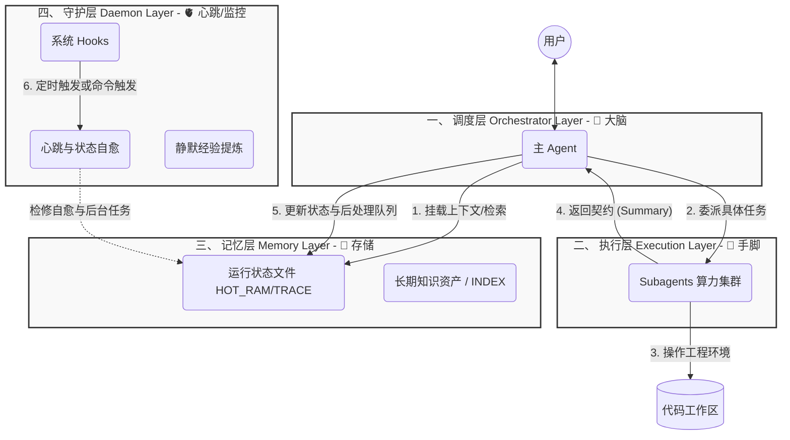
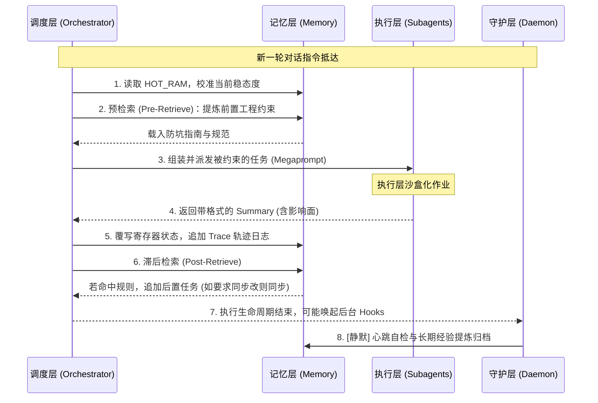

# 灵犀（LingXi）架构概览 (Architecture Overview)

> **定位**：本文档是对灵犀（LingXi）现有 AgentOS 工程体系的顶层设计解释。作为整个 `about-lingxi` 知识体系的“骨架”，其它具体机制与原则均依附于此架构的四个层级展开。

---

## 🧭 一、 AgentOS 四层架构模型

灵犀的本质是一个基于文件系统运行的 **Agent 操作系统 (AgentOS)**。与传统应用开发类似，系统遵循清晰的分层架构（高度契合 OpenClaw 倡导的理念）。通过抽象出四层模型，实现了高内聚、低耦合的系统运作：

### 1. 调度层 (Orchestrator Layer)
*   **定位**：系统的大脑与宏观指挥官（即主 Agent）。
*   **核心职责**：统揽全局，负责理解用户意图、规划全局路径、委派底层能力，并在任务结束后收敛和校验状态。
*   **内置逻辑与机理**：
    *   **确定性管道 (Deterministic Pipeline)**：将开放式对话收束为“前置约束 -> 任务委派 -> 状态回收 -> 追加后置义务”的精密流水线。
    *   **后置收敛 (Post-Processing)**：不以输出几句话作为结束，而是以“工作流节点状态的稳态闭环”为收敛标准（如必须整理报错日志后才算结束）。

### 2. 执行层 (Execution Layer)
*   **定位**：提供隔离算力的专用执行插件集合（各路 Subagents 等工具）。
*   **核心职责**：在独立的沙盒中完成脏活累活（如大跨度代码重构、测试排查、深层索引搜索），保障主干对话（调度层）视窗的纯净与焦点不散。
*   **具象体现**：**主从解耦 (Orchestrator-Worker)** 的实际落脚点。调度层只交代“做什么以及约束”，执行层负责“干活”并向调度层返回强约束规范的“执行摘要与影响记录 (Summary)”。

### 3. 记忆层 (Memory Layer)
*   **定位**：AgentOS 运行的基础数据实体与底座，涵盖短期状态寄存与长期知识库。
*   **核心职责**：持久化知识资产，确保上下文精准隔离并沉淀项目全局规范。
*   **工程实现**：**状态文件化 (File-as-State)**。灵犀以此作为 OS 的基石，全面采用物理文件实现 IPC（进程间通信）并留存快照：
    *   `HOT_RAM.md` (动态寄存器：指示当前进行到的状态机步骤、排队队列)。
    *   `SESSION_TRACE.md` (时间轴流水账：高保真追踪底层执行轨迹与回溯点)。
    *   `memory/` (长效资产目录：持久化的最佳实践规范与经验法则)。

### 4. 守护层 (Daemon / Heartbeat Layer)
*   **定位**：游离于用户前台直接交互之外的后台自动机与维保网络。
*   **核心职责**：如同“心跳系统”，凭借周期性或事件触发的 Hooks 静默维护系统的鲁棒性与健康度，无须人工干预也能保障长期可用。
*   **涵盖机制**：
    *   **心跳与挂载自愈 (Watchdog)**：防范中断或异常造成的 `HOT_RAM` 与实际流水日志不同步，在用户察觉前强制修复脏状态。
    *   **静默提炼 (Distillation)**：在生命周期边缘定时整合低密度的历史日志记录，提取为高信噪比、可复用的长期经验记忆。

---

## 🔁 二、 基于四层架构的数据流转

有了四层的分段结构，灵犀处理日常繁复指令的链路，即成为一条精密且高容错的工程数据管道：

---

## 📚 三、 架构骨架下的文档系统映射

本文档是整个 `about-lingxi` 的顶层心智模型骨头。围绕此模型的血肉与羽毛，全部展开在旁侧的文档中：

1. **指向调度层 (Orchestrator)**：
   - 探寻策略与评价准则：参见 `design-principles.md`、`evaluation-criteria.md`。
   - 法典规则约束：参见 `rules-guide.md`。
2. **指向执行层 (Execution)**：
   - 组件实现与协作范式：参见 `component-guides.md`、`workflow-output-principles.md`。
3. **指向记忆层 (Memory)**：
   - 沉淀检索机制及索引结构：参见 `memory-system.md`。
   - 文件协议细化：参见 `ipc-protocols.md`。
4. **指向守护层 (Daemon)**：
   - Hooks 挂载、稳定性兜底及工程代码实践：参见 `engineering-practices.md` 及其它源码实现规范。

> **结语**：这套四层架构彻底让自然语言的开放式推断降级并规范为确定性的状态机循环。无论是二次开发本工作流还是模型在理解工程项目，皆应从这四个立体切面看待 Agent 行动：用调度层思考、用执行层干活、写在记忆层、依托守护层保活。
