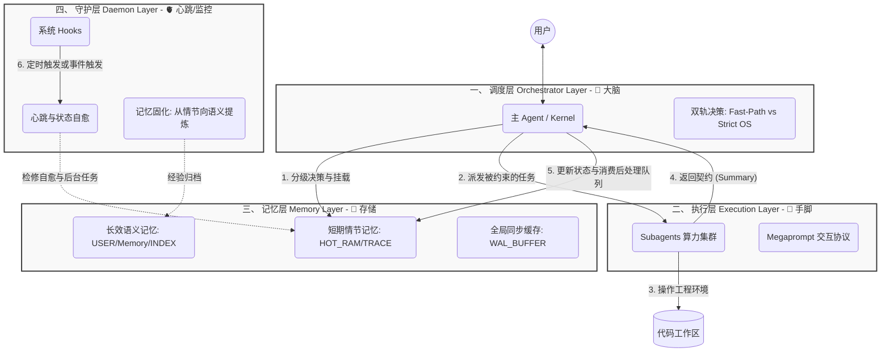

# 灵犀（LingXi）架构概览 (Architecture Overview)

> **定位**：本文档是对灵犀（LingXi）现有 AgentOS 工程体系的顶层设计解释。作为整个 `about-lingxi` 知识体系的“骨架”，其它具体机制与原则均依附于此架构的四个层级展开。

---

## 🧭 一、 AgentOS 四层架构模型

灵犀是一个基于文件系统运行的 **Agent 操作系统 (AgentOS)**。系统遵循清晰的分层架构，实现了从高层调度到低层维护的完整工程闭环：

### 1. 调度层 (Orchestrator Layer / Kernel)
*   **定位**：系统大脑，负责宏观规划与决策权。
*   **核心机理**：
    *   **双轨执行决策 (Dual-Path Execution)**：内核接收指令后，通过 **Decision Tree** 判定任务等级（Tier 1/2/3）。简单问答走 **Fast-Path**（无状态机）；复杂任务（业务逻辑/代码变更）强制进入 **Strict OS Mode**（激活状态机）。
    *   **确定性管道 (Deterministic Pipeline)**：在 OS 模式下执行“前置检索 -> 任务委派 -> 状态回收 -> 追加后置义务”的完整链路。
    *   **后置闭环收敛 (Lifecycle Convergence)**：通过 `[POST-PROCESSING QUEUE]` 确保所有衍生义务（如文档更新、经验提取）在会话谢幕前被彻底析构。

### 2. 执行层 (Execution Layer / Worker)
*   **定位**：提供隔离算力的专用执行单元。
*   **核心机理**：
    *   **主从解耦 (Orchestrator-Worker)**：调度层不直接书写代码，所有高风险、重度 I/O 操作均下放给 Subagents 隔离执行。
    *   **标准契约协议 (The Protocol)**：调度层通过 **Megaprompt**（包含 4 步约束注入）进行下发，Subagent 必须返回 **`<Execution_Summary>`** 结构体。这种标准的 I/O 契约确保了不同模型集群间的协作一致性。

### 3. 记忆层 (Memory Layer / Storage)
*   **定位**：AgentOS 的虚拟内存与硬盘系统。
*   **工程实现 (File-as-State)**：
    *   **短期情节记忆 (Episodic)**：由 `HOT_RAM.md` (状态寄存器) 和 `SESSION_TRACE.md` (顺序操作流水账) 组成，负责维护当前会话的上下文与断点。
    *   **长效语义记忆 (Semantic)**：涵盖 `USER.md` (用户全局偏好) 和 `memory/` (项目资产/规范库)，负责沉淀跨任务的确定性常识。
    *   **全局同步缓存 (IPC)**：通过 `WAL_BUFFER.md` 实现跨会话的异步信号同步与大数据块暂行交换。

### 4. 守护层 (Daemon Layer / Heartbeat)
*   **定位**：后台静默运行的维保网络，系统的自愈核心。
*   **核心机理**：
    *   **心跳自检 (Heartbeat/Watchdog)**：依托 `post-command` 等 Hooks 定时脉冲，监控 `HOT_RAM` 指纹，在工具异常或连接中断后自动执行“状态拉回”协议，防范数据撕裂。
    *   **记忆固化 (Memory Consolidation)**：从周期性的 `SESSION_TRACE` 流水中“静默提炼”极简经验片段，实现从“短期操作情节”向“长期项目资产”的自动化合并转换。

---

## 📚 二、 架构骨架下的文档映射

本文档是整个 `about-lingxi` 的顶层心智模型。相关细节映射如下：

1. **指向调度层 (Orchestrator)**：参见 `design-principles.md`、`evaluation-criteria.md`、`rules-guide.md`。
2. **指向执行层 (Execution)**：参见 `component-guides.md`、`workflow-output-principles.md`、`cursor-agent-tools.md`。
3. **指向记忆层 (Memory)**：参见 `memory-system.md`、`ipc-protocols.md`。
4. **指向守护层 (Daemon)**：参见 `engineering-practices.md` 及其关联心跳逻辑实现。

> **结语**：灵犀架构的核心是**用调度层思考、用执行层干活、写在记忆层、依托守护层保活**。这是一套不仅让人理解、更让 AI 敢于自我驱动的工程框架。
