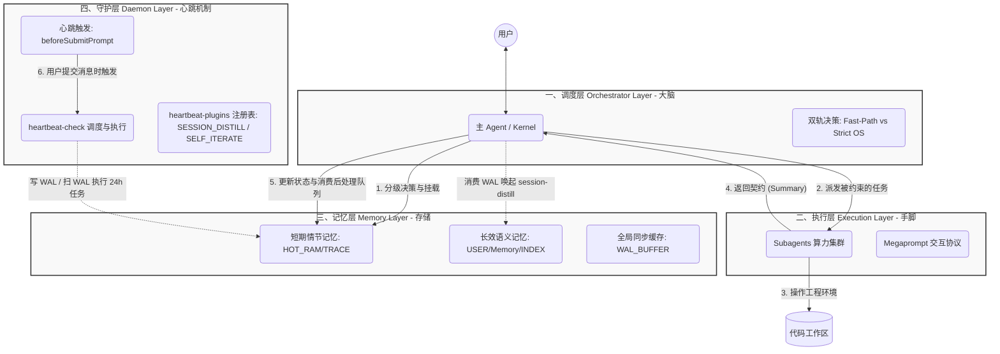

# 灵犀（LingXi）架构概览 (Architecture Overview)

> **定位**：本文档是灵犀（LingXi）AgentOS 工程体系的顶层设计说明，也是整个 `about-lingxi` 知识体系的**骨架**。四层架构与开发工作流在此统一呈现，其它机制与原则均依附于此展开。阅读顺序建议：先建立四层心智模型，再理解工作流如何在这一架构上运行。

---

## 一、AgentOS 四层架构模型

灵犀将 Agent 能力收敛为一座**基于文件系统运行的 Agent 操作系统 (AgentOS)**：调度、执行、记忆、守护四层各司其职，形成从决策到落地、从状态到保活的完整闭环。这一分层并非简单归类，而是通过**职责边界清晰**与**契约唯一**，使系统可推理、可审计、可演进。

下图概括了四层之间的数据流与依赖关系：

### 1. 调度层 (Orchestrator Layer / Kernel)

**定位**：系统的决策中枢。所有用户请求首先由调度层解读与分级，再决定“谁来做、以何种模式做”，调度层自身不直接执行业务代码或重度 I/O，从而保持**单一职责**与**可审计性**。

**核心机理**：

- **双轨执行决策 (Dual-Path Execution)**：内核通过决策树将请求划分为 Tier 1/2/3。纯信息类、轻量交互、以及**工作流中的 task / vet / plan / review**（交互与审计类）走 **Fast-Path**，由主 Agent 直接执行，可 ask-questions、直接写文档与完整审查报告，无需状态机与子代理派发，**低延迟、省 token**；仅**涉及代码编写、调试或 build 步骤**的请求强制进入 **Strict OS Mode**，激活状态机并委派 Subagent，**隔离风险、契约可追溯**。双轨设计使“规划与审查在主会话完成、仅实现阶段走子代理”成为可能，兼顾体验与可控性。
- **确定性管道 (Deterministic Pipeline)**：在 Strict OS 下，调度层严格按“前置检索 → 任务委派 → 状态回收 → 后置义务”执行。每一轮子代理返回后，内核必先同步状态文件、再消费后处理队列，**无隐式分支**，便于推理与排错。
- **后置闭环收敛 (Lifecycle Convergence)**：通过 `HOT_RAM.md` 中的 `[POST-PROCESSING QUEUE]`，所有衍生义务（如记忆写入、文档同步、报告呈现）在会话收敛前被显式执行并勾销。**会话结束即无遗留任务**，避免“做了开发却忘了记一笔”的语义泄漏。

**架构优势**：决策集中、路径可预测；双轨降低简单请求成本，严格管道保障复杂请求的完整性与可追溯性。

---

### 2. 执行层 (Execution Layer / Worker)

**定位**：提供**隔离的算力单元**。所有高风险、重度 I/O 的操作（写代码、跑测试、大规模读写）均由执行层承担，调度层只做“派发 + 回收结果”，从而实现**主从解耦**。

**核心机理**：

- **主从解耦 (Orchestrator-Worker)**：调度层不直接修改代码或执行长链工具调用；此类工作一律通过 **Subagent** 在独立上下文中完成。主 Agent 上下文得以保持精简，专注于“理解意图、做决策、收结果”，子代理专注于“在约束内执行并返回契约”。职责分离后，主会话不易被实现细节污染，子代理可独立升级或替换。
- **标准契约协议 (The Protocol)**：调度层通过 **Megaprompt**（含 4 步约束注入）下发任务，Subagent 必须返回 **`<Execution_Summary>`** 结构体（含状态、摘要、可选的 Payload JSON）。统一的 I/O 契约使不同模型、不同子代理类型都能与内核无缝协作，**可替换、可扩展**。

**架构优势**：执行与调度解耦，主会话稳定、子代理可隔离演进；统一契约降低集成成本，便于多模型/多任务编排。

---

### 3. 记忆层 (Memory Layer / Storage)

**定位**：AgentOS 的**虚拟内存与持久存储**。状态与知识均以**文件即状态 (File-as-State)** 的形式落盘，便于版本管理、人工巡检与跨会话恢复。

**工程实现**：

- **短期情节记忆 (Episodic)**：`HOT_RAM.md` 作为当前会话的**状态寄存器**（当前状态、后处理队列、全局配置等），`SESSION_TRACE.md` 记录顺序操作流水，共同支撑断点恢复与后处理消费。会话内“正在做什么、还要做什么”一目了然。
- **长效语义记忆 (Semantic)**：`USER.md` 存用户全局偏好与行为指引，`memory/` 与索引（如 `INDEX.md`）存项目资产与规范。情节记忆在会话结束或守护层触发时，可经提炼写入语义记忆，实现**从操作到常识**的沉淀。
- **全局同步缓存 (IPC)**：`WAL_BUFFER.md` 用于跨会话的异步信号与大块数据暂存（如会话提炼任务），由主 Agent 在后处理阶段消费，避免阻塞主循环。

**架构优势**：状态可读、可查、可恢复；情节与语义分离，既满足会话内即时需求，又支持长期资产积累；文件形态与现有工具链兼容，易于治理与审计。

---

### 4. 守护层 (Daemon Layer / Heartbeat)

**定位**：守护层的**主体是心跳机制**。用户每次提交消息时由 `beforeSubmitPrompt` 触发 `heartbeat-trigger.mjs`，其调用 Watchdog（`heartbeat-check.mjs`），不阻塞主对话。心跳采用**入队（enqueue）与消费（consume）两阶段**：待办任务统一写入 `WAL_BUFFER.md`，格式与解析由 `wal-schema.md` 与 `wal-utils.mjs` 契约约束。具体应用由 **`.cursor/heartbeat-plugins/`** 下的单文件插件通过 `registry.mjs` 注册，目前包含 **30 分钟会话提炼（SESSION_DISTILL）** 与 **24 小时自我迭代（SELF_ITERATE）**。

**心跳机制结构**：

- **触发链**：`beforeSubmitPrompt` → `heartbeat-trigger.mjs` → `runHeartbeatCheck`（先入队再消费），与用户使用节奏对齐。
- **插件目录**：`.cursor/heartbeat-plugins/` 下每个插件一个 `.mjs` 文件，通过 `registry.mjs` 注册；Watchdog 按注册表顺序调用各插件的 `shouldEnqueue(env)`，若有 payload 则入队并更新 control。
- **入队阶段 (runHeartbeatEnqueue)**：按注册表依次调用插件的 `shouldEnqueue`；根据 `heartbeat-control.json` 与插件逻辑判断是否满足条件，若满足则通过 `appendWalTask` 向 WAL 追加未勾选任务行，并更新 control（锁、时间、processed 等）。**不在此阶段读 WAL 或执行任务**。
- **消费阶段 (runHeartbeatConsume)**：读取 WAL，用统一解析得到未勾选任务，按任务类型查注册表分发。仅 **Watchdog 可直接执行**的类型（如 SELF_ITERATE）在本阶段 `exec` 并勾选；需主 Agent 参与的类型（如 SESSION_DISTILL）只入队，由主 Agent 在后处理中消费。
- **WAL 契约**：任务行格式为 `- [ ] \`[TYPE]\`: <JSON>` / `- [x] \`[TYPE]\`: <JSON>`，TYPE 含 `SESSION_DISTILL`、`SELF_ITERATE` 等；写入与解析由 `.cursor/hooks/wal-utils.mjs` 提供，与 `.cursor/skills/workspace-bootstrap/references/wal-schema.md` 一致。

**30 分钟会话提炼**：

- **入队**：若距上次提炼完成超过 30 分钟且持有锁，Watchdog 根据 transcript 索引与 `processed_conversation_ids` 计算待提炼会话（排除当前会话与已处理，按 mtime 取前 N 条，条数上限由实现约束），将 `candidate_ids` 与 `enqueued_by` 写入一条 `[SESSION_DISTILL]` 任务到 WAL，并更新 control 的锁与 transcript 索引；**候选列表仅存在于 WAL 的 payload 中**，control 不再保存待提炼列表副本。
- **消费**：主 Agent 在后处理阶段读取 WAL，若发现未勾选的 `[SESSION_DISTILL]`，则唤起 **lingxi-session-distill** 子代理并传入该行 payload；子代理从历史对话（agent-transcripts）中提炼可沉淀经验，产出 payload 经 memory-write 写入记忆层。
- **完成路径**：子代理返回后，主 Agent 按 HOT_RAM 约定调用 `heartbeat-distill-done.mjs`（传入本次 `candidate_ids`），更新 `heartbeat-control.json`（`last_distillation_completed_at`、合并 `processed_conversation_ids`、清空 `heartbeat.running`），并在 WAL 中将该 `[SESSION_DISTILL]` 行勾选为已完成，实现**从情节到语义的闭环**。

**24 小时自我迭代**：

- **入队**：若距上次诊断超过 24 小时，Watchdog 将一条 `[SELF_ITERATE]` 任务（含 `session_id`）写入 WAL，并更新 control 的提示标记。
- **消费**：Watchdog 在消费阶段扫描 WAL，对未勾选的 `[SELF_ITERATE]` 在后台 `exec` 执行 `lingxi-self-iterate` 的 Node 脚本（如 memory-improvement-proposal + apply），读取 `MEMORY_JOURNAL.jsonl` 等做低风险诊断与改进；**仅在 exec 成功回调中**将对应 WAL 行勾选并写回，失败时不勾选（下次扫描可重试），并将 `last_improvement_failed_at` 写入 control 便于排查。每轮最多处理一条，避免并发写 WAL。

**架构优势**：心跳与用户行为绑定，主流程无感；入队与消费分离、WAL 为唯一队列与契约，职责清晰、易扩展；30min 由主 Agent 消费并完成路径脚本收尾，24h 由 Watchdog 纯脚本执行且仅成功时勾选，语义明确；记忆可持续沉淀，支撑“心有灵犀”的长期价值。

---

## 二、开发工作流（Workflow）

开发工作流是灵犀在四层架构之上提供的一条**可选、显式触发**的工程管道：从需求到交付，各步骤由对应 Skill 实现，产物与状态落在记忆层，执行路径由调度层双轨决策与执行层 Subagent 契约共同保障。工作流与架构的关系见下文 2.2。

### 2.1 工作流概览

**定位**：可伸缩的软件开发管道——既可严格走全流程（task → vet → plan → build → review），也可按需切入任意阶段（如直接 `/plan`、`/build`），兼顾工程严谨与轻便快捷（对应核心价值中的“称心如意”与“可伸缩工作流”）。

**步骤与职责**：

| 步骤 | 职责 | 主要产物 / 输出 |
|------|------|-----------------|
| **task** | 需求提纯与放大，产出可验收的 task 文档 | `.cursor/.lingxi/tasks/<taskId>.task.<标题>.md` |
| **vet** | 对 task 做多维度审查（D1–D5），不写文件 | 审查结果与下一步建议 |
| **plan** | 任务拆解、F→T→TC 映射、先测再实现顺序 | `<taskId>.plan.*.md`、`<taskId>.testcase.*.md` |
| **build** | 按 task/plan 实现与测试（Plan-driven 或 Task-driven，TDD） | 代码与测试变更 |
| **review** | 按需求编号验收，多维度审查（文档一致性 / 安全 / 性能 / E2E） | `<taskId>.review.*.md` |

**统一契约**：上述步骤及 `/init`、`/remember` 均遵循 `workflow-output-principles.md`：成功时静默或最小高信号输出；有产物时必须在当轮回复末尾给出「下一步可尝试（选一项）」及 A/B/C/D 选项，保证用户每步之后都能明确可选动作。契约由各 Command/Skill 文档引用该文件统一约束，不通过全局 Rules 注入，**保持工作流行为可预测且易于调优**。

### 2.2 工作流与四层的关系

工作流并非独立于四层之外，而是**由四层协同承载**：

| 层级 | 在工作流中的角色 |
|------|------------------|
| **调度层** | 判定请求属于哪一工作流步骤；**task / vet / plan / review** 走 **Fast-Path**（主 Agent 直接执行，可 ask-questions、直接写文档与完整审查报告）；**仅 build** 走 **Strict OS**（委派 Subagent，主 Agent 做零干预派发与后处理）。编排、下一步建议、状态读写均经调度层。 |
| **执行层** | 各步骤由对应 **Skill** 实现；**仅 build** 由 **Subagent** 在隔离上下文中执行，通过 Megaprompt 与 `<Execution_Summary>` 与内核交互；task / vet / plan / review 由主 Agent 在主会话中直接执行。 |
| **记忆层** | 工作流**产物**统一落在 `.cursor/.lingxi/tasks/`（task / plan / testcase / review 文档）；会话状态与后处理队列在 `HOT_RAM.md`、`SESSION_TRACE.md`；后处理阶段可能触发记忆写入等，仍写入记忆层。 |
| **守护层** | 不驱动工作流步骤，但通过心跳与状态自愈保障 `HOT_RAM` 与会话一致性，使工作流在异常或中断后**可恢复、可追溯**。 |

由此可见：**工作流是架构的上层用法**，四层为其提供决策、执行、持久化与保活能力；工作流的可伸缩与可跳过设计，也反过来依赖调度层双轨与执行层契约才能稳定实现。

### 2.3 延伸阅读

- **输出与静默契约**：`workflow-output-principles.md`
- **各步细节与入口**：task / plan / build / review / vet 的 `SKILL.md`；调度与管道见 `lifecycle-flow.md`

---

## 三、架构骨架下的文档映射

本文档是整个 `about-lingxi` 的顶层心智模型；**references 目录的文档索引**以本节与 `SKILL.md` 的 References 定位为准，按层级与主题挂靠如下：

1. **指向调度层**：`design-principles.md`、`lifecycle-flow.md`
2. **指向执行层**：`lifecycle-flow.md`
3. **指向记忆层**：`memory-system.md`、`ipc-protocols.md`
4. **指向守护层**：`engineering-practices.md` 及心跳相关实现
5. **指向工作流**：`workflow-output-principles.md`、`lifecycle-flow.md`、各工作流 Skill 的 `SKILL.md`
6. **调优与外部**：`optimization-guide.md`、`optimization-checklist.md`（按层级调优）；`cursor-learn-courses-summary.md`（外部课程摘要，按需参阅）

> **结语**：灵犀架构的核心是**用调度层思考、用执行层干活、写在记忆层、依托守护层保活**；开发工作流则是在此之上的可伸缩管道，从需求到交付均可追溯、可跳过、可组合。这是一套既便于人理解、又便于 AI 在约束内自我驱动的工程框架。
