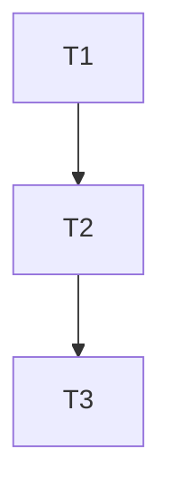

# Plan Executor

## Instructions

### 1. 读取输入

- 扫描 `.cursor/.lingxi/requirements/` 目录
- 查找 `<taskId>.req.*.md` 文件（如 `001.req.*.md`）
- 如果找不到文件，提示用户并提供解决方案
- 识别需求类型（前端/后端/全栈）和复杂度

### 2. 理解 req 文档内容并生成 plan 所需内容

读取 req 文档全文，使用 LLM 理解文档结构和内容，基于理解生成 plan 所需的内容：

#### 2.1 目标回放生成

基于 req 文档的以下部分理解生成：

- **"1. 概述"**：
  - 1.1 背景：理解业务驱动和需求来源
  - 1.2 问题描述：理解要解决的问题和痛点
  - 1.3 解决方案概述：理解技术选型、架构思路和关键技术点
- **"2. 目标与指标"**：
  - 2.1 目标：提取核心目标（G1, G2, ...）
  - 2.2 非目标：理解明确排除的范围
  - 2.3 成功标准：提取可验证的成功标准

**生成方式**：总结和提炼 req 中的核心目标、成功标准和关键约束，形成简洁的目标回放。

#### 2.2 任务清单生成

基于 req 文档的"4. 功能需求"表格理解生成：

- 读取功能需求表格（F1, F2, ...）
- 分析每个功能需求的：
  - 需求描述：理解功能点
  - 实现方案：提取关键文件路径和实现模式（如存在）
  - 验收标准：理解验收要求
  - 优先级：识别优先级
- 将功能需求拆解为可执行任务（T1, T2, ...）
- 识别任务间的依赖关系
- 从"实现方案"列提取文件路径信息（如存在），用于文件变更清单

**生成方式**：分析功能需求，识别依赖关系，将功能需求拆解为可执行任务。

#### 2.3 测试用例基础生成

基于 req 文档的"10. 验收检查清单"理解生成：

- 读取验收检查清单
- 分析每个验收标准
- 将验收标准转化为可测试行为
- 识别适合单元测试的行为（纯逻辑、服务层、工具函数）
- 过滤掉 UI 交互、API 集成、视觉效果等（留给集成测试/手工验证）

**生成方式**：分析验收标准，提取可测试行为，为后续测试设计提供基础。

**注意事项**：

- 如果 req 文档结构不规范或缺少某些章节，应该能够优雅降级（提示用户或使用默认逻辑）
- 理解过程应该准确，特别是功能需求表格的解析
- 生成的内容应该与 req 文档的语义保持一致

### 3. 代码库分析（复杂需求必选）

在任务拆解前，分析代码库获取相关上下文：

**触发条件**（满足任一）：

- 需求涉及存量系统/多服务协作
- 需要修改多个模块
- 涉及与现有代码的集成

**分析内容**：

- 使用 `service-loader` 补齐服务上下文
- 使用 SemanticSearch/Grep 定位相关代码
- 识别需要修改的现有文件和模块
- 分析依赖关系和影响范围

**输出要求**：

- 将分析结果融入"文件变更清单"
- 在任务描述中引用具体文件路径
- 复杂需求必须执行此步骤，简单需求可静默跳过

### 4. 补齐服务上下文（推荐，复杂需求必选）

如果需求涉及存量系统/多服务协作，参考 `service-loader` 补齐服务上下文：

- 生成/更新 `.cursor/.lingxi/context/tech/services/<service>.md`
- 只写"概要 + 指针 + 常见坑"，避免长文档膨胀

### 5. 澄清性问题（复杂需求必选）

在开始任务拆解前，分析 req 是否存在以下不清晰点：

| 检查维度 | 检查内容              | 示例问题                                   |
| -------- | --------------------- | ------------------------------------------ |
| 边界不清 | 功能边界、影响范围    | "这个功能是否需要支持移动端？"             |
| 方案未定 | 存在多个可行方案      | "用 A 方案还是 B 方案？各有什么优劣？"     |
| 依赖不明 | 与其他模块/系统的依赖 | "这个功能需要调用哪些现有服务？"           |
| 约束缺失 | 性能/安全/兼容性约束  | "对响应时间有要求吗？需要支持哪些浏览器？" |
| 验收模糊 | 成功标准不明确        | "什么样的结果算成功？"                     |

**输出格式**：

如有澄清性问题，先输出问题列表，等待用户回答后再继续任务拆解。

**静默跳过**：如果 req 已经足够清晰（简单需求），则静默跳过此步骤。

### 6. 外部知识放大（推荐）

在生成任务拆解前，针对具体技术实现进行深入调研：

**触发条件**（满足任一即触发）：

- 任务涉及第三方库/API 的使用
- 需要选择多个技术方案中的一个
- 实现细节存在不确定性

**调研工具分工**：

| 场景            | 工具         | 调研内容                                    |
| --------------- | ------------ | ------------------------------------------- |
| 方案选型/对比   | WebSearch    | "X vs Y 2024/2025"、"best practice for X"   |
| 具体库用法      | MCP context7 | 获取库的最新文档、API 说明、代码示例        |
| 常见报错/兼容性 | WebSearch    | "X common issues"、"X with Y compatibility" |

**输出要求**：

- 调研结果不单独写入
- 将最佳实践融入"任务清单"的具体步骤描述
- 将已知坑点融入"复利候选"或直接规避

**注意**：req 阶段做广度调研，plan 阶段做深度调研。

### 7. 规范引用

生成任务时，检查项目是否有相关质量资产（通过 experience-index 匹配团队级标准/经验和项目级经验），在任务描述中明确引用。

### 8. 任务拆解

#### 8.1 任务分类

根据需求类型组织任务（测试任务必选）：

| 需求类型 | 任务分类                                   |
| -------- | ------------------------------------------ |
| 纯前端   | 组件任务、状态任务、样式任务、**测试任务** |
| 纯后端   | API 任务、服务任务、数据任务、**测试任务** |
| 全栈     | 后端任务、前端任务、集成任务、**测试任务** |

#### 8.2 任务依赖

- 标注任务间的依赖关系（如 `依赖: T1, T2`）
- 确定执行顺序：优先实现被依赖项

#### 8.3 文件变更清单

每个任务明确列出需要创建/修改的文件：

```markdown
- [ ] T1: 实现用户服务
  - 创建: `src/services/user.ts`
  - 修改: `src/services/index.ts`
```

### 9. 测试设计（强化）

#### 9.1 行为提取

从需求中提取可测试行为：

- 只提取适合单元测试的行为（纯逻辑、服务层、工具函数）
- 过滤掉 UI 交互、API 集成、视觉效果等（留给集成测试/手工验证）
- 不发明或推断未明确说明的行为

#### 9.2 测试规格

对每个可测试行为，定义结构化规格：

| 行为         | 输入                    | 预期输出 | 边界/错误条件      |
| ------------ | ----------------------- | -------- | ------------------ |
| B1: 计算折扣 | price=100, discount=0.1 | 90       | discount<0 抛错    |
| B2: 验证邮箱 | "test@example.com"      | true     | 空字符串返回 false |

#### 9.3 测试类型选择

| 验证类型 | 适用场景                    | 内容要求                         |
| -------- | --------------------------- | -------------------------------- |
| 单元测试 | 纯函数、服务逻辑、工具函数  | 测试文件路径、输入/输出/边界条件 |
| 集成测试 | API、多模块协作、数据库操作 | 测试场景、预期结果、Mock 范围    |
| 手工验证 | UI 交互、视觉效果、用户体验 | 操作步骤、预期行为               |

### 10. 测试框架检测与安装

**多层检测策略**：

1. 检查 `package.json` 的 `devDependencies`（jest, vitest, mocha, jasmine 等）
2. 检查项目根目录的测试配置文件（`jest.config.js`, `vitest.config.ts`, `mocha.opts` 等）
3. 检查测试目录结构（`tests/`, `__tests__/`, `test/`, `spec/` 等）
4. 检查测试文件模式（`*.test.js`, `*.spec.ts`, `*.test.tsx` 等）

**检测结果处理**：

- 如果检测到现有框架：记录框架类型和配置，在 plan 中说明将使用该框架
- 如果未检测到框架：
  - 检查依赖冲突：检查 `package.json` 是否有冲突依赖
  - 安装 vitest：`yarn add -D vitest` 或 `npm install -D vitest`
  - 创建配置文件：`vitest.config.ts`（按最佳实践）
  - 创建测试目录：`tests/unit/`, `tests/integration/`
  - 更新 `package.json` 的 `scripts.test`
  - 验证安装：执行 `yarn test` 或 `npm test` 验证框架是否正常工作

**冲突处理**：

- 如果检测到依赖冲突：提示用户，不自动安装，在 plan 中标记需要手动处理

**注意**：经验捕获由 `experience-capture` Skill 统一处理，本 Skill 不包含经验捕获逻辑。

### 11. Plan 文档写入

#### Plan 文档模板

```markdown
# 001.plan.<标题>

| 属性     | 值                |
| -------- | ----------------- |
| 关联需求 | 001.req.<标题>.md |
| 创建日期 | {DATE}            |

---

## 1. 目标回放

<!-- 基于 req 文档的概述和目标部分理解生成 -->

---

## 2. 任务清单

| 序号 | 任务描述 | 依赖任务 | 预估耗时 | 状态   |
| ---- | -------- | -------- | -------- | ------ |
| T1   | ...      | -        | 30min    | 待开始 |
| T2   | ...      | T1       | 1h       | 待开始 |

**状态说明**：待开始 / 进行中 / 已完成 / 已跳过

---

## 3. 依赖关系图



---

## 4. 执行顺序

1. T1: ...
2. T2: ...（依赖 T1）
3. T3: ...（依赖 T2）

---

## 5. 技术调研结果

<!-- 深度调研结果，补充 req 中的广度调研 -->

---

## 6. 文档同步清单

| 文档路径    | 变更类型 | 变更说明       |
| ----------- | -------- | -------------- |
| docs/api.md | 更新     | 添加新接口说明 |

---

## 7. 测试策略

- 单元测试覆盖：T1, T2
- 集成测试覆盖：T3
- 详见：001.testcase.<标题>.md
```

#### 文档命名约定

- Plan 文档：`001.plan.<标题>.md`（标题 10 字以内，从 req 文档标题提取）

### 12. Testcase 文档写入

#### Testcase 文档模板

```markdown
# 001.testcase.<标题>

| 属性     | 值                |
| -------- | ----------------- |
| 关联需求 | 001.req.<标题>.md |
| 关联规划 | 001.plan.<标题>.md |
| 创建日期 | {DATE}            |

---

## 1. 测试范围

### 1.1 覆盖的功能需求

| 需求编号 | 需求描述 | 测试用例编号 |
|---------|---------|-------------|
| F1      | ...     | TC-001, TC-002 |

### 1.2 不覆盖的范围

- ...

---

## 2. 单元测试用例

### TC-001: <测试场景名称>

**前置条件**：
- ...

**测试数据**：
```json
{
  "input": ...,
  "expected": ...
}
```

**测试步骤**：

1. ...
2. ...

**预期结果**：

- ...

**边界条件**：

- 空输入：...
- 超大输入：...
- 特殊字符：...

---

## 3. 集成测试用例

### TC-010: <集成场景名称>

**前置条件**：

- ...

**测试步骤**：

1. ...

**预期结果**：

- ...

---

## 4. 端到端测试用例（如适用）

### E2E-001: <测试场景名称>
- **场景描述**：简要描述要验证的用户流程
- **前置条件**：
  - 服务器运行在：`http://localhost:3000`
  - 测试数据准备：...
- **测试步骤**：
  1. 导航到 `/login`
  2. 输入邮箱：`user@example.com`
  3. 输入密码：`password123`
  4. 点击"登录"按钮
  5. 验证跳转到 `/dashboard`
- **验证点**：
  - URL 变更：`/login` → `/dashboard`
  - 页面元素：存在用户头像元素（`.user-avatar`）
  - 文本匹配：页面包含"欢迎"文本
  - 网络请求：POST `/api/login` 返回 200
- **预期结果**：用户成功登录，跳转到仪表盘页面

---

## 5. 测试数据准备

| 数据名称  | 数据内容 | 用途        |
| --------- | -------- | ----------- |
| mock_user | {...}    | 用于 TC-001 |
```

#### 文档命名约定

- Testcase 文档：`001.testcase.<标题>.md`（标题 10 字以内，从 req 文档标题提取）

### 13. Plan 质量自检

写入前检查：

- [ ] 覆盖 req 中的所有功能需求
- [ ] 每个验收标准有对应的验证方式
- [ ] 任务可独立执行，依赖关系明确
- [ ] 文件变更清单完整（包含测试文件）
- [ ] 测试任务作为独立分类存在
- [ ] 可测试行为已从需求中提取
- [ ] 单元测试规格包含输入/输出/边界条件
- [ ] 复杂任务有规范引用

### 14. 文档同步清单检测

检测项目中现有的技术方案文档、设计文档：

- 扫描项目目录（`docs/`, `design/`, `architecture/` 等）
- 识别可能受本次改动影响的文档
- 在 plan 中列出需同步的文档列表，作为任务的一部分

---

## 使用场景

### 场景 1：简单前端需求

用户输入：`/plan 001`

执行流程：
1. 读取 req 文件
2. 理解 req 文档内容并生成 plan 所需内容
3. 代码库分析（静默跳过，简单需求）
4. 澄清性问题（静默跳过，需求清晰）
5. 外部知识放大（可选）
6. 任务拆解（组件任务、样式任务、测试任务）
7. 测试设计
8. 测试框架检测
9. 文档生成（plan + testcase）

### 场景 2：复杂全栈需求

用户输入：`/plan 001`

执行流程：
1. 读取 req 文件
2. 理解 req 文档内容并生成 plan 所需内容
3. 代码库分析（必选）
4. 补齐服务上下文（必选）
5. 澄清性问题（必选）
6. 外部知识放大（推荐）
7. 任务拆解（后端任务、前端任务、集成任务、测试任务）
8. 测试设计（强化）
9. 测试框架检测与安装
10. 文档生成（plan + testcase）

---

## 注意事项

1. **经验捕获**：经验捕获由 `experience-capture` Skill 统一处理，本 Skill 不包含经验捕获逻辑
2. **静默原则**：简单需求静默跳过部分步骤，复杂需求必须执行所有步骤
3. **测试设计**：必须从需求中提取可测试行为，不发明未明确说明的行为
4. **文档质量**：生成的 plan 和 testcase 文档必须完整、准确

---

## 与 Commands 的协作

本 Skill 由 `/plan 001` 命令自动激活，执行逻辑完全由本 Skill 负责。Commands 只负责参数解析和产物说明。

---

## 参考

- **原 plan.md 命令**：`.cursor/commands/plan.md`（备份在 `.cursor/commands-backup/plan.md`）
- **经验捕获**：`.cursor/skills/experience-capture/SKILL.md`
- **经验匹配**：`.cursor/skills/experience-index/SKILL.md`
- **服务加载**：`.cursor/skills/service-loader/SKILL.md`
