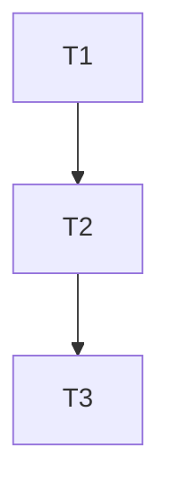

# 001.plan.<标题>

| 属性     | 值                |
| -------- | ----------------- |
| 关联需求 | 001.req.<标题>.md |
| 创建日期 | {DATE}            |

---

## 1. 目标回放

<!-- 基于 req 文档的概述和目标部分理解生成 -->

---

## 2. 任务清单

| 序号 | 任务描述 | 依赖任务 | 预估耗时 | 状态   |
| ---- | -------- | -------- | -------- | ------ |
| T1   | ...      | -        | 30min    | 待开始 |
| T2   | ...      | T1       | 1h       | 待开始 |

**状态说明**：待开始 / 进行中 / 已完成 / 已跳过

---

## 3. 依赖关系图

---

## 4. 执行顺序

1. T1: ...
2. T2: ...（依赖 T1）
3. T3: ...（依赖 T2）

---

## 5. 技术调研结果

<!-- 深度调研结果，补充 req 中的广度调研 -->

---

## 6. 文档同步清单

| 文档路径    | 变更类型 | 变更说明       |
| ----------- | -------- | -------------- |
| docs/api.md | 更新     | 添加新接口说明 |

---

## 7. 测试策略

- 单元测试覆盖：T1, T2
- 集成测试覆盖：T3
- 详见：001.testcase.<标题>.md
