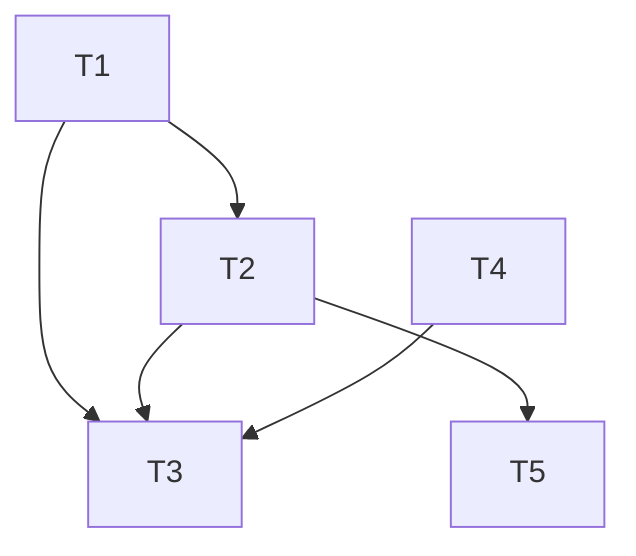

# 002.plan.灵犀卸载脚本

| 属性     | 值                         |
| -------- | -------------------------- |
| 关联需求 | 002.task.灵犀卸载脚本.md   |
| 创建日期 | 2026-03-06                 |

---

## 1. 目标回放

- **G1**：用户通过 `lx:uninstall` 彻底清除灵犀核心文件与运行文件，卸载后无残留。
- **G2**：卸载脚本在 scripts 目录，随安装程序安装到用户项目；卸载范围由安装清单/SSoT 确定。
- **G3**：灵犀提供的脚本统一使用 `lx:` 前缀。
- **G4**：脚本可安全执行（确认或 --yes）。
- **非目标**：不提供卸载前自动备份或数据恢复。

实施要点：以现有 `install/install-manifest.json` 为 SSoT 扩展「安装到用户项目的 scripts 路径」与「package.json scripts 注册项」；卸载脚本读取该清单（或安装时写入用户项目的副本）按清单删除，仅删清单内路径。

---

## 2. 任务清单

| 序号 | 任务描述 | 关联需求 | 依赖任务 | 预估耗时 | 状态   |
| ---- | -------- | -------- | -------- | -------- | ------ |
| T1   | 扩展 install-manifest.json：增加 scripts 数组（要复制到用户项目 scripts/ 的文件列表）及 packageScripts（要写入用户 package.json 的 scripts 键），供安装与卸载共用 | F1, F2, F4, F5 | - | 20min | 待开始 |
| T2   | 在仓库 scripts/ 下实现 lx-uninstall.mjs：读取清单、解析删除列表（.lingxi 整树 + 清单内 plugin 路径 + 清单内 scripts 路径）、--yes 或交互确认、按序删除 | F3, F4, F6 | T1 | 1h | 待开始 |
| T3   | 修改安装脚本（bash.sh / powershell.ps1）：安装时复制 manifest 中 scripts 到用户 scripts/，并合并 packageScripts 到用户 package.json | F1, F2 | T1, T2 | 40min | 待开始 |
| T4   | 仓库内灵犀脚本统一 lx: 前缀：package.json 中 scripts 改为 lx:*，脚本文件名改为 lx-*（如 lx-bootstrap 与 workspace-bootstrap 对齐由 T4 或后续处理） | F5 | - | 30min | 待开始 |
| T5   | 文档：install/README 与主 README 增加「卸载」小节，说明 lx:uninstall 用法及 --yes | F7 | T2 | 15min | 待开始 |

**说明**：F5 要求「已有非 lx 前缀脚本需在本次或后续改为 lx: 前缀」；若 workspace-bootstrap 当前由 init 调用且未作为独立 npm script 暴露，T4 可仅覆盖仓库根 package.json 的 scripts 与本次新增的 lx-uninstall；安装程序写入用户项目的 script 名为 lx:uninstall。

---

## 3. 依赖关系图

（T4 与 T2 可并行；T3 依赖 T1 与 T2 就绪；T5 依赖 T2 行为稳定以便文档描述。）

---

## 4. 执行顺序

1. **T1**：扩展 install-manifest.json（scripts、packageScripts），确定卸载时读取清单的位置（安装时复制到用户项目如 `install/install-manifest.json`，供 lx-uninstall.mjs 读取）。
2. **T2**：实现 scripts/lx-uninstall.mjs（读清单、建删除列表、确认/--yes、删除 .lingxi 与清单路径）。
3. **T4**：仓库 package.json 与灵犀相关脚本改为 lx: 前缀（可与 T2 并行）。
4. **T3**：安装脚本增加复制 scripts、写入 packageScripts 到用户 package.json。
5. **T5**：更新 install/README 与主 README 的卸载说明。

---

## 5. 技术调研结果

- 现有 `install/install-manifest.json` 已包含 commands、skills、hooks、agents、references、workflowDirectories、gitignoreEntries；无 `scripts` 与 package.json 脚本注册。扩展方式：增加 `"scripts": ["lx-uninstall.mjs"]`（或带路径），以及 `"packageScripts": { "lx:uninstall": "node scripts/lx-uninstall.mjs" }`。
- 卸载脚本需在用户项目根执行，清单路径为相对项目根；安装时可将 manifest 复制到用户项目固定位置（如 `install/install-manifest.json`），lx-uninstall.mjs 通过 `process.cwd()` 或环境变量定位项目根后读取该文件。
- 删除顺序建议：先删 .lingxi（运行数据），再按清单删 plugin 下各路径及 scripts 下文件，避免目录非空导致删父目录失败；可先删叶子文件再删目录，或对目录做递归删除。

---

## 6. 文件变更清单

| 文件路径 | 变更类型 | 关联任务 | 说明 |
| -------- | -------- | -------- | ---- |
| install/install-manifest.json | 更新 | T1 | 增加 scripts、packageScripts |
| scripts/lx-uninstall.mjs | 新增 | T2 | 卸载主脚本 |
| install/bash.sh | 更新 | T3 | 复制 scripts、写 package.json |
| install/powershell.ps1 | 更新 | T3 | 同上 |
| package.json | 更新 | T4 | scripts 改为 lx:* |
| install/README.md | 更新 | T5 | 卸载小节 |
| README.md / README_ZH.md | 更新 | T5 | 卸载说明（若有安装章节则补充） |

---

## 7. 测试策略

- **集成/手工**：安装到临时目录 → 执行 lx:uninstall → 检查 .lingxi 与清单路径已删除、清单外保留（对应 F3、F4、F6）。
- **手工**：yarn lx:uninstall 与 npm run lx:uninstall 均可触发（F2）；无 --yes 时提示确认（F6）；文档可找到卸载命令（F7）。
- **Rubric**：用户项目 package.json 中灵犀相关 scripts 均为 lx:*（F5）。
- 详见：002.testcase.灵犀卸载脚本.md

---

## 8. F→T 映射

| 需求 | 任务 |
| ---- | ---- |
| F1 | T1, T2, T3 |
| F2 | T1, T3 |
| F3 | T2 |
| F4 | T1, T2 |
| F5 | T4, T3 |
| F6 | T2 |
| F7 | T5 |
