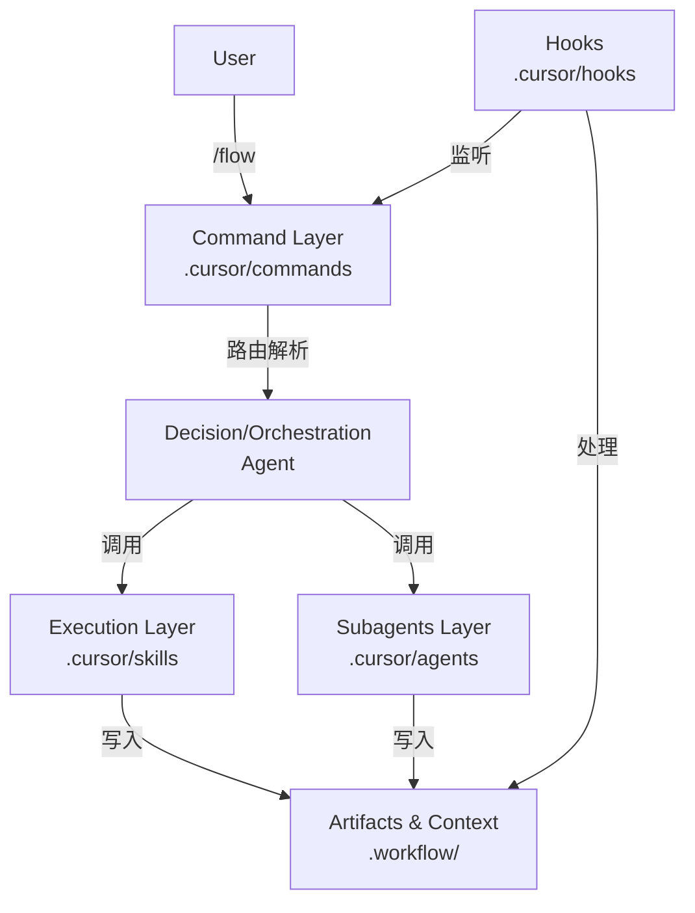
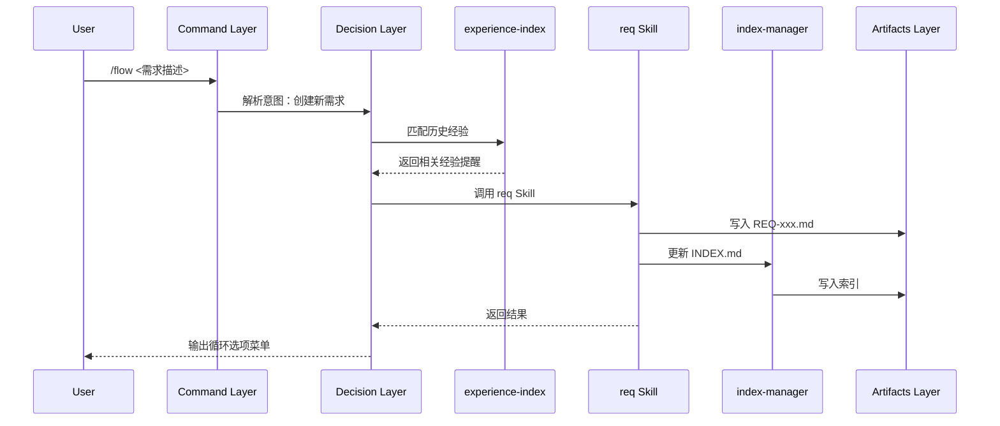
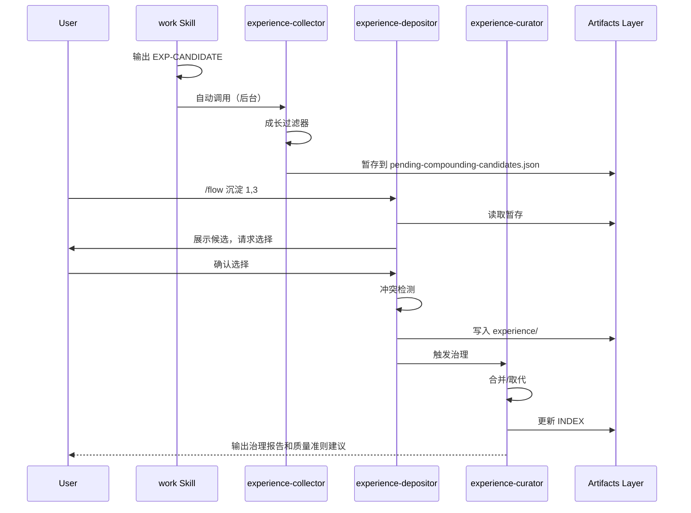
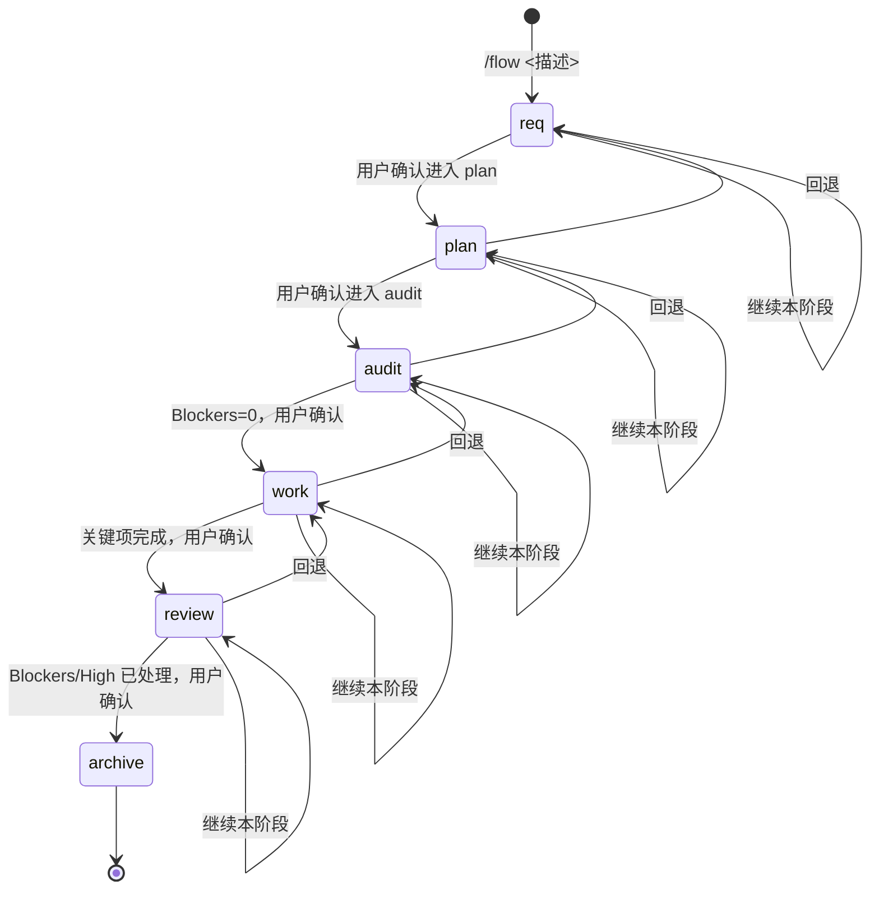

# 架构概览

## 分层架构

cursor-workflow 采用分层架构设计，从用户输入到底层存储，每一层都有明确的职责和边界。



## 各层职责

### 1. Command Layer（命令层）

**位置**：`.cursor/commands/`

**职责**：
- 提供单入口命令 `/flow`
- 解析用户意图（创建需求/继续需求/沉淀确认/质量准则采纳）
- 定义命令协议和产物约定

**组件**：
- `flow.md`：主入口命令，状态机路由，人工闸门协议
- `remember.md`：可选即时沉淀入口（兼容）

**关键特性**：
- **Single Entrypoint**：只用 `/flow` 一个入口
- **状态机路由**：根据 INDEX 和 plan 状态决定进入哪个阶段
- **人工闸门**：阶段推进必须用户确认

### 2. Decision/Orchestration Layer（决策/编排层）

**位置**：Agent 主流程

**职责**：
- 读取索引和产物，判断当前阶段
- 在进入阶段前调用 `experience-index` 匹配历史经验
- 根据阶段调用对应的 Skill
- 管理阶段推进和人工闸门

**关键流程**：
1. 解析 `/flow` 命令参数
2. 读取 `.workflow/requirements/INDEX.md` 获取状态
3. 调用 `experience-index` 匹配相关经验
4. 根据阶段调用对应 Skill（req/plan/audit/work/review/archive）
5. 输出循环选项菜单，等待用户选择

### 3. Subagents Layer（子代理层）

**位置**：`.cursor/agents/`

**职责**：
- 隔离上下文的辅助执行者
- 后台静默处理，减少主对话干扰
- 前台处理用户确认的请求

**组件**：

#### experience-collector
- **模式**：`is_background: true`
- **触发**：检测到 EXP-CANDIDATE 注释时自动调用
- **职责**：
  - 解析 EXP-CANDIDATE JSON
  - 应用成长过滤器
  - 暂存到 `.workflow/context/session/pending-compounding-candidates.json`
- **特点**：静默处理，不干扰主对话

#### experience-depositor
- **模式**：`is_background: false`
- **触发**：用户执行 `/flow 沉淀 ...` 或 `/remember ...`
- **职责**：
  - 读取暂存候选
  - 展示候选，请求用户选择
  - 冲突检测
  - 写入经验库
  - 触发 curator 进行治理

### 4. Execution Layer（执行层）

**位置**：`.cursor/skills/`

**职责**：
- 承载阶段 Playbook（高质量模板、检查清单、写入规范）
- 提供底座能力（索引管理、计划管理、经验检索等）
- 提供工具能力（服务加载、上下文工程、规则创建等）

**分类**：

#### 阶段 Skills
- `req`：需求澄清与定义
- `plan`：任务拆解与计划
- `audit`：技术审查与风险评估
- `work`：实现与验证
- `review`：多维度审查
- `archive`：归档

#### 底座 Skills
- `flow-router`：路由 `/flow` 命令到对应阶段
- `index-manager`：维护 INDEX 一致性
- `plan-manager`：管理 plan 作为执行账本
- `experience-index`：匹配历史经验
- `experience-curator`：经验治理（合并/取代）
- `experience-depositor`：经验写入

#### 工具 Skills
- `service-loader`：生成服务上下文
- `context-engineering`：上下文组织原则
- `rules-creator`：规则创建流程

### 5. Artifacts & Long-term Context（产物与长期上下文层）

**位置**：`.workflow/`

**职责**：
- 存储需求三件套（REQ.md、REQ.plan.md、REQ.review.md）
- 存储长期经验库（experience/）
- 存储服务上下文（tech/services/）
- 存储会话暂存（session/）

**结构**：

```
.workflow/
├── requirements/
│   ├── INDEX.md              # SSoT：需求状态索引
│   ├── in-progress/          # 进行中的 REQ 三件套
│   └── completed/            # 已完成归档三件套
├── context/
│   ├── experience/           # 长期经验库 + INDEX
│   ├── tech/
│   │   └── services/        # 服务上下文
│   ├── business/             # 业务边界（可选）
│   └── session/              # 会话暂存
└── workspace/                # 临时工作区
```

**关键特性**：
- **SSoT 机制**：INDEX.md 是需求状态的单一事实源
- **Confirm-only**：experience/ 写入需要用户确认
- **位置即语义**：目录结构反映数据语义

### 6. Hooks Layer（钩子层）

**位置**：`.cursor/hooks/` 和 `.cursor/hooks.json`

**职责**：
- 提供自动门控（输入校验、REQ 存在性检查）
- 提供候选提醒（stop 时 followup）
- 提供自动归档（completed 状态自动归档）

**组件**：

#### before-submit-prompt
- **时机**：提交提示前
- **职责**：
  - `/flow` 空参数拦截
  - 指定 REQ 不存在则拦截

#### stop
- **时机**：对话结束时
- **职责**：
  - 检测 pending candidates，输出 followup 提醒
  - 自动归档 completed 状态的 REQ

#### audit-after-shell-execution
- **时机**：Shell 执行后
- **职责**：记录审计日志（可选）

## 数据流

### 需求创建流程



### 经验沉淀流程



## 控制流

### 阶段推进流程



### 人工闸门机制

每个阶段推进都需要：

1. **输出循环选项菜单**：
   ```
   A) 继续本阶段
   B) 进入下一阶段（等待确认）
   C) 回退到上一阶段
   D) 退出
   ```

2. **质量闸门**：在阶段切换前给出"可推进判据"
   - req → plan：Requirement 已写入，关键缺失项=0
   - plan → audit：plan 含 Tasks/Validation/Worklog
   - audit → work：Blockers=0，技术风险已评估
   - work → review：Deliverables 关键项完成
   - review → archive：Blockers/High 已处理

3. **用户确认**：等待用户明确选择

## 目录约定（位置即语义）

### .cursor/ 目录

```
.cursor/
├── agents/              # Subagents（后台/前台辅助执行者）
├── commands/            # 入口命令（单入口 /flow）
├── rules/               # 规则（常驻约束，部分 alwaysApply）
├── skills/              # 阶段 Playbook（Nightly Agent Skills）
├── hooks.json           # Hook 注册
└── hooks/               # Hook 脚本（Node.js）
```

### .workflow/ 目录

```
.workflow/
├── requirements/
│   ├── INDEX.md         # 需求状态索引（SSoT）
│   ├── in-progress/     # 进行中的 REQ 三件套
│   └── completed/       # 已完成归档三件套
├── context/
│   ├── experience/      # 长期经验库 + INDEX（confirm-only）
│   ├── tech/
│   │   └── services/    # 服务/模块上下文
│   ├── business/        # 业务边界/协作上下文（可选）
│   └── session/         # 会话暂存（checkpoint、pending candidates）
└── workspace/           # 临时工作区（默认 gitignore）
```

**设计原则**：
- **位置即语义**：目录结构反映数据语义
- **SSoT 机制**：INDEX.md 是状态的单一事实源
- **分层存储**：区分长期知识（experience/）和会话暂存（session/）

## 组件交互

### 典型交互场景

1. **需求创建**：
   - User → Command → Decision → experience-index → req Skill → index-manager → Artifacts

2. **经验捕获**：
   - work Skill → EXP-CANDIDATE → experience-collector（后台）→ Artifacts（暂存）

3. **经验沉淀**：
   - User → Command → experience-depositor → Artifacts（写入）→ experience-curator → Artifacts（治理）

4. **阶段推进**：
   - User → Command → Decision → 对应 Skill → Artifacts → Decision → User（菜单）

### 关键接口

- **INDEX.md**：SSoT，所有组件都读取/更新它
- **pending-compounding-candidates.json**：experience-collector 写入，experience-depositor 读取
- **EXP-CANDIDATE**：Skills 输出，experience-collector 解析
- **循环选项菜单**：Decision Layer 输出，User 选择

## 扩展点

系统设计时预留了以下扩展点：

1. **新增阶段**：在 `.cursor/skills/` 添加新 Skill，在 `flow-router` 注册
2. **新增 Skill**：遵循 Skill 规范，在对应目录创建
3. **新增 Hook**：在 `.cursor/hooks/` 创建脚本，在 `hooks.json` 注册
4. **新增 Rule**：在 `.cursor/rules/` 创建，遵循命名规范

详见 [扩展指南](../04-maintenance/extension-guide.md)。
