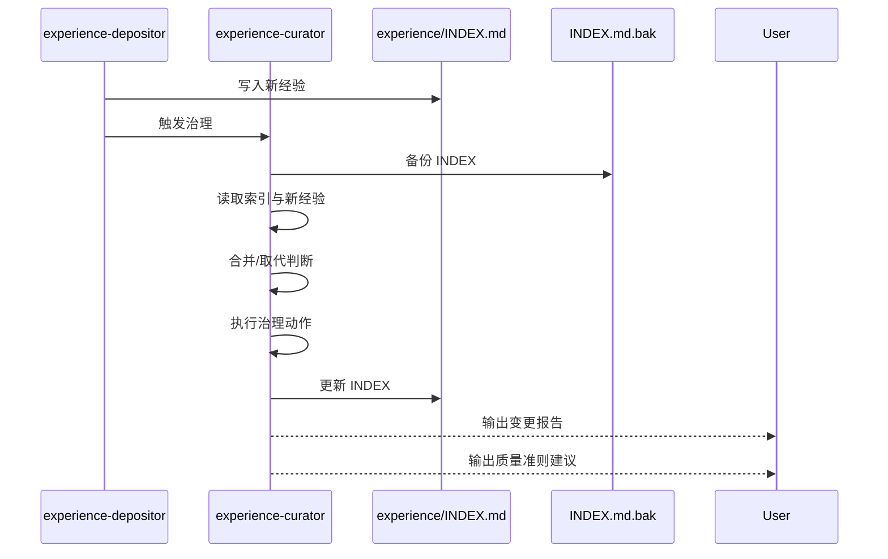

# 经验治理机制设计

## 概述

经验治理机制确保经验库保持精炼和高质量，通过自动合并、取代和谱系管理，让经验会演化而不是无限堆积。

## 触发时机

当 `experience-depositor` **实际新增**了经验文件后，必须自动触发 `experience-curator` 进行治理。

## 治理流程



## 合并/取代判断规则

### 判断优先级（从高到低）

| 优先级 | 条件 | 动作 |
|--------|------|------|
| 1 | **Tag 相同** | 必定合并/取代（新覆盖旧） |
| 2 | **Decision being made 相同/高度相似** | 候选合并/取代（同一判断单元的升级/补全） |
| 3 | **Trigger 关键词重叠 ≥ 60%** | 候选合并（同主题重复） |
| 4 | **Title 语义高度相似** | 候选取代（新经验是旧经验升级版） |

### 关键词重叠计算

```
overlap = |keywords(new) ∩ keywords(old)| / |keywords(old)|
```

如果 `overlap ≥ 0.6`，则认为高度相似，建议合并。

## 治理动作

### 合并（多条 → 1 条）

当检测到重复或高度相似的经验时：

1. **保留新经验**作为"主经验"
2. **旧经验** `Status` 改为 `deprecated`
3. **旧经验** `ReplacedBy` 填入新经验 Tag
4. **新经验** `Replaces` 追加旧经验 Tag（逗号分隔）
5. **新经验** `Scope` 取更 broad 的值（narrow < medium < broad）
6. **新经验** `Strength` 取更高的值（hypothesis < validated < enforced）

### 取代（新覆盖旧）

当新经验是旧经验的升级版时：

1. **旧经验** `Status` 改为 `deprecated`
2. **旧经验** `ReplacedBy` 填入新经验 Tag
3. **新经验** `Replaces` 追加旧经验 Tag

### 谱系管理

通过 `Replaces` 和 `ReplacedBy` 字段建立经验谱系链：

- **Replaces**：本经验取代了哪些旧经验（谱系链：新 → 旧）
- **ReplacedBy**：本经验被哪条新经验取代（谱系链：旧 → 新）

**目的**：
- 保持可追溯性：可以从新经验找到被取代的旧经验
- 支持回滚：如果需要，可以恢复旧经验

## 自动治理流程

### 0) 备份索引（回滚准备）

在执行任何治理动作前，必须先备份：

```bash
cp .workflow/context/experience/INDEX.md .workflow/context/experience/INDEX.md.bak
```

### 1) 读取索引与新经验

- 读取 `INDEX.md` 中所有 `Status = active` 的经验
- 识别本轮新增的经验（从对话上下文获取）
- 读取本轮新增经验文件内容，确保包含并可提取：
  - `Decision Shape`（Decision being made / Alternatives rejected / Discriminating signal）
  - `Judgment Capsule`（I used to think / Now I believe / decisive variable）
  - `Surface signal` / `Hidden risk`（来自 INDEX；若缺失则提示在后续补齐）

### 2) 合并/取代判断

对每条新经验，遍历现有 `active` 经验，按优先级判断：

1. Tag 相同 → 必定合并/取代
2. Decision being made 相同/高度相似 → 候选合并/取代
3. Trigger 关键词重叠 ≥ 60% → 候选合并
4. Title 语义高度相似 → 候选取代

### 3) 自动执行治理动作

根据判断结果执行：

- **合并**：更新 INDEX（Replaces/ReplacedBy/Status），合并 Scope/Strength
- **取代**：更新 INDEX，建立谱系关系

### 4) 输出变更报告

执行完成后，必须输出结构化变更报告：

```markdown
## 成长循环：治理报告

### 执行动作
| 类型 | 新经验 | 旧经验 | 理由 |
|---|---|---|---|
| 合并 | EXP-003 | EXP-001 | Trigger 关键词重叠 75%，主题高度相似 |
| 取代 | EXP-004 | EXP-002 | 新经验是旧经验的升级版（更完整/更准确） |

### 影响范围
- INDEX 变更行数：2
- deprecated 经验数：2
- 涉及文件：EXP-001.md, EXP-002.md（状态变更，内容未删除）

### 回滚方式
如需撤销本次治理，执行：
```bash
cp .workflow/context/experience/INDEX.md.bak .workflow/context/experience/INDEX.md
```
```

## 质量准则提炼

### 触发条件

治理完成后，基于本轮新增经验，提炼 1-3 条"质量准则建议"。

### 提炼原则

- **优先从 Judgment Capsule 抽象**：而不是复述案例步骤
- **决策记录摘要**：决策点/备选方案/选择理由/关键判据
- **若 Capsule 缺失/质量差**：优先提示"需要补齐 Decision Shape/Capsule"，不要强行输出泛化口号
- **如果某类问题反复出现**（Trigger 相似的经验 ≥ 2 条），优先建议升级为自动拦截
- **优先选择已存在的规则**（插入），避免创建过多新规则

### 输出格式

```markdown
## 成长循环：质量准则建议（需人工采纳）

以下建议从近期沉淀中提炼，采纳后将由 `rules-creator` Skill 创建规则。
请使用 `/flow 采纳质量准则 <序号>` 采纳，或 `/flow 忽略质量准则` 跳过。

| # | 建议 | Type | Scope | 目标规则 |
|---|------|------|-------|----------|
| 1 | 涉及用户数据的变更必须有审计日志 | always | security | qs-always-security |
| 2 | 跨服务调用应先检查超时配置 | i | backend | qs-i-backend |
| 3 | 组件必须定义 Props 类型 | fs | frontend | qs-fs-frontend |

建议写法（建议本身应当是"判断结构"）：
- Surface signal：...
- Hidden risk：...
- Decisive variable：...
- Boundary（不适用条件）：...
```

### 类型与 Scope

每条建议必须指定：

- **Type**：`always`（常驻约束）/ `fs`（文件系统相关）/ `i`（接口相关）/ `m`（模块相关）
- **Scope**：规则适用范围（如 `security`、`backend`、`frontend`）
- **目标规则**：`qs-{type}-{scope}`

## 人工闸门

### 治理动作（自动执行）

- **合并/取代**：自动执行，无需人工审核
- **备份**：自动执行
- **INDEX 更新**：自动执行

### 质量准则建议（仅建议）

- **不得自动写入**：必须等用户 `/flow 采纳质量准则` 或 `/flow 忽略质量准则`
- **明确标注为建议**：不是强制要求

## 禁止事项

- **删除任何经验文件**：只做 `deprecated` 标记，不删除文件
- **自动写入质量准则建议**：必须等用户确认
- **在没有备份的情况下修改 INDEX**：必须先备份

## 回滚机制

### 回滚方式

如需撤销本次治理，执行：

```bash
cp .workflow/context/experience/INDEX.md.bak .workflow/context/experience/INDEX.md
```

### 回滚限制

- 只能回滚 INDEX 的变更
- 已 deprecated 的经验文件不会被恢复（但文件仍然存在，可以手动恢复）
- 质量准则建议的采纳无法回滚（需要手动撤销）

## 总结

经验治理机制通过以下设计保证了经验库的质量和可维护性：

- **自动治理**：合并重复、取代过时，保持经验库精炼
- **谱系管理**：建立可追溯的经验关系链
- **备份机制**：支持回滚，保证安全性
- **质量准则提炼**：从经验中抽象可复用的判断标准
- **人工闸门**：质量准则采纳需要人工确认

参考：
- [experience-curator 实现](../03-implementation/skills/foundation-skills/experience-curator.md)
- [知识沉淀机制设计](./knowledge-compounding.md)
