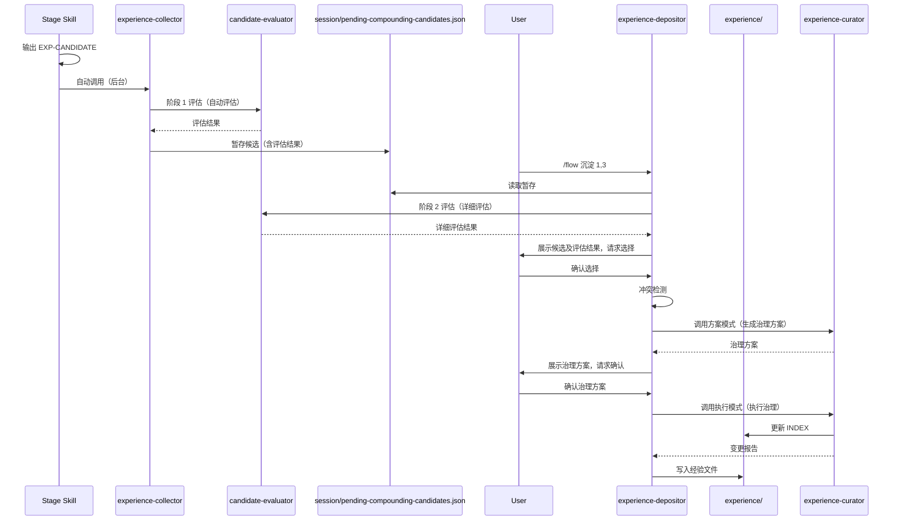

# 知识沉淀机制设计

## 概述

知识沉淀机制是 LingXi workflow 的核心能力，它通过"即时捕获 → 暂存 → 确认沉淀 → 治理"的流程，将工作过程中的判断和决策沉淀为可复用的长期资产。

## 流程概览



## 即时捕获机制

### EXP-CANDIDATE 格式

在工作过程中，当出现以下情况时，Skills 应输出结构化 EXP-CANDIDATE 注释：

- 纠正了实现方向、接口契约、数据结构、边界处理
- 排查找到 root cause，或放弃/替换某实现方案
- 测试失败暴露新坑点或隐含假设
- 重要文件/模块的关键指针或交互契约被确认/修订

**格式**：

```html
<!-- EXP-CANDIDATE
{
  "stage": "work",
  "trigger": "当发现 root cause 并更换方案",
  "decision": "实现/修复/接口/边界的取舍",
  "alternatives": ["原方案A（放弃，因为...）"],
  "signal": "判断依据/风险信号/失败证据",
  "solution": "新的实现/修复方案",
  "verify": "测试/验证步骤与结果期望",
  "pointers": ["path/to/file"],
  "notes": "可选补充"
}
-->
```

### 触发时机

EXP-CANDIDATE 应在以下阶段输出：

- **req**：需求澄清过程中的关键决策
- **plan**：计划制定过程中的取舍
- **work**：实现过程中的纠正和根因发现
- **review**：审查过程中发现的问题和风险

### 自动收集

`experience-collector` 子代理（后台）会自动：

1. **解析注释**：从最新消息中读取 EXP-CANDIDATE JSON
2. **统一评估**：调用 `candidate-evaluator` Skill 执行阶段 1 评估（自动评估），包括结构完整性、判断结构质量、可复用性和沉淀载体适配性评估
3. **根据评估结果决定是否暂存**：不通过的候选过滤，通过的候选暂存并记录评估结果
4. **最小上下文包**：合并高信号上下文（REQ id/title/一行描述、stage、行为/验收摘要、关键决策、指针列表），与候选 JSON 和评估结果一起存入暂存区
5. **暂存**：写入或合并到 `.workflow/context/session/pending-compounding-candidates.json`，包含评估结果

**特点**：
- 静默处理，不干扰主对话
- 不写入经验，不触发 curator
- 只过滤明显不通过的候选，边界模糊的候选仍暂存，由用户最终判断（保护品味）
- 仅在必要时简短确认已接收

**参考**：[候选评估机制设计](./candidate-evaluation.md)

## 候选评估机制

候选评估机制统一处理所有 EXP-CANDIDATE 的质量评估和分类决策，替代了原来分散的"噪音过滤器"、"成长过滤器"和"沉淀分流"。

### 评估维度

1. **结构完整性**：检查必要字段（decision/alternatives/signal/solution/verify）
2. **判断结构质量**：评估是否包含"如何判断"的结构，而非"做了什么"的步骤
3. **可复用性**：评估时间维度（长期价值）、空间维度（跨项目价值）、抽象层次
4. **沉淀载体适配性**：推荐最适合的载体（experience/rules/skills/services/session）

### 评估阶段

- **阶段 1（自动评估）**：在 experience-collector 中执行，初步过滤明显不通过的候选
- **阶段 2（详细评估）**：在 experience-depositor 中执行，对用户选择的候选进行详细评估

### 目的

- 避免 experience 退化为"事实堆叠/案例百科"，把长期资产留给"可迁移的判断结构"
- 统一评估逻辑，消除重复实现，提升设计严谨性

**详细设计**：参见 [候选评估机制设计](./candidate-evaluation.md)

**注意**：沉淀分流逻辑已整合到候选评估机制的"沉淀载体适配性评估"维度中，不再作为独立流程。详情参见 [候选评估机制设计](./candidate-evaluation.md#4-沉淀载体适配性评估deposition-target-fitness)。

## Decision Shape 与 Judgment Capsule

### 为什么需要这两个结构？

**核心思想**：把经验主语从【事】换成【判断】。

经验不应该只是"做过什么/怎么做"的文档，而应该是"如何判断"的结构。

### Decision Shape（判断结构）

每条经验必须包含：

- **Decision being made**：我当时在判断什么
- **Alternatives rejected**：我拒绝了哪些备选方案（至少 1 个）
- **Discriminating signal**：我靠什么可观测信号做出分叉

**示例**：

```markdown
## Decision Shape（判断结构）

- Decision being made: 选择使用哪个状态管理方案
- Alternatives rejected:
  - Redux（过于复杂，项目规模不需要）
  - Context API（性能问题，频繁更新会导致全量重渲染）
- Discriminating signal: 组件更新频率、状态共享范围、团队熟悉度
```

### Judgment Capsule（认知蒸馏）

每条经验必须包含：

- **I used to think**：我之前的认知
- **Now I believe**：我现在的认知
- **Because the decisive variable is**：决定性变量是什么

**示例**：

```markdown
## Judgment Capsule（认知蒸馏）

- I used to think: 所有异步操作都应该用 async/await
- Now I believe: 并发场景下 Promise.all 更合适
- Because the decisive variable is: 操作的依赖关系和性能要求
```

### 目的

确保经验一定能上升为"判断结构"，而不是仅成为"做过什么/怎么做"的文档。

## 经验模板

每条经验必须包含以下字段：

### 基础字段

- **触发条件（When to load）**：在什么场景下需要加载这条经验
- **问题现象（Symptom）**：用户看到/遇到的具体表现
- **根因（Root cause）**：为什么会出现这个问题
- **解决方案（Fix）**：如何解决/规避
- **校验方式（How to verify）**：如何验证问题已被解决/规避，必须可复现
- **关联指针（Pointers）**：相关文件路径、函数名、配置项等

### 判断结构字段

- **Decision Shape**：判断结构（必须）
- **Judgment Capsule**：认知蒸馏（必须）

### 可选字段

- **替代关系（Replaced by / Replaces）**：如有冲突则必须

## 冲突检测

在沉淀新经验前，必须执行冲突检测：

1. **读取所有现有经验**：读取 `.workflow/context/experience/INDEX.md` 中的所有 active 经验
2. **冲突检测**：检查新经验是否与现有经验冲突（触发条件相同/相似且解决方案矛盾）
3. **自动剔除矛盾旧经验**：如果检测到冲突，自动标记旧经验为 `deprecated`，并在新经验中记录替代关系
4. **经验合并/去重**：如果检测到重复或高度相似的经验（而非冲突），提供合并选项

## 确认沉淀流程

### 用户操作

1. **查看候选**：stop hook 在对话结束时提醒有待沉淀候选
2. **选择沉淀**：
   - `/flow 沉淀 1,3`：沉淀第 1 和第 3 条
   - `/flow 沉淀 全部`：沉淀全部
   - `/flow 忽略沉淀`：忽略并清空候选

### experience-depositor 处理

1. **读取暂存**：加载 `.workflow/context/session/pending-compounding-candidates.json`
2. **统一评估（阶段 2）**：调用 `candidate-evaluator` Skill 对暂存的候选执行详细评估
3. **展示候选**：按 stage/时间排序，展示候选及评估结果（包括推荐载体、评估理由、预期收益）
4. **请求选择**：支持全选/部分/放弃
5. **冲突检测**：检查与现有经验的冲突
6. **调用 curator 方案模式**：如果检测到需要治理，生成治理方案（不执行）
7. **展示治理方案**：向用户展示治理方案，请求用户确认
8. **用户确认治理方案**：等待用户确认或调整
9. **调用 curator 执行模式**：用户确认后，执行治理（更新 INDEX）
10. **写入**：按模板写入 `.workflow/context/experience/<tag>-<title>.md`，更新 INDEX
11. **清理**：从暂存中移除已处理项；未写入项保留

**关键改进**：
- 评估前置到展示之前，避免用户选择后再被过滤
- 治理方案在写入前展示并确认，用户可预览和调整治理动作

## 与 /remember 的区别

- **`/remember`**：即时沉淀**单条经验**，不需要 REQ-xxx，最低摩擦
- **`/flow 沉淀`**：围绕一个 **REQ-xxx** 做**系统性复利收尾**（多条经验 + 上下文补齐 + 需求状态推进）

两者互补，不冲突。

## 总结

知识沉淀机制通过以下设计保证了知识的质量和可复用性：

- **即时捕获**：不依赖人的记忆，自动识别可沉淀点
- **统一候选评估机制**：多维度评估候选质量（结构完整性、判断结构质量、可复用性、沉淀载体适配性），确保只有长期资产进入知识库
- **判断结构**：确保经验是"如何判断"而非"怎么做"
- **冲突检测与治理**：避免矛盾经验污染知识库，治理方案在写入前确认
- **确认机制**：人工确认保证质量

参考：
- [候选评估机制设计](./candidate-evaluation.md)
- [experience-collector 实现](../03-implementation/subagents/experience-collector.md)
- [experience-depositor 实现](../03-implementation/subagents/experience-depositor.md)
- [经验治理机制设计](./experience-governance.md)
