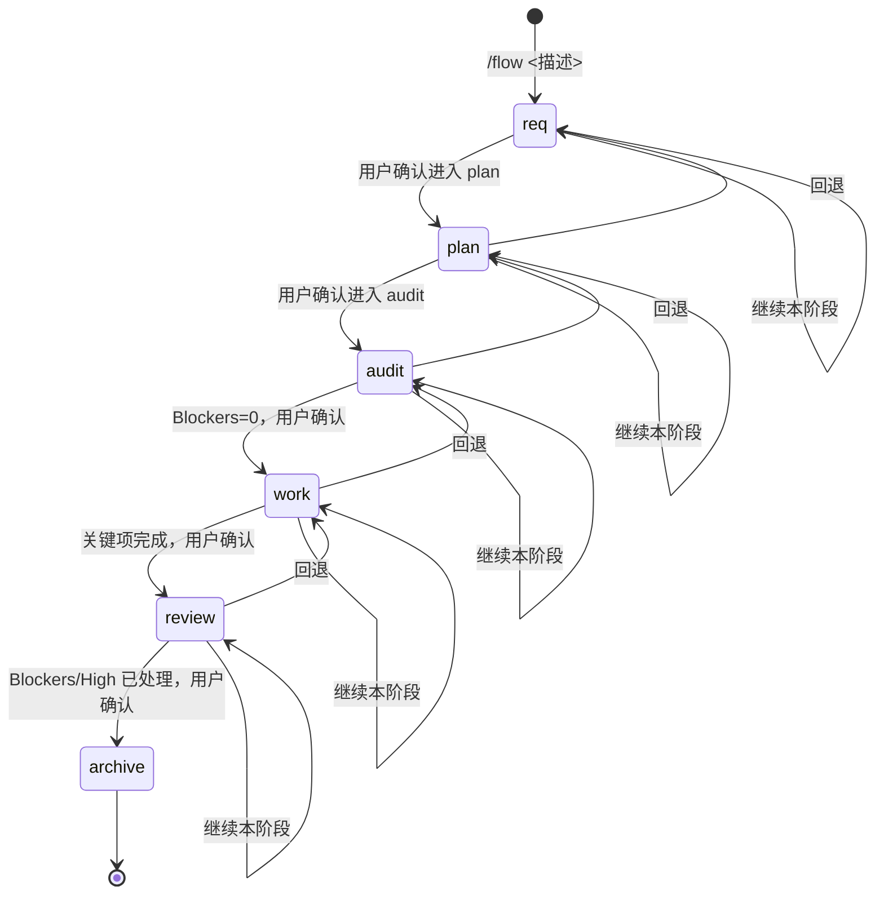

# 工作流生命周期设计

## 概述

cursor-workflow 通过 `/flow` 命令驱动需求的全生命周期，从需求创建到归档，共 6 个阶段：req → plan → audit → work → review → archive。

## 阶段定义

### req（需求澄清）

**目标**：明确需求边界与验收标准

**关键活动**：
- 项目上下文分析
- 需求类型识别（前端/后端/全栈/简单功能）
- 复杂度评估（简单/中等/复杂）
- 必要信息一次性澄清
- 外部参考（按需，使用 WebSearch/MCP）

**主要产物**：
- `.workflow/requirements/in-progress/REQ-xxx.md`

**状态更新**：
- INDEX.md：Status = `in-progress`，Current Phase = `req`

**参考**：[req Skill 实现](../../.cursor/skills/req/SKILL.md)

### plan（计划制定）

**目标**：形成可执行、可验证的计划

**关键活动**：
- 任务拆解（含依赖与文件清单）
- 测试设计（行为提取/规格）
- 外部参考（按需）
- 服务上下文补齐（按需，使用 service-loader）

**主要产物**：
- `.workflow/requirements/in-progress/REQ-xxx.plan.md`

**Plan 账本结构**：
- Status Summary：阶段/进度/当前任务/阻塞项/上次更新（可选的测试状态）
- Files to Change：需要创建/修改的文件清单（含测试文件）
- Tasks：可勾选、可拆分为最小步；任务需标注依赖关系
- Test Specifications / Validation：验证方式必须可复现
- Compounding Candidates：持续输出"待沉淀候选"

**状态更新**：
- INDEX.md：Status = `planned`，Current Phase = `plan`

**参考**：[plan Skill 实现](../../.cursor/skills/plan/SKILL.md)

### audit（技术审查）

**目标**：降低进入 work 的风险

**关键活动**：
- 审查技术风险
- 审查任务完整性
- 审查测试规格
- 审查规范符合度
- 给出是否可推进判据

**主要产物**：
- 对话输出（不写入文件）

**审查维度**：
- 技术可行性
- 任务完整性
- 测试覆盖
- 规范符合度
- 风险识别

**状态更新**：
- INDEX.md：Current Phase = `audit`（Status 可保持 `planned`）

**参考**：[audit Skill 实现](../../.cursor/skills/audit/SKILL.md)

### work（实现与验证）

**目标**：按计划实现并持续验证

**关键活动**：
- 按任务推进
- 按节奏执行测试
- 记录验证结果与证据
- 必要时写 checkpoint
- 即时捕获经验候选（EXP-CANDIDATE）

**主要产物**：
- 回写 `REQ-xxx.plan.md`（任务勾选 + Worklog + Status Summary）
- 可选：`.workflow/context/session/<REQ-xxx>-checkpoint-*.md`

**经验捕获**：
- 在实现/排查过程中，如发生纠正/取舍/根因/覆盖缺口等情况，立即输出 EXP-CANDIDATE
- experience-collector 后台自动收集并暂存

**状态更新**：
- INDEX.md：Current Phase = `work`

**参考**：[work Skill 实现](../../.cursor/skills/work/SKILL.md)

### review（多维度审查）

**目标**：多维度验收与回归风险控制

**关键活动**：
- 功能审查
- 安全审查
- 性能审查
- 架构审查
- 可维护性审查
- 回归风险审查
- 测试覆盖审查

**主要产物**：
- `.workflow/requirements/in-progress/REQ-xxx.review.md`
- 回写 plan（Blockers/High 问题）

**审查维度**：
- 功能完整性
- 安全性
- 性能
- 架构合理性
- 可维护性
- 回归风险
- 测试覆盖

**状态更新**：
- INDEX.md：Status = `in-review` 或 `needs-fix`，Current Phase = `review`

**参考**：[review Skill 实现](../../.cursor/skills/review/SKILL.md)

### archive（归档）

**目标**：归档已完成的需求

**关键活动**：
- 归档 REQ 三件套（从 in-progress 移动到 completed）
- 更新 INDEX Links 指向 completed/
- 更新索引状态

**主要产物**：
- `.workflow/requirements/completed/REQ-xxx.md`
- `.workflow/requirements/completed/REQ-xxx.plan.md`
- `.workflow/requirements/completed/REQ-xxx.review.md`

**状态更新**：
- INDEX.md：Status = `completed`，Current Phase = `archive`，Next Action = `已完成`

**注意**：
- 不负责经验沉淀（经验沉淀在各阶段通过 EXP-CANDIDATE + subagent 完成）
- 不输出 experience 文件

**参考**：[archive Skill 实现](../../.cursor/skills/archive/SKILL.md)

## 状态机设计

### 状态来源优先级

阶段判断的优先级（从高到低）：

1. `.workflow/requirements/INDEX.md` 的 `Status/Current Phase/Next Action`
2. `.workflow/requirements/(in-progress|completed)/<REQ-xxx>.plan.md` 的 `Status Summary`
3. 文件存在性推断（REQ 三件套是否齐全）

### 状态流转



### 状态值定义

#### Status（需求状态）

- `in-progress`：进行中
- `planned`：已计划
- `in-review`：审查中
- `needs-fix`：需要修复
- `completed`：已完成

#### Current Phase（当前阶段）

- `req`：需求澄清
- `plan`：计划制定
- `audit`：技术审查
- `work`：实现与验证
- `review`：多维度审查
- `archive`：归档

## 推进协议

### 人工闸门（循环菜单）

每轮阶段输出必须给出菜单，禁止静默推进：

```text
你要怎么做？
A) 继续本阶段（例如再 audit 一次 / 继续 work 下一个 task）
B) 进入下一阶段（我会先复述推进判据，等待你确认）
C) 回退到上一阶段（说明原因与影响）
D) 退出
```

### 质量闸门（可推进判据）

在阶段切换前，必须给出"可推进判据"，等待用户确认：

| 阶段切换 | 可推进判据 |
|---------|-----------|
| req → plan | Requirement 已写入，关键缺失项=0 |
| plan → audit | plan 含 Tasks/Validation/Worklog/复利候选小节 |
| audit → work | Blockers=0；技术风险已评估；未决问题有明确处理方式 |
| work → review | Deliverables 关键项完成；验证记录可复现 |
| review → archive | Blockers/High 已处理或明确拒绝并记录原因 |

### 每阶段进入前的强制前置

在进入 req/audit/plan/work/review/archive 任一阶段之前：

- **必须**调用 `experience-index`：按 Trigger 匹配 active 经验，输出"最小高信号"的风险提醒与指针
- **按需**调用 `index-manager`：做 Fail Fast（索引与文件一致性）
- **推荐**调用 `service-loader`：当涉及存量/多服务系统时，先补齐服务上下文
- **按需**调用外部知识工具（如 WebSearch、MCP）：在 req/plan 阶段用于补齐外部最佳实践

## 产物模型

### REQ 三件套

每个需求包含三个文件：

1. **REQ-xxx.md**：需求定义
   - 需求概述
   - 目标与指标
   - 用户故事
   - 功能需求
   - 验收检查清单

2. **REQ-xxx.plan.md**：执行账本
   - Status Summary
   - Files to Change
   - Tasks
   - Test Specifications / Validation
   - Worklog
   - Compounding Candidates

3. **REQ-xxx.review.md**：审查报告
   - 验收标准审查
   - 审查结论
   - 问题清单
   - 推进建议
   - 复利候选

### INDEX（SSoT）

`.workflow/requirements/INDEX.md` 是需求状态的**单一事实源**，表头：

```markdown
| ID | Title | Status | Current Phase | Next Action | Blockers | Links |
```

- **ID**：REQ-xxx
- **Title**：需求标题
- **Status**：需求状态（in-progress/planned/in-review/needs-fix/completed）
- **Current Phase**：当前阶段（req/plan/audit/work/review/archive）
- **Next Action**：下一步行动
- **Blockers**：阻塞项
- **Links**：指向三件套路径（in-progress 或 completed）

### Checkpoint（可选）

在 work 阶段，必要时可以创建 checkpoint：

- 位置：`.workflow/context/session/<REQ-xxx>-checkpoint-*.md`
- 用途：记录当前进度，便于中断后恢复
- 内容：当前任务、已完成项、待办项、关键决策

## 循环与回退

### 循环执行

- **允许**：在任意阶段反复执行（例如 audit 多次直到满意）
- **机制**：选择菜单选项 A（继续本阶段）

### 回退机制

- **允许**：回退到上一阶段
- **要求**：必须说明原因与影响
- **机制**：选择菜单选项 C（回退到上一阶段）

## 自动化支持

### Hooks 自动化

- **before-submit-prompt**：输入门控（/flow 形态校验 + REQ 存在性检查）
- **stop**：对话结束时 followup 提醒，自动归档 completed 状态的 REQ

### 自动归档

当 INDEX 中 REQ 的 Status = `completed` 时，stop hook 会自动：
- 将 REQ 三件套从 `in-progress/` 移动到 `completed/`
- 同步更新 INDEX 的 Links 指向 `completed/`

## 总结

工作流生命周期设计保证了：

- **可控性**：每个阶段都有明确的职责和边界
- **可观测性**：状态可追踪，产物可查询
- **可回退性**：支持循环执行和阶段回退
- **自动化**：Hooks 提供自动门控和归档支持

参考：[flow 命令实现](../03-implementation/commands/flow-command.md)
