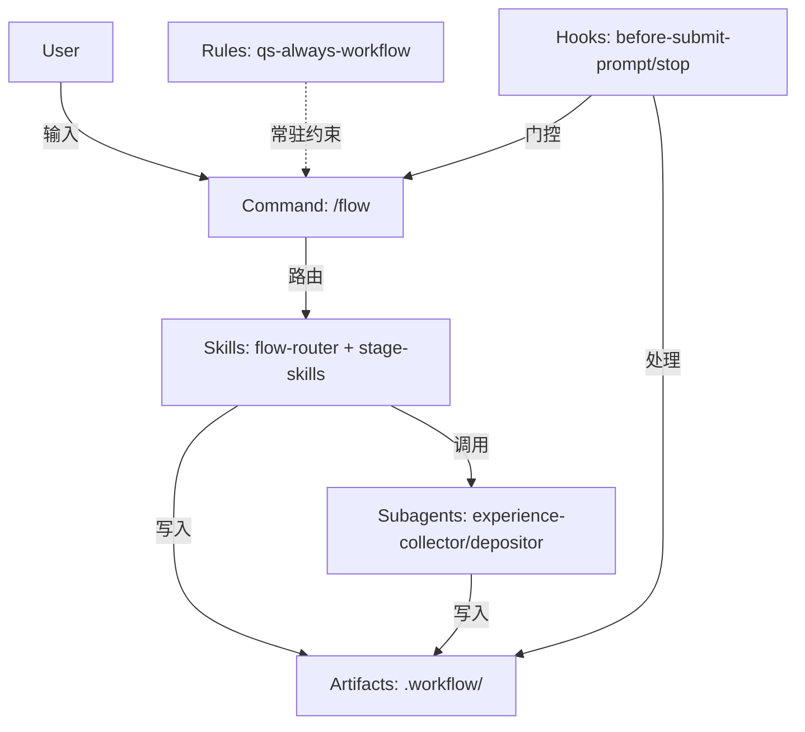

# Cursor 底层能力分析与架构评估

## 各工具能力分析

### 1. Rules（规则）

#### 设计目标
- 提供**系统级指令**，在提示级别提供持久、可重用的上下文
- 将提示词、脚本等内容打包，便于在团队内管理和共享工作流

#### 能力边界
- **四种应用类型**：
  - `Always Apply`：应用于每个聊天会话（必须极精炼，< 50 行）
  - `Apply Intelligently`：Agent 根据描述判断相关时应用
  - `Apply to Specific Files`：文件匹配指定模式时应用（globs）
  - `Apply Manually`：在对话中被 @ 提及时应用

#### 适用场景
- 沉淀与代码库相关的领域知识
- 自动化项目特定的工作流或模板
- 统一风格或架构决策
- **不适合**：单一用途的简单任务（应用 Commands）

#### 限制
- 应控制在 500 行以内
- 应聚焦、可操作、范围明确
- Always Apply 规则必须极精炼（< 50 行，总计 < 150 行）

#### 当前 workflow 使用情况
- ✅ `qs-always-workflow`：核心约束（Always Apply）
- ✅ `qs-always-general`：通用规范（Always Apply）
- ✅ `qs-fs-workflow-artifacts`：工作流产物规范（File-scoped）
- ✅ `qs-i-security`：安全场景建议（Intelligent）
- **评估**：使用合理，符合各类型的设计目标

---

### 2. Commands（命令）

#### 设计目标
- 创建**可复用的工作流**，在聊天输入框中使用简单的 `/` 前缀触发
- 有助于在团队内规范流程并提升常见任务的效率

#### 能力边界
- 纯 Markdown 文件，存放在 `.cursor/commands/` 或 `~/.cursor/commands/`
- 支持参数：命令名之后的内容会包含在模型提示中
- **适合**：单一用途、可重复的操作（如生成变更日志、格式化等）
- **不适合**：需要上下文隔离的复杂任务（应用 Subagents）

#### 适用场景
- 代码审查清单
- 安全审计流程
- 创建 PR 的标准流程
- 新功能设置模板

#### 限制
- 单一用途，不需要单独的上下文窗口
- 任务可以一次性完成
- 不需要并行执行

#### 当前 workflow 使用情况
- ✅ `/flow`：单入口工作流命令（合理）
- ✅ `/remember`：即时沉淀入口（合理）
- **评估**：使用合理，Commands 作为入口点，复杂度下沉到 Skills

---

### 3. Skills（技能）

#### 设计目标
- 可移植、受版本控制的包，用于**教会 Agent 如何执行特定领域的任务**
- Agent 会根据上下文决定何时使用（基于 description 匹配）

#### 能力边界
- 自动发现：从 `.cursor/skills/` 或 `~/.cursor/skills/` 加载
- Agent 自动匹配：根据 description 判断何时使用
- 手动调用：在对话中输入 `/` 搜索技能名称
- **适合**：特定领域的知识和工作流
- **不适合**：需要独立上下文窗口的长时间任务（应用 Subagents）

#### 适用场景
- 阶段 Playbook（req、plan、audit、work、review、archive）
- 底座能力（index-manager、plan-manager、experience-index）
- 工具能力（service-loader、context-engineering、rules-creator）

#### 限制
- 需要明确的 description 以便 Agent 匹配
- 不应过长（保持精炼）
- 与主 Agent 共享上下文窗口

#### 当前 workflow 使用情况
- ✅ **阶段 Skills**：req、plan、audit、work、review、archive（合理）
- ✅ **底座 Skills**：index-manager、plan-manager、experience-index、experience-curator、experience-depositor（合理）
- ✅ **工具 Skills**：service-loader、context-engineering、rules-creator（合理）
- **评估**：使用合理，Skills 承载阶段逻辑和检查清单，符合设计目标

---

### 4. Subagents（子代理）

#### 设计目标
- 专门 AI 助手，可以**委派任务**
- 每个子代理都有**独立的上下文窗口**
- 可以**并行执行**工作

#### 能力边界
- **前台模式**（`is_background: false`）：阻塞直到完成，立即返回结果
- **后台模式**（`is_background: true`）：立即返回，在后台独立工作
- **模型选择**：`fast`、`inherit`、或指定的模型 ID
- **适合**：
  - 长时间的研究类任务（隔离上下文）
  - 需要并行运行多个工作流
  - 任务在多个步骤中需要专业领域知识
  - 对工作结果进行独立验证
- **不适合**：
  - 单一用途的简单任务（应用 Commands 或 Skills）
  - 可以一次性完成的任务

#### 适用场景
- 验证代理（verifier）：独立核实已完成的工作
- 调试器（debugger）：根因分析
- 测试运行器（test-runner）：测试自动化
- **当前 workflow**：experience-collector（后台）、experience-depositor（前台）

#### 限制
- **启动开销**：每个子代理需要单独收集自己的上下文
- **Token 消耗**：多个上下文同时运行，消耗更高
- **延迟**：对于简单任务可能比主代理更慢
- **并行运行 5 个子代理 ≈ 单个 agent 约 5 倍的 tokens**

#### 当前 workflow 使用情况
- ✅ `experience-collector`：
  - `is_background: true`（合理：静默处理，不干扰主对话）
  - `model: fast`（合理：简单解析任务，不需要强模型）
- ✅ `experience-depositor`：
  - `is_background: false`（合理：需要用户交互，等待确认）
  - `model: inherit`（合理：需要完整能力处理沉淀逻辑）
- **评估**：使用合理，符合 Subagents 的设计目标

---

### 5. Hooks（钩子）

#### 设计目标
- 通过自定义脚本**观察、控制和扩展 agent 循环**
- 在 agent 循环中定义的各阶段之前或之后运行

#### 能力边界
- **Agent Hooks**：`beforeShellExecution`、`afterShellExecution`、`beforeMCPExecution`、`afterMCPExecution`、`beforeReadFile`、`afterFileEdit`、`beforeSubmitPrompt`、`stop`、`afterAgentResponse`、`afterAgentThought`
- **Tab Hooks**：`beforeTabFileRead`、`afterTabFileEdit`（仅适用于内联补全）
- **适合**：
  - 在编辑后运行代码格式化工具
  - 为事件添加分析统计
  - 扫描敏感个人信息（PII）或机密数据
  - 为高风险操作加上门控（例如 SQL 写入）
- **不适合**：
  - 复杂的业务逻辑（应在 Skills 中）
  - 需要 AI 推理的任务（应在 Skills 或 Subagents 中）

#### 适用场景
- 输入门控（`beforeSubmitPrompt`）：校验 prompt 格式
- 命令拦截（`beforeShellExecution`）：阻止危险命令
- 自动归档（`stop`）：对话结束时自动归档
- 审计日志（`afterShellExecution`）：记录命令执行

#### 限制
- 需要编写脚本（Node.js 或其他）
- 有性能开销（每次触发都会执行）
- 错误处理需要谨慎（避免阻塞主流程）

#### 当前 workflow 使用情况
- ✅ `before-submit-prompt`：输入门控（/flow 形态校验 + REQ 存在性检查）（合理）
- ✅ `stop`：对话结束时 followup 提醒 + 自动归档（合理）
- ✅ `audit-after-shell-execution`：审计日志（合理）
- ⚠️ `before-shell-execution`：占位符，不执行任何检查（可能可以移除或利用）
- **评估**：使用基本合理，但 `before-shell-execution` 可能可以更好地利用

---

## 架构合理性分析

### 当前架构概览

### 各环节工具选择评估

#### 1. 入口层：Command vs Rule

**当前选择**：Command (`/flow`)

**评估**：
- ✅ **合理**：Command 适合单一入口、可重复操作
- ✅ **符合设计**：Commands 用于规范流程，提升效率
- ⚠️ **可优化**：可以考虑将 `/flow` 的部分逻辑下沉到 Rule（如 Always Apply 的核心约束）

#### 2. 约束层：Rule vs Skill

**当前选择**：Rule (`qs-always-workflow`)

**评估**：
- ✅ **合理**：Rule 适合系统级指令、常驻约束
- ✅ **符合设计**：Always Apply 规则用于核心约束
- ✅ **精炼**：规则内容简洁，符合 < 50 行要求

#### 3. 路由层：Skill vs Subagent

**当前选择**：Skill (`flow-router`)

**评估**：
- ✅ **合理**：Skill 适合阶段 Playbook、路由逻辑
- ✅ **符合设计**：不需要独立上下文窗口，可以一次性完成
- ✅ **效率高**：比 Subagent 更轻量，无额外开销

#### 4. 阶段执行层：Skill vs Subagent

**当前选择**：Skill（req、plan、audit、work、review、archive）

**评估**：
- ✅ **合理**：阶段执行不需要独立上下文窗口
- ✅ **符合设计**：Skills 适合阶段 Playbook
- ⚠️ **可优化**：某些复杂阶段（如 audit）可能可以考虑 Subagent 进行独立验证

#### 5. 经验收集层：Subagent vs Hook

**当前选择**：Subagent (`experience-collector`)

**评估**：
- ✅ **合理**：Subagent 适合后台静默处理
- ✅ **符合设计**：`is_background: true` 不干扰主对话
- ✅ **效率考虑**：使用 `model: fast` 降低消耗
- ⚠️ **可优化**：可以考虑用 Hook (`afterAgentResponse`) 检测 EXP-CANDIDATE，但当前方案更清晰

#### 6. 经验写入层：Subagent vs Skill

**当前选择**：Subagent (`experience-depositor`)

**评估**：
- ✅ **合理**：需要用户交互，前台模式合适
- ⚠️ **可优化**：如果不需要独立上下文窗口，可以考虑改为 Skill
- **权衡**：Subagent 提供上下文隔离，但增加开销；Skill 更轻量，但共享上下文

#### 7. 门控层：Hook vs Skill

**当前选择**：Hook (`before-submit-prompt`)

**评估**：
- ✅ **合理**：Hook 适合输入门控、Fail Fast
- ✅ **符合设计**：在提交前校验，避免无效执行
- ✅ **效率高**：脚本执行快速，无 AI 开销

#### 8. 归档层：Hook vs Skill

**当前选择**：Hook (`stop`)

**评估**：
- ✅ **合理**：Hook 适合对话结束时的自动化处理
- ✅ **符合设计**：自动归档，无需 AI 推理
- ✅ **效率高**：脚本执行，无 AI 开销

---

## 优化建议

### 优化 1：experience-depositor 是否应该用 Subagent？

**当前**：使用 Subagent（`is_background: false`）

**分析**：
- **优点**：上下文隔离，不影响主对话
- **缺点**：启动开销、Token 消耗、可能更慢

**建议**：
- **保持 Subagent**：如果经验写入逻辑复杂，需要独立验证和冲突检测，Subagent 的上下文隔离是有价值的
- **考虑改为 Skill**：如果写入逻辑简单，可以改为 Skill 降低开销

**决策依据**：
- 如果经验写入涉及复杂的冲突检测、合并判断、curator 触发，保持 Subagent
- 如果只是简单的文件写入，可以改为 Skill

### 优化 2：是否可以利用 afterAgentResponse Hook？

**当前**：使用 Subagent (`experience-collector`) 检测 EXP-CANDIDATE

**分析**：
- **Hook 方案**：`afterAgentResponse` 可以检测 EXP-CANDIDATE，但需要脚本解析
- **Subagent 方案**：自动触发，AI 解析，更智能

**建议**：
- **保持 Subagent**：AI 解析更灵活，可以处理格式变化
- **Hook 作为兜底**：可以考虑 Hook 检测，但当前方案更优

### 优化 3：audit 阶段是否应该用 Subagent？

**当前**：使用 Skill (`audit`)

**分析**：
- **Skill 方案**：在主对话中审查，不写入文件
- **Subagent 方案**：独立验证，可以更彻底

**建议**：
- **保持 Skill**：audit 是对话式审查，不需要独立上下文
- **可选增强**：如果需要独立验证，可以添加 `verifier` Subagent

### 优化 4：before-shell-execution Hook 是否可以利用？

**当前**：占位符，不执行任何检查

**分析**：
- **潜在用途**：命令风险判断、包管理器统一、git 操作确认
- **当前设计**：workflow 不负责用户偏好相关的事项

**建议**：
- **保持现状**：符合设计理念（不负责用户偏好）
- **可选扩展**：如果需要项目级命令规范，可以添加检查

### 优化 5：Rules 是否可以更好地利用？

**当前**：4 条 Rules（always-workflow、always-general、fs-workflow-artifacts、i-security）

**分析**：
- **Always Apply**：已使用，合理
- **File-scoped**：已使用，合理
- **Intelligent**：已使用，合理
- **Manual**：未使用

**建议**：
- **保持现状**：当前 Rules 使用合理
- **可选扩展**：可以考虑添加 Manual Rules（如 `@code-review-checklist`）

### 优化 6：Commands 是否可以扩展？

**当前**：2 条 Commands（`/flow`、`/remember`）

**分析**：
- **`/flow`**：单入口，合理
- **`/remember`**：即时沉淀，合理

**建议**：
- **保持现状**：Commands 作为入口点，复杂度下沉到 Skills，符合设计
- **可选扩展**：如果需要快速操作（如 `/quick-review`），可以添加

---

## 架构优化总结

### 当前架构优势

1. **职责清晰**：
   - Commands 作为入口
   - Rules 提供约束
   - Skills 承载逻辑
   - Subagents 处理独立任务
   - Hooks 提供自动化

2. **效率考虑**：
   - 使用 `model: fast` 的 Subagent 降低消耗
   - 使用 Hook 处理自动化，无 AI 开销
   - Skills 共享上下文，无额外开销

3. **符合设计目标**：
   - 各工具都在其适用场景中使用
   - 没有滥用（如用 Subagent 处理简单任务）

### 潜在优化点

1. **experience-depositor**：
   - **当前**：Subagent（前台）
   - **考虑**：如果写入逻辑简单，可以改为 Skill 降低开销
   - **建议**：保持 Subagent（上下文隔离有价值）

2. **audit 阶段**：
   - **当前**：Skill
   - **考虑**：如果需要独立验证，可以添加 verifier Subagent
   - **建议**：保持 Skill（对话式审查不需要独立上下文）

3. **before-shell-execution Hook**：
   - **当前**：占位符
   - **考虑**：如果需要项目级命令规范，可以添加检查
   - **建议**：保持现状（符合设计理念）

4. **Rules 扩展**：
   - **当前**：4 条 Rules
   - **考虑**：可以添加 Manual Rules
   - **建议**：按需扩展

### 总体评估

**架构合理性**：✅ **优秀**

- 各工具都在其适用场景中使用
- 职责清晰，边界明确
- 效率考虑合理
- 符合各工具的设计目标

**优化空间**：🟡 **有限**

- 主要是细节优化，不是架构性问题
- 可以考虑的优化点：
  1. experience-depositor 是否改为 Skill（权衡上下文隔离 vs 开销）
  2. 是否需要添加 verifier Subagent（独立验证）
  3. 是否需要扩展 Rules 和 Commands（按需）

---

## 参考

- [Cursor Rules 文档](https://cursor.com/cn/docs/context/rules)
- [Cursor Commands 文档](https://cursor.com/cn/docs/agent/chat/commands)
- [Cursor Skills 文档](https://cursor.com/cn/docs/context/skills)
- [Cursor Subagents 文档](https://cursor.com/cn/docs/agent/subagents)
- [Cursor Hooks 文档](https://cursor.com/cn/docs/agent/hooks)
