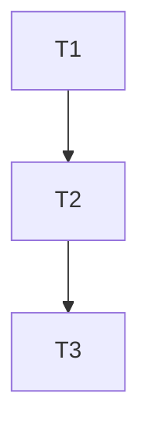

# 灵犀 2.0 重构方案

## 概述

本文档描述灵犀 workflow 从 1.0 到 2.0 的完整重构方案，包括流程架构重构和质量资产化机制优化。

## 重构目标

### 核心目标

1. **提升灵活性**：废弃单入口设计，改为多入口 Commands，支持优秀开发者直接切入任意阶段
2. **流程解耦**：所有环节可跳过，实现真正的可伸缩工作流
3. **Req 升级**：将 req 文档升级为"造物计划"（设计+产品+技术方案概览）
4. **经验管理优化**：统一经验捕获机制，优化经验注入和匹配策略

### 设计原则

- **心有灵犀**：Req 作为造物计划有助于沉淀设计思路，经验管理优化提升复用效率
- **AI Native**：-
- **称心如意**：多入口灵活，无生命周期限制，优秀开发者可直接切入，提高灵活性

## 一、流程架构重构

### 1.1 命令体系（多入口，手动指定编号）

#### 命令列表

```markdown
/req <描述> # 创建造物计划（产出：001.req.<标题>.md）
/req-review 001 # 审查 req 文档（可选，可多次）
/plan 001 # 生成任务规划（产出：001.plan.<标题>.md + 001.testcase.<标题>.md）
/build 001 # 执行构建（编写测试脚本+执行单元测试+文档同步）
/review 001 # 审查交付（产出：001.review.<标题>.md，包含测试执行+多维度审查）
```

#### 命令特性

- **除req外所有命令必须手动指定任务编号**（001, 002, ...）
- **无生命周期管理，无状态路由**
- **每个命令独立执行，不依赖前一阶段完成**
- **允许任务停留在任意阶段**（不强制状态）

#### 命令文件技术规范

命令文件采用 Markdown 格式，存放于 `.cursor/commands/` 目录，包含 YAML frontmatter：

```yaml
---
name: req
description: 创建造物计划（产出：001.req.<标题>.md）
args:
  - name: description
    required: true
    description: 需求描述
---
[命令执行逻辑的 Markdown 说明]
```

**Frontmatter 字段说明**：

| 字段               | 类型    | 必填 | 说明                         |
| ------------------ | ------- | ---- | ---------------------------- |
| name               | string  | 是   | 命令名称（如 `req`、`plan`） |
| description        | string  | 是   | 命令功能描述                 |
| args               | array   | 否   | 命令参数列表                 |
| args[].name        | string  | 是   | 参数名称                     |
| args[].required    | boolean | 是   | 是否必填                     |
| args[].description | string  | 是   | 参数说明                     |

#### 架构优势

- **优秀开发者优先**：按需选择命令，直接命令零等待，符合"称心如意"
- **新手友好**：命令语义清晰，降低学习成本
- **不向后兼容**：与2.0不兼容的设计全部移除，无需兼容

### 1.2 Req：造物计划（设计+产品+技术方案概览）

#### 定位

Req 是整个流程的核心，高质量的 req 文档是保证任务最终效果的前提。Req 必须超越普通 PRD 文档的范畴，除了需求提纯和放大之外，还必须定好核心技术方案或技术决策。这不是一份传统意义上产品经理向技术团队提出的需求说明，而是一个顶尖创造者脑海中迸发的集设计灵感、产品构思、实现途径于一体的造物计划。

#### 执行流程

**1. 项目上下文分析**（执行前）：

在理解需求前，先获取项目背景：

- 查看 `package.json`、`README.md` 等，了解技术栈
- 浏览项目目录结构，识别与需求相关的现有模块
- 初步判断技术可行性和需要引入的新依赖

**2. 需求提纯**（核心环节）：

在开始类型识别和复杂度评估前，先进行需求提纯：

**2.1 结构化澄清**：

对于模糊需求，使用 5W1H 框架引导用户表达：

- **What**: 具体要做什么功能/改动
- **Why**: 为什么需要这个功能（业务驱动）
- **Who**: 目标用户是谁
- **Where**: 影响范围在哪里
- **When**: 有无时间/顺序约束
- **How**: 用户期望的交互/体验

**执行方式**：

- 如果需求描述清晰完整，静默跳过此步骤
- 如果需求描述模糊或缺失关键信息，主动提出结构化问题
- 一次性列出所有需要澄清的问题，等待用户回答后再继续

**2.2 隐含意图挖掘**：

从用户描述中提取未明说的期望：

- 分析用户描述中的关键词和上下文
- 识别可能隐含的功能需求（如"添加按钮"可能隐含"要有点击反馈、要有禁用状态"）
- 识别可能隐含的非功能需求（如性能、安全、可访问性等）

**执行方式**：

- 将识别到的隐含意图以建议形式呈现给用户确认
- 避免过度推断，只提出高置信度的隐含需求

**2.3 用户真实意图确认**：

在完成结构化澄清和隐含意图挖掘后，总结理解并确认：

- 用简洁的语言总结需求的核心目标
- 明确需求的范围边界
- 确认关键约束和成功标准

**执行方式**：

- 输出需求理解总结
- 询问用户"以上理解是否正确？"
- 等待用户确认后再继续后续分析

**静默原则**：

- 如果需求已经非常清晰（简单功能），可以静默跳过部分提纯步骤
- 但必须确保核心信息（What/Why）已明确

**任务编号生成规则**：

`/req` 命令自动生成任务编号：

1. 扫描 `.workflow/requirements/` 目录
2. 提取所有 `*.req.*.md` 文件的编号（使用正则 `^(\d{3})\.req\..*\.md$`）
3. 取最大编号 +1，格式化为三位数（001, 002, ...）
4. 如果目录为空或不存在，从 001 开始
5. 编号上限为 999，超出时提示用户归档旧任务

**标题生成规则**：

- 从需求描述中提取核心关键词作为标题
- 标题限制：最多 10 个中文字符或 20 个英文字符
- 超出时自动截断并添加省略号
- 特殊字符自动替换为下划线（`/\:*?"<>|` → `_`）

**3. 类型识别与复杂度评估**：

**3.1 类型识别**：

| 类型     | 特征                                | 示例                             |
| -------- | ----------------------------------- | -------------------------------- |
| 纯前端   | 只涉及 UI/交互/前端状态，不涉及后端 | "优化移动端展示"、"添加按钮动画" |
| 纯后端   | 只涉及 API/服务/数据库，不涉及界面  | "优化查询性能"、"调整配额逻辑"   |
| 全栈     | 同时涉及前端和后端                  | "实现用户认证"、"新增分享功能"   |
| 简单功能 | 单一、明确、范围小                  | "修改按钮文案"、"调整错误提示"   |

**3.2 复杂度评估**：

| 复杂度 | 特征                                         |
| ------ | -------------------------------------------- |
| 简单   | 单一功能点，影响范围小，无复杂依赖           |
| 中等   | 涉及多个模块，需要前后端协作，有一定技术难度 |
| 复杂   | 架构级变更，影响全局，依赖多个系统           |

**4. 需求放大**（核心环节）：

对每个需求都尝试找到最佳实践和最优方案。

**4.1 主动外部调研**：

对每个需求都尝试找到最佳实践：

- 使用 WebSearch 搜索 "best practice for X 2025/2026"、"X implementation guide"
- 使用 MCP context7 获取框架/库的官方文档和最新 API 说明
- 识别需求中的关键技术点，主动调研相关领域的主流方案

**调研内容**（req 阶段做广度调研，深度留给 plan）：

- 该领域的主流技术方案
- 常见的实现模式
- 已知的典型坑点
- 最新的最佳实践和趋势

**4.2 方案对比**：

对于有多种可行方案的需求：

- 列出 2-3 个主要备选方案
- 对比各方案的优劣（性能、复杂度、维护成本等）
- 基于项目上下文推荐最优方案
- 将对比结果融入文档的相应章节

**4.3 最佳实践融入**：

将调研到的最佳实践直接融入解决方案：

- 在"背景"中引用行业最佳实践
- 在"解决方案概述"中体现推荐方案的理由
- 在"附录"中列出关键参考来源

**输出要求**：

- 不单独写入调研报告，将知识融入需求文档的相应章节
- 复杂需求：在附录中列出关键参考来源和决策对比
- 简单需求：静默融入，不显式标注来源

**静默原则**：

- 如果需求非常简单（如"修改按钮文案"），可以静默跳过外部调研
- 但涉及新技术栈或复杂功能时，必须主动调研

**5. 经验融入**：

如果 `experience-index` 匹配到相关经验，在文档中引用，或在"非目标"中体现历史踩坑点。

**6. 模板选择**（根据类型和复杂度灵活选择）：

**模板选择矩阵**：

| 类型     | 复杂度    | 包含章节                                                                             |
| -------- | --------- | ------------------------------------------------------------------------------------ |
| 简单功能 | 任意      | 概述、目标、功能需求、验收清单                                                       |
| 纯前端   | 简单      | 概述、目标、用户故事、UI 交互规范、验收清单                                          |
| 纯前端   | 中等/复杂 | 概述、目标、用户故事、功能需求、UI 交互规范、依赖与集成、验收清单                    |
| 纯后端   | 简单      | 概述、目标、用户故事、API 规范（如涉及）、技术可行性、验收清单                       |
| 纯后端   | 中等/复杂 | 概述、目标、用户故事、功能需求、API 规范、数据模型、依赖与集成、技术可行性、验收清单 |
| 全栈     | 任意      | 完整模板（所有章节）                                                                 |

**决策规则**：

- **UI 交互规范**（前端需求）：描述用户交互流程、界面布局、状态变化等，不涉及具体实现细节
- **API 规范**（后端需求）：定义接口契约、请求/响应格式、错误码等，不涉及具体实现
- **数据模型**（后端中等+）：定义核心数据结构、字段含义、约束条件等
- **依赖与集成**（中等+复杂度）：列出外部依赖、需要集成的系统/服务、集成方式概述
- **技术可行性**（后端需求）：评估技术难点、风险点、可行性分析
- req 阶段定义"做什么"和"与什么集成"，详细实现细节留给 plan 和 build

#### 文档结构

**完整模板**（全栈或复杂需求）：

```markdown
# 001.req.<标题>.md

| 属性     | 值                        |
| -------- | ------------------------- |
| 版本     | 1.0                       |
| 状态     | 草稿                      |
| 创建日期 | {DATE}                    |
| 需求类型 | [前端/后端/全栈/简单功能] |
| 复杂度   | [简单/中等/复杂]          |

---

## 1. 概述

### 1.1 背景

- 为什么需要这个功能？业务驱动是什么？
- 引用行业最佳实践（如适用）

### 1.2 问题描述

- 什么被认为是问题？痛点识别的价值判断

### 1.3 解决方案概述（不含技术实现细节）

- 为什么选择这个方向？体现的设计原则
- 技术选型（框架/库/工具）
- 架构思路（分层、模块划分）
- 关键技术点（核心算法/设计模式）
- **技术方案不包含实现细节**（具体代码、文件路径、函数签名）

<!-- PLAN-EXTRACT:GOAL-START -->
<!-- PLAN-EXTRACT:GOAL-END -->

---

## 2. 目标与指标

### 2.1 目标

| 编号 | 目标 | 优先级   |
| ---- | ---- | -------- |
| G1   | ...  | 必须实现 |

### 2.2 非目标

> 明确列出"容易被误解为需求范围内，但实际不做"的内容。
> 体现历史踩坑点（如适用）

### 2.3 成功标准（必须可验证）

| 标准 | 描述 | 验证方式           |
| ---- | ---- | ------------------ |
| ...  | ...  | 测试/脚本/手工步骤 |

---

## 3. 用户故事（至少 1 条）

### US-1: ...

**作为** ...
**我想要** ...
**以便** ...

**验收标准：**

- [ ] ...

---

## 4. 功能需求

<!-- PLAN-EXTRACT:TASKS-START -->

| 编号 | 需求描述 | 实现方案            | 验收标准     | 优先级   |
| ---- | -------- | ------------------- | ------------ | -------- |
| F1   | ...      | 关键文件 + 实现模式 | 可验证的标准 | 必须实现 |

<!-- PLAN-EXTRACT:TASKS-END -->

**实现方案列内容要求**：

- **关键文件**：需要修改/创建的文件路径（指针优先，如 `src/components/Button.tsx`）
- **实现模式**：推荐的代码组织方式或参考指针（简洁描述，如"使用 React Hook 管理状态"）
- **简洁原则**：指针优先，详细实现细节留给 build 阶段

---

## 5. UI 交互规范（前端需求）

### 5.1 交互流程

描述用户操作流程和界面状态变化。

### 5.2 界面布局

描述关键界面的布局结构、组件位置、响应式要求等。

### 5.3 状态说明

描述界面状态（加载、成功、错误、空状态等）及其展示方式。

---

## 6. API 规范（后端需求）

### 6.1 接口列表

| 接口路径   | 方法         | 功能描述 | 请求参数 | 响应格式 |
| ---------- | ------------ | -------- | -------- | -------- |
| `/api/...` | GET/POST/... | ...      | ...      | ...      |

### 6.2 错误码定义

| 错误码 | 说明 | HTTP 状态码 |
| ------ | ---- | ----------- |
| ...    | ...  | ...         |

---

## 7. 数据模型（后端中等+复杂度）

### 7.1 核心实体

| 实体名称 | 字段 | 类型 | 说明 | 约束 |
| -------- | ---- | ---- | ---- | ---- |
| ...      | ...  | ...  | ...  | ...  |

### 7.2 关系说明

描述实体间的关系和约束。

---

## 8. 依赖与集成（中等+复杂度）

### 8.1 外部依赖

- 第三方库/服务：...
- 内部服务依赖：...

### 8.2 集成方式

描述与外部系统/服务的集成方式概述。

---

## 9. 技术可行性（后端需求）

### 9.1 技术难点

列出可能的技术难点和挑战。

### 9.2 风险评估

评估技术风险点和缓解措施。

### 9.3 可行性结论

综合评估技术可行性。

---

## 10. 验收检查清单

<!-- PLAN-EXTRACT:VALIDATION-START -->

- [ ] ...

<!-- PLAN-EXTRACT:VALIDATION-END -->

---

## 11. 附录（复杂需求）

### 11.1 外部参考

- [参考 1]（来源：xxx）
- [参考 2]（来源：xxx）

### 11.2 关键决策记录

| 决策点 | 备选方案 | 最终选择 | 理由 |
| ------ | -------- | -------- | ---- |
| ...    | A / B    | A        | ...  |
```

**简化模板**（简单功能）：

```markdown
# 001.req.<标题>.md

| 属性     | 值       |
| -------- | -------- |
| 版本     | 1.0      |
| 创建日期 | {DATE}   |
| 需求类型 | 简单功能 |
| 复杂度   | 简单     |

---

## 1. 概述

### 1.1 背景

### 1.2 问题描述

### 1.3 解决方案概述

<!-- PLAN-EXTRACT:GOAL-START -->
<!-- PLAN-EXTRACT:GOAL-END -->

---

## 2. 目标

| 编号 | 目标 | 优先级   |
| ---- | ---- | -------- |
| G1   | ...  | 必须实现 |

---

## 3. 功能需求

<!-- PLAN-EXTRACT:TASKS-START -->

| 编号 | 需求描述 | 实现方案            | 验收标准     | 优先级   |
| ---- | -------- | ------------------- | ------------ | -------- |
| F1   | ...      | 关键文件 + 实现模式 | 可验证的标准 | 必须实现 |

<!-- PLAN-EXTRACT:TASKS-END -->

---

## 4. 验收检查清单

<!-- PLAN-EXTRACT:VALIDATION-START -->

- [ ] ...

<!-- PLAN-EXTRACT:VALIDATION-END -->
```

#### 关键标记说明

文档中包含以下标记，用于后续 plan 阶段的自动提取：

- `<!-- PLAN-EXTRACT:GOAL-START -->` 到 `<!-- PLAN-EXTRACT:GOAL-END -->`：目标回放
- `<!-- PLAN-EXTRACT:TASKS-START -->` 到 `<!-- PLAN-EXTRACT:TASKS-END -->`：任务清单（功能需求表格）
- `<!-- PLAN-EXTRACT:VALIDATION-START -->` 到 `<!-- PLAN-EXTRACT:VALIDATION-END -->`：验收检查清单

#### 文件命名约定

- 格式：`001.req.<标题>.md`（标题 10 字以内）

### 1.3 Req-Review：审查 req 文档

#### 定位

对 req 文档展开 review，用于辅助提升 req 文档的质量。该步骤可省略，也可以多次执行，完全取决于使用者。

#### 审查维度

- **需求完整性**：功能描述是否完整、边界是否清晰
- **技术可行性**：技术选型是否可行、架构是否合理
- **可测试性**：需求是否可验证、验收标准是否明确
- **可实现性**：方案是否可实现、依赖是否明确

#### 执行方式

- 用户手动执行：`/req-review 001`
- 不产出文件，仅输出审查结果和建议

### 1.4 Plan：任务规划（测试用例文档 + 文档检测）

#### 定位

基于 req 文档中的需求做进一步的任务规划，通过澄清细节问题，规划具体的执行步骤等，辅助提高任务执行质量。

#### 产出文件

1. **任务规划文档**：`001.plan.<标题>.md`
2. **测试用例文档**：`001.testcase.<标题>.md`

#### Plan 文档模板

````markdown
# 001.plan.<标题>

| 属性     | 值                |
| -------- | ----------------- |
| 关联需求 | 001.req.<标题>.md |
| 创建日期 | {DATE}            |

---

## 1. 目标回放

<!-- 从 req 的 PLAN-EXTRACT:GOAL 区域提取 -->

---

## 2. 任务清单

| 序号 | 任务描述 | 依赖任务 | 预估耗时 | 状态   |
| ---- | -------- | -------- | -------- | ------ |
| T1   | ...      | -        | 30min    | 待开始 |
| T2   | ...      | T1       | 1h       | 待开始 |

**状态说明**：待开始 / 进行中 / 已完成 / 已跳过

---

## 3. 依赖关系图


````

---

## 4. 执行顺序

1. T1: ...
2. T2: ...（依赖 T1）
3. T3: ...（依赖 T2）

---

## 5. 技术调研结果

<!-- 深度调研结果，补充 req 中的广度调研 -->

---

## 6. 文档同步清单

| 文档路径    | 变更类型 | 变更说明       |
| ----------- | -------- | -------------- |
| docs/api.md | 更新     | 添加新接口说明 |

---

## 7. 测试策略

- 单元测试覆盖：T1, T2
- 集成测试覆盖：T3
- 详见：001.testcase.<标题>.md

````

#### Testcase 文档模板

```markdown
# 001.testcase.<标题>

| 属性     | 值       |
| -------- | -------- |
| 关联需求 | 001.req.<标题>.md |
| 关联规划 | 001.plan.<标题>.md |
| 创建日期 | {DATE}   |

---

## 1. 测试范围

### 1.1 覆盖的功能需求

| 需求编号 | 需求描述 | 测试用例编号 |
|---------|---------|-------------|
| F1      | ...     | TC-001, TC-002 |

### 1.2 不覆盖的范围

- ...

---

## 2. 单元测试用例

### TC-001: <测试场景名称>

**前置条件**：
- ...

**测试数据**：
```json
{
  "input": ...,
  "expected": ...
}
````

**测试步骤**：

1. ...
2. ...

**预期结果**：

- ...

**边界条件**：

- 空输入：...
- 超大输入：...
- 特殊字符：...

---

## 3. 集成测试用例

### TC-010: <集成场景名称>

**前置条件**：

- ...

**测试步骤**：

1. ...

**预期结果**：

- ...

---

## 4. 测试数据准备

| 数据名称  | 数据内容 | 用途        |
| --------- | -------- | ----------- |
| mock_user | {...}    | 用于 TC-001 |

````

#### 产出内容

1. **任务拆解**（在 plan 文档中）：
   - 功能需求 → 任务列表
   - 依赖关系
   - 执行顺序

2. **测试用例文档**（独立文件 `001.testcase.<标题>.md`）：
   - 基于 req 的功能需求编写测试用例
   - 测试场景、测试数据、预期结果
   - 不包含测试脚本（脚本在 build 阶段编写）

3. **文档检测**（需同步的文档）：
   - 检测项目中现有的技术方案文档、设计文档
   - 识别可能受本次改动影响的文档
   - 在 plan 中列出需同步的文档列表，作为任务的一部分

#### 测试框架检测与安装

**多层检测策略**：

1. 检查 `package.json` 的 `devDependencies`（jest, vitest, mocha, jasmine 等）
2. 检查项目根目录的测试配置文件（`jest.config.js`, `vitest.config.ts`, `mocha.opts` 等）
3. 检查测试目录结构（`tests/`, `__tests__/`, `test/`, `spec/` 等）
4. 检查测试文件模式（`*.test.js`, `*.spec.ts`, `*.test.tsx` 等）

**检测结果处理**：

- 如果检测到现有框架：记录框架类型和配置，在 plan 中说明将使用该框架
- 如果未检测到框架：
  - 检查依赖冲突：检查 `package.json` 是否有冲突依赖
  - 安装 vitest：`yarn add -D vitest` 或 `npm install -D vitest`
  - 创建配置文件：`vitest.config.ts`（按最佳实践）
  - 创建测试目录：`tests/unit/`, `tests/integration/`
  - 更新 `package.json` 的 `scripts.test`
  - 验证安装：执行 `yarn test` 或 `npm test` 验证框架是否正常工作

**冲突处理**：

- 如果检测到依赖冲突：提示用户，不自动安装，在 plan 中标记需要手动处理

#### 文档命名约定

- Plan 文档：`001.plan.<标题>.md`（标题 10 字以内）
- 测试用例文档：`001.testcase.<标题>.md`（标题 10 字以内）

#### 特性

- 该步骤可跳过，仅复杂任务建议在 build 之前执行规划
- 取决于使用者对任务复杂度以及 agent 的执行能力的判断

### 1.5 Build：执行构建（双模式：Plan-driven 或 Agent-driven）

#### 定位

用于按 req 文档实现功能，支持两种执行模式：
- **Plan-driven 模式**：有 plan 文档时，按计划结构化执行（推荐）
- **Agent-driven 模式**：无 plan 文档时，Agent 基于 req 自行决策执行

该步骤虽然理论上不可跳过，但是创造者可以选择不调用 build 命令而自行基于 req 文档和可选的 plan 文档进行开发工作，因此从流程上将该步骤仍然可以跳过。

#### 模式检测（自动）

执行 `/build 001` 时，自动检测执行模式：

1. **检测 plan 文件**：
   - 扫描 `.workflow/requirements/` 目录
   - 查找 `001.plan.*.md` 文件

2. **模式判断**：
   - **存在 plan 文件** → Plan-driven 模式
   - **不存在 plan 文件** → Agent-driven 模式

3. **模式提示**：
   - 静默检测，在开始执行时输出当前模式（如："检测到 plan 文档，进入 Plan-driven 模式"）

#### 执行逻辑分支

**Plan-driven 模式**（有 plan 时）：

1. **读取输入**：
   - `.workflow/requirements/001.req.<标题>.md`
   - `.workflow/requirements/001.plan.<标题>.md`
   - `.workflow/requirements/001.testcase.<标题>.md`

2. **代码实现**：
   - 按 req 的技术方案实现功能
   - 按 plan 的任务清单顺序执行开发任务
   - 遵循 plan 中的依赖关系和执行顺序

3. **编写测试脚本**：
   - 读取 `001.testcase.<标题>.md`
   - 基于测试用例文档编写测试脚本
   - 遵循项目测试框架（plan 中检测到的框架）
   - 按模块组织：模块完成后编写并执行对应测试

4. **执行单元测试**（循环修复直到全部通过）：
   - 模块完成后执行单元测试
   - 记录测试执行结果（通过/失败）
   - **如果测试失败**：
     - 分析失败原因，定位 bug
     - 修复 bug
     - 重新执行单元测试
     - **循环执行**：修复 → 测试 → 修复 → 测试，直到所有单元测试全部通过
   - **只有所有单元测试通过后，才继续下一个模块或任务**

5. **文档同步**（plan 中的任务）：
   - 读取 plan 中的文档同步任务清单
   - 基于代码变更自动更新相关文档：
     - 扫描代码注释、类型定义
     - 提取接口信息、模块结构
     - 更新文档对应章节
   - 同步完成后标记任务完成

**Agent-driven 模式**（无 plan 时）：

1. **读取输入**：
   - `.workflow/requirements/001.req.<标题>.md`（仅）

2. **任务拆解（Agent 决策）**：
   - 基于 req 的功能需求，Agent 自行拆解为可执行的子任务
   - 识别功能模块、依赖关系、执行顺序
   - 动态决策实现路径（在无 plan 的情况下）

3. **代码实现**：
   - 按 req 的技术方案实现功能
   - 按 Agent 拆解的任务顺序执行
   - Agent 自行判断实现细节（req 中不含实现细节）

4. **测试框架检测**（Agent 决策）：
   - 检测项目中现有的测试框架（同 plan 阶段的检测逻辑）
   - 如无框架，Agent 自行决定是否安装 vitest（推荐安装）
   - 如安装，执行安装流程（同 plan 阶段）

5. **编写测试脚本**（基于 req 验收标准）：
   - 基于 req 的验收标准编写测试用例（而非 testcase 文档）
   - 覆盖 req 中定义的功能验收清单
   - 遵循检测到的测试框架
   - 按模块组织：模块完成后编写并执行对应测试

6. **执行单元测试**（循环修复直到全部通过）：
   - 模块完成后执行单元测试
   - 记录测试执行结果（通过/失败）
   - **如果测试失败**：
     - 分析失败原因，定位 bug
     - 修复 bug
     - 重新执行单元测试
     - **循环执行**：修复 → 测试 → 修复 → 测试，直到所有单元测试全部通过
   - **只有所有单元测试通过后，才继续下一个模块或任务**

7. **文档同步**（Agent 识别）：
   - Agent 自行识别可能受本次改动影响的文档：
     - 扫描项目目录（`docs/`, `design/`, `architecture/` 等）
     - 基于代码变更识别相关文档
     - 识别技术方案文档、设计文档等
   - 基于代码变更自动更新相关文档：
     - 扫描代码注释、类型定义
     - 提取接口信息、模块结构
     - 更新文档对应章节

#### 降级方案

**Plan-driven 模式降级**：

- 如果测试框架无法执行：输出手动测试清单（基于 testcase 文档）
- 如果文档同步无法执行：输出文档更新清单（基于 plan 清单）

**Agent-driven 模式降级**：

- 如果测试框架无法执行：输出手动测试清单（基于 req 验收标准）
- 如果文档同步无法执行：输出文档更新清单（Agent 识别的文档列表）

#### 模式选择建议

| 场景 | 推荐模式 | 理由 |
|------|---------|------|
| 复杂任务（多模块、多依赖） | Plan-driven | 需要明确的任务拆解和依赖管理 |
| 简单任务（单一功能、无依赖） | Agent-driven | Agent 可直接判断和执行 |
| 需要明确的测试策略 | Plan-driven | 有 testcase 文档指导 |
| 需要文档同步计划 | Plan-driven | 有明确的文档清单 |
| 快速原型开发 | Agent-driven | 无需详细规划，快速迭代 |
| 生产环境功能 | Plan-driven | 需要更严格的计划和验证 |

#### 执行质量保证

两种模式都确保：

1. **功能完整性**：满足 req 中的所有功能需求
2. **验收标准**：通过 req 定义的验收标准
3. **代码质量**：遵循项目代码规范（由 rules 定义）
4. **测试覆盖**：确保关键功能有测试覆盖
5. **文档一致性**：代码与相关文档保持一致

### 1.6 Review：审查交付（测试执行 + 多维度审查）

#### 定位

Review 实际上是除了 req 之外第二重要的环节，因为工作流的最终目的就是交付，而 review 就是判定产出是否达到交付标准的环节。

#### 执行内容

1. **测试用例文档审查**：
   - 读取 `001.testcase.<标题>.md`（如果存在）
   - 基于 req 审查测试用例文档
   - 检查覆盖完整性、准确性
   - 如不完整或不合格，补充或修改测试用例文档

2. **测试脚本质量检查**（执行测试前）：
   - 读取 build 阶段编写的测试脚本文件
   - 检查测试脚本的实现质量：
     - **覆盖完整性**：是否覆盖了 req 中的所有功能需求和验收标准
     - **断言准确性**：断言是否正确验证了预期行为，是否验证了关键结果
     - **测试隔离性**：测试之间是否相互独立，是否有外部依赖泄漏
     - **边界条件测试**：是否测试了边界情况、错误处理、异常场景
     - **测试可维护性**：测试代码是否清晰、可读，是否遵循测试最佳实践
     - **测试结构**：是否遵循"一行为一测试"原则，测试命名是否清晰
   - **如果发现问题**：
     - 补充缺失的测试场景
     - 修正不准确的断言
     - 修复测试隔离问题
     - 补充边界条件测试
     - 优化测试代码结构
   - **只有测试脚本质量合格后，才执行测试**

3. **测试执行**：
   - 执行单元测试（基于 build 编写的测试脚本，已通过质量检查）
   - 执行集成测试
   - 记录测试执行结果

4. **多维度审查**（依次执行）：

   按以下维度依次审查，每个维度发现问题按优先级分级（Blockers/High/Medium/Low）：

   **4.1 功能审查**：
   - 是否符合 req 要求
   - 功能是否完整实现
   - 是否存在功能缺陷或需求偏差
   - 是否存在回归风险

   **4.2 测试覆盖审查**：
   - **覆盖完整性**：
     - plan/testcase 中定义的所有可测试行为是否都有对应测试
     - 单元测试是否覆盖正常流程、边界条件、错误处理
     - 集成测试是否覆盖关键交互场景
   - **测试质量**（已在步骤 2 检查，此处复核）：
     - 测试是否隔离（无外部依赖泄漏）
     - 测试是否遵循一行为一测试原则
     - 测试断言是否明确、有意义
     - 测试是否可重复执行
   - **测试结果**：
     - 所有测试是否通过
     - 是否有被跳过（skip）的测试需要处理
     - 测试运行时间是否合理
   - **测试覆盖不足视为 High 级别问题**

   **4.3 安全审查**：
   - 是否存在安全漏洞或风险
   - 是否存在注入风险
   - 是否存在敏感信息暴露
   - 权限控制是否合理

   **4.4 性能审查**：
   - 是否存在性能瓶颈或风险
   - 是否存在内存泄漏风险
   - 响应时间是否满足要求
   - 资源使用是否合理

   **4.5 架构审查**：
   - 架构设计是否合理
   - 模块耦合是否过紧
   - 职责划分是否清晰
   - 是否符合 req 中的架构思路

   **4.6 可维护性审查**：
   - 代码可维护性：代码结构是否清晰
   - 代码可读性：命名是否清晰、注释是否充分
   - 代码可扩展性：是否易于扩展
   - 代码规范性：是否遵循项目代码规范

   **4.7 回归风险审查**：
   - 是否存在破坏现有功能的风险
   - 是否影响其他模块
   - 是否需要更新相关文档
   - 是否需要通知相关团队

   **4.8 文档一致性审查**：
   - 代码与文档是否一致（检查 build 阶段同步的文档）
   - 接口文档是否与实现一致
   - 架构文档是否与代码结构一致

#### 测试执行逻辑

- 使用项目中检测到的测试框架
- 执行命令：`yarn test` 或 `npm test`（由项目配置决定）
- 解析测试输出：提取通过/失败/跳过的测试数量
- 失败处理：列出失败用例，提供修复建议

#### 降级方案

如果测试框架无法执行（环境问题、依赖问题等）：
- 输出手动测试清单（基于 plan 的测试用例文档）
- 提供测试步骤和预期结果
- 标记需要手动验证

#### 产出文档

- `001.review.<标题>.md`（审查总结报告，**不存档**）

**review.md 模板**（分级输出）：

```markdown
# 001.review.<标题>

## 总结（3-6 行）

## 测试覆盖报告

### 测试执行结果

| 类型 | 通过 | 失败 | 跳过 |
|-----|-----|-----|-----|
| 单元测试 | X | 0 | 0 |
| 集成测试 | X | 0 | 0 |

### 行为覆盖情况

| 行为ID | 行为描述 | 测试状态 |
|-------|---------|---------|
| B1 | ... | ✅ 已覆盖 |
| B2 | ... | ✅ 已覆盖 |
| B3 | ... | ⚠️ 部分覆盖（缺少边界条件） |

### 测试质量评估

- 隔离性：✅ / ⚠️ / ❌
- 可维护性：✅ / ⚠️ / ❌
- 断言质量：✅ / ⚠️ / ❌

## 多维度审查结果

### 1. 功能审查

- Blockers:
- High:
- Medium:
- Low:

### 2. 测试覆盖审查

- Blockers:
- High:
- Medium:
- Low:

### 3. 安全审查

- Blockers:
- High:
- Medium:
- Low:

### 4. 性能审查

- Blockers:
- High:
- Medium:
- Low:

### 5. 架构审查

- Blockers:
- High:
- Medium:
- Low:

### 6. 可维护性审查

- Blockers:
- High:
- Medium:
- Low:

### 7. 回归风险审查

- Blockers:
- High:
- Medium:
- Low:

### 8. 文档一致性审查

- Blockers:
- High:
- Medium:
- Low:

## 汇总：分级 TODO

### Blockers

### High

### Medium

### Low
````

**审查结果处理**：

- 每个维度发现问题按优先级分级（Blockers/High/Medium/Low）
- **测试覆盖不足视为 High 级别问题**
- Blockers 必须修复，High 可修复或明确接受风险
- 审查结论必须明确（通过/需修复/拒绝）

### 1.7 流程解耦特性

#### 废弃任务生命周期设计

- **彻底废弃任务生命周期设计**，所有环节命令需要手动指定任务编号
- **所有环节可跳过**：除了 req 之外，其他环节都可以跳过
- **不强制状态**：允许任务停留在任意阶段

#### 目录结构简化

由于废弃了任务生命周期管理，不再区分"进行中"和"已完成"任务，目录结构简化为：

**原结构（1.0）**：

```
.workflow/requirements/
├── in-progress/
│   ├── REQ-001.md
│   └── REQ-002.md
└── completed/
    └── REQ-003.md
```

**新结构（2.0）**：

```
.workflow/requirements/
├── 001.req.<标题>.md
├── 001.plan.<标题>.md
├── 001.testcase.<标题>.md
├── 002.req.<标题>.md
└── 002.plan.<标题>.md
```

**简化优势**：

- 统一目录：所有任务文档统一存放在 `.workflow/requirements/` 目录
- 文件命名唯一：通过文件名（任务编号+类型）即可识别任务和阶段
- 简化管理：无需维护 in-progress 和 completed 目录的切换
- 便于查找：所有任务文档在同一目录，便于查找和管理

#### 文件命名约定

所有产出文档统一命名格式：

- Req：`001.req.<标题>.md`
- Plan：`001.plan.<标题>.md`
- Testcase：`001.testcase.<标题>.md`
- Review：`001.review.<标题>.md`（不存档）

#### 文档关系图

```
001.req.<标题>.md
  ↓
  ├─→ 001.plan.<标题>.md（任务规划，引用测试用例文档）
  │     ↓
  │     └─→ 001.testcase.<标题>.md（测试用例文档，独立文件）
  │           ↓
  │           └─→ build 阶段编写测试脚本
  │                 ↓
  │                 └─→ review 阶段审查和执行测试
  │
  └─→ 001.req.<标题>.md（review 阶段对照审查）
```

## 二、质量资产化机制优化

### 2.1 经验注入机制改进

#### 2.1.1 调整 experience-index 激活条件

**原机制**：

- 激活时机：`/flow` 进入 req/plan/work/review/archive 任一阶段前自动激活
- 匹配依据：基于当前场景（需求描述/阶段/涉及模块）做关键词 + 语义匹配 Trigger

**新机制**：

```markdown
---
name: experience-index
description: 此 Skill 在执行 /req、/plan 001、/build 001、/review 001 等命令时自动激活，按 Trigger 匹配 .workflow/context/experience/INDEX.md 的 active 经验并主动提醒风险与指针。
---
```

#### 2.1.2 上下文获取逻辑

在激活 experience-index 时，自动获取上下文：

1. **从命令参数推断任务编号和阶段**：
   - `/plan 001` → 阶段：plan，任务编号：001
   - `/build 001` → 阶段：build，任务编号：001
   - `/review 001` → 阶段：review，任务编号：001

2. **读取对应的 req 文件**：
   - 扫描 `.workflow/requirements/` 目录
   - 匹配 `001.req.*.md` 文件
   - 读取 req 文件内容作为匹配上下文

3. **基于 req 内容 + 当前阶段进行经验匹配**：
   - 提取 req 中的关键词（技术选型、功能描述、架构思路等）
   - 结合当前阶段（plan/build/review）进行 Trigger 匹配
   - 输出匹配的经验（风险级别 + 指针）

#### 2.1.3 输出规则

- **无匹配时**：完全静默，不输出任何内容
- **有匹配时**：仅输出关键信息（风险级别 + 指针），省略冗长的结构化格式
- 输出格式示例：
  ```
  ⚠️ 高风险：XXX（参考 EXP-001.md）
  ```

### 2.2 经验捕获机制改进（抽取为 Skill）

#### 2.2.1 创建统一的 experience-capture Skill

**原机制**：

- 捕获方式：各阶段 Skill 中通过 EXP-CANDIDATE 注释捕获
- 触发场景：req/plan/work/review 各阶段定义的经验候选触发场景

**新机制**：

```markdown
---
name: experience-capture
description: 此 Skill 在执行 /req、/plan 001、/build 001、/review 001 等命令时自动激活，自动检测当前阶段和任务编号，提供统一的 EXP-CANDIDATE 捕获逻辑。
---
```

#### 2.2.2 阶段和任务编号检测逻辑

**统一检测策略：对话历史优先 + 文件验证补充**

采用分层检测策略，确保检测的准确性和可靠性：

**检测层级**（按优先级顺序）：

| 层级 | 检测方式   | 用途                   | 可靠性             |
| ---- | ---------- | ---------------------- | ------------------ |
| L1   | 对话历史   | 确定当前阶段和任务编号 | 高（唯一权威来源） |
| L2   | 文件存在性 | 验证任务状态、显示进度 | 中（辅助信息）     |
| L3   | 用户确认   | 兜底（历史缺失时）     | 高（用户明确指定） |

**L1：对话历史检测**（主要来源）：

1. 检测用户最近输入的命令（`/plan 001`、`/build 001`、`/review 001` 等）
2. 提取命令名（plan/build/review）和参数（001）
3. 命令名直接对应阶段：`/plan` → plan 阶段，`/build` → build 阶段，`/review` → review 阶段
4. 命令参数直接对应任务编号：`001` → 任务编号 001

**L2：文件存在性验证**（辅助来源）：

用于验证任务状态和显示任务进度，**不用于判断当前阶段**：

```
扫描 .workflow/requirements/ 目录：
- 001.req.*.md 存在 → 任务 001 已创建 req
- 001.plan.*.md 存在 → 任务 001 已创建 plan
- 001.testcase.*.md 存在 → 任务 001 已创建 testcase
```

**使用场景**：

- 执行 `/plan 001` 前验证 `001.req.*.md` 是否存在
- 显示任务进度（如 "任务 001：req ✅ plan ✅ build ⏳"）
- 提供任务状态概览

**L3：用户确认兜底**：

当对话历史缺失（如新会话）时：

- 提示用户明确指定任务编号
- 或通过命令参数获取（如 `/build 001`）

**为什么文件推断不能作为主要来源**：

- **并行任务切换**：用户可能在任务 001 和 002 之间切换，文件系统无法判断当前正在处理哪个任务
- **文件修改时间**：最近修改的文件可能是之前任务留下的，不代表当前任务
- **文件存在性**：文件存在性只能说明任务曾经执行过某个阶段，不能说明当前正在执行哪个阶段

#### 2.2.3 统一的 EXP-CANDIDATE 捕获逻辑

**捕获流程**：

1. **自动检测当前阶段和任务编号**
2. **加载对应阶段的触发场景**（从 references 目录按需加载）
3. **监控对话，捕获经验候选**（HTML 注释包裹）

**输出格式**：

```html
<!-- EXP-CANDIDATE
{
  "taskId": "001",
  "stage": "plan",
  "trigger": "当任务 T2 依赖从A改为B",
  "decision": "任务/验收/测试策略的取舍",
  "alternatives": ["原方案A（放弃，因为...）"],
  "signal": "判断依据/风险信号",
  "solution": "新的任务拆解/验收/测试策略",
  "verify": "后续如何验证该决策",
  "pointers": ["path/to/plan-file 或相关模块"],
  "reqFile": ".workflow/requirements/001.req.<标题>.md",
  "notes": "可选补充"
}
-->
```

**关键字段**：

- `taskId`：任务编号（001, 002, ...）
- `stage`：当前阶段（req/plan/build/review）
- `reqFile`：关联的 req 文件路径（用于后续匹配和追溯）

#### 2.2.4 各阶段触发场景（references）

创建 `references/` 目录，存放各阶段的触发场景：

- `references/req-triggers.md`：req 阶段的触发场景列表
- `references/plan-triggers.md`：plan 阶段的触发场景列表
- `references/build-triggers.md`：build 阶段的触发场景列表
- `references/review-triggers.md`：review 阶段的触发场景列表

每个文件包含该阶段的触发场景定义和典型信号。

#### 2.2.5 文件结构

```
.cursor/skills/
├── experience-capture/（新建）
│   ├── SKILL.md
│   └── references/
│       ├── req-triggers.md
│       ├── plan-triggers.md
│       ├── build-triggers.md
│       └── review-triggers.md
```

### 2.3 经验沉淀机制改进

#### 2.3.1 保持用户主动触发

- 各阶段执行过程中通过 experience-capture 捕获经验候选
- 经验候选自动收集到 `.workflow/context/session/pending-compounding-candidates.json`
- 阶段完成后（或用户主动）提示可沉淀的经验候选

#### 2.3.2 优化沉淀体验

1. **阶段完成提示**：
   - 各阶段完成后，自动展示待沉淀的经验候选列表
   - 提供编号选择（如 `1,3`）快速沉淀

2. **沉淀时机**：
   - 用户主动触发：输入编号（如 `1,3`）或 `/remember`
   - 自动提示：阶段完成后提示可沉淀的经验候选

3. **沉淀流程**：
   - 调用 `candidate-evaluator` 评估候选
   - 展示候选及评估结果
   - 用户选择要沉淀的候选
   - 调用 `experience-curator` 进行冲突检测和治理
   - 用户选择存储目标（经验库/规则库）
   - 写入对应位置

### 2.4 经验匹配优化

#### 2.4.1 经验匹配算法

**算法概述**：关键词提取 + Jaccard 相似度 + 阶段加权

**Step 1：关键词提取**

从 req 内容中提取关键词：

```
输入：req 文件内容
处理：
1. 提取技术术语（框架名、库名、设计模式）
2. 提取功能名词（动词+名词短语）
3. 提取架构关键词（分层、模块、组件）
4. 去除停用词和通用词
输出：关键词集合 K_req = {k1, k2, ..., kn}
```

**Step 2：Jaccard 相似度计算**

```
对每个经验 E 的 Trigger 关键词集合 K_trigger：

Jaccard(K_req, K_trigger) = |K_req ∩ K_trigger| / |K_req ∪ K_trigger|
```

**Step 3：阶段加权**

```
最终得分 = Jaccard × 阶段权重

阶段权重：
- 当前阶段匹配：1.5
- 相邻阶段匹配：1.2（如 plan 阶段匹配 req/build 阶段经验）
- 其他阶段：1.0
```

**Step 4：结果筛选与排序**

```
1. 过滤：得分 < 0.3 的结果丢弃
2. 排序：按得分降序
3. 截取：返回 Top 5 结果
```

**匹配示例**：

```
req 关键词：{React, Hook, 状态管理, 表单验证}
经验 Trigger：{React, 表单, 校验, 性能优化}

Jaccard = |{React}| / |{React, Hook, 状态管理, 表单验证, 表单, 校验, 性能优化}|
        = 1 / 7 ≈ 0.14

（注："表单验证" 和 "表单" + "校验" 可通过同义词扩展提升匹配度）
```

#### 2.4.2 多维度匹配策略

在 experience-index 中，基于以下维度进行匹配：

1. **任务编号 + 阶段**：
   - 如果经验候选的 `taskId` 和 `stage` 匹配，优先返回

2. **req 内容匹配**：
   - 提取 req 文件中的关键词（技术选型、功能描述、架构思路等）
   - 与经验的 `Trigger` 进行关键词 + Jaccard 相似度匹配

3. **阶段匹配**：
   - 优先返回与当前阶段相关的经验（如 plan 阶段优先返回 plan 相关经验）

4. **跨任务经验复用**：
   - 基于 `Trigger` 关键词和相似度匹配，支持跨任务经验复用
   - 如果当前任务与历史任务的 Trigger 相似，返回相关经验

#### 2.4.3 匹配优先级

1. **高优先级**：任务编号 + 阶段 + Trigger 完全匹配（得分 > 0.7）
2. **中优先级**：阶段 + Trigger 匹配（得分 0.4-0.7，跨任务复用）
3. **低优先级**：仅 Trigger 关键词匹配（得分 0.3-0.4）

#### 2.4.4 经验关联优化

在 EXP-CANDIDATE 中增加关联字段：

- `taskId`：任务编号（001, 002, ...）
- `reqFile`：关联的 req 文件路径
- `stage`：当前阶段

支持双重关联：

- 通过任务编号关联（快速查找）
- 通过 req 文件路径关联（精确追溯）

## 三、架构对比

### 3.1 命令体系对比

| 维度     | 1.0（单入口）            | 2.0（多入口）                                |
| -------- | ------------------------ | -------------------------------------------- |
| 入口     | `/flow` 统一入口         | `/req`, `/plan 001`, `/build 001` 等独立命令 |
| 状态管理 | flow-router 自动状态判断 | 无状态管理，手动指定任务编号                 |
| 灵活性   | 必须按流程顺序执行       | 所有环节可跳过，按需执行                     |
| 目标用户 | 新手友好                 | 优秀开发者优先                               |

### 3.2 流程解耦对比

| 维度     | 1.0                          | 2.0                              |
| -------- | ---------------------------- | -------------------------------- |
| 生命周期 | 完整生命周期管理             | 废弃生命周期，允许停留在任意阶段 |
| 环节依赖 | 前一环节完成才能进入下一环节 | 所有环节独立，可跳过             |
| 状态追踪 | 通过 INDEX.md 追踪状态       | 通过文件存在性推断（可选）       |

### 3.3 经验管理对比

| 维度     | 1.0                     | 2.0                                         |
| -------- | ----------------------- | ------------------------------------------- |
| 经验注入 | 依赖 `/flow` 统一入口   | 支持多入口命令自动激活                      |
| 经验捕获 | 各阶段 Skill 中重复定义 | 统一的 experience-capture Skill             |
| 经验匹配 | 基于阶段和需求描述      | 多维度匹配（任务编号+阶段+req内容+Trigger） |

## 四、实施计划

### 4.1 阶段 1：流程架构重构

1. **创建新命令**（`.cursor/commands/`）：
   - `req.md`：创建造物计划
   - `req-review.md`：审查 req 文档
   - `plan.md`：生成任务规划
   - `build.md`：执行构建
   - `review.md`：审查交付

2. **迁移逻辑**：
   - 从各阶段 Skill 中提取执行逻辑到对应 Command
   - 保留辅助 Skills（plan-manager, index-manager 等）

3. **废弃 flow-router**：
   - 标记 flow-router 为 deprecated（可选保留作为智能路由）

### 4.2 阶段 2：经验管理优化

1. **调整 experience-index**：
   - 更新激活条件，支持多入口命令
   - 实现上下文获取逻辑

2. **创建 experience-capture**：
   - 创建统一的经验捕获 Skill
   - 实现阶段和任务编号自动检测
   - 创建各阶段触发场景文件（references）

3. **优化经验匹配**：
   - 实现多维度匹配策略
   - 优化经验关联机制

### 4.3 阶段 3：测试与验证

1. **功能测试**：
   - 测试各命令独立执行
   - 测试流程解耦（跳过环节）
   - 测试经验注入和捕获

2. **兼容性测试**：
   - 确保现有经验库正常工作
   - 确保现有 req/plan 文档可正常读取

3. **性能测试**：
   - 测试经验匹配性能
   - 测试文件系统推断性能

## 五、风险评估与应对

### 5.1 状态管理缺失

**风险**：删除 flow-router 后，如何判断任务当前状态？

**应对**：

- **对话历史**作为判断当前阶段的唯一权威来源（详见 2.2.2 节）
- **文件存在性**仅用于验证任务状态和显示进度，不用于判断当前阶段
- 不强制状态，允许任务停留在任意阶段

### 5.2 经验注入遗漏

**风险**：多入口可能导致某些命令未激活经验注入

**应对**：

- 调整 experience-index 激活条件，支持所有命令
- 通过对话历史 + 文件验证确保上下文完整

### 5.3 经验捕获准确性

**风险**：阶段和任务编号检测可能不准确

**应对**：

- 统一检测策略：对话历史优先 + 文件验证补充（详见 2.2.2 节）
- 兜底机制：对话历史缺失时提示用户明确指定

### 5.4 向后兼容性

**风险**：现有工作流可能依赖 flow-router

**应对**：

- 保留 flow-router 作为可选智能路由（标记为 deprecated）
- 提供迁移指南，帮助用户迁移到新命令

## 六、价值对齐评估

| 维度          | 评估                                                            |
| ------------- | --------------------------------------------------------------- |
| **心有灵犀**  | ✅ Req 作为造物计划有助于沉淀设计思路，经验管理优化提升复用效率 |
| **AI Native** | ✅ 流程解耦尊重创造者选择，不过度约束 AI                        |
| **称心如意**  | ✅ 多入口灵活，优秀开发者可直接切入，降低认知负担               |

## 七、总结

灵犀 2.0 重构方案通过流程架构重构和质量资产化机制优化，实现了以下目标：

1. **提升灵活性**：多入口设计，支持优秀开发者直接切入任意阶段
2. **流程解耦**：所有环节可跳过，实现真正的可伸缩工作流
3. **Req 升级**：将 req 文档升级为"造物计划"，提升文档质量
4. **经验管理优化**：统一经验捕获机制，优化经验注入和匹配策略

该方案符合灵犀的核心价值指引（心有灵犀、AI Native、称心如意），为创造者提供了更灵活、更高效的 AI 辅助工作流。

---

## 八、验收检查清单

<!-- PLAN-EXTRACT:VALIDATION-START -->

### 8.1 流程架构重构验收

- [ ] `/req <描述>` 命令可独立执行，正确生成编号和文件
- [ ] `/req-review 001` 命令可独立执行，正确读取并审查 req 文件
- [ ] `/plan 001` 命令可独立执行，正确生成 plan 和 testcase 文件
- [ ] `/plan 001` 在缺少 req 文件时正确报错并提示用户
- [ ] `/build 001` 命令可独立执行，正确检测 Plan-driven/Agent-driven 模式
- [ ] `/build 001` Plan-driven 模式下正确读取 plan 和 testcase 文件
- [ ] `/build 001` Agent-driven 模式下正确基于 req 自行决策
- [ ] `/review 001` 命令可独立执行，正确执行多维度审查
- [ ] 任务编号自动生成逻辑正确（扫描目录、取最大编号+1）
- [ ] 标题生成逻辑正确（长度限制、特殊字符处理）
- [ ] 所有命令可在任意顺序执行（流程解耦）
- [ ] 跳过任意阶段后，后续阶段可正常执行

### 8.2 经验管理验收

- [ ] experience-index 在 `/req`、`/plan 001`、`/build 001`、`/review 001` 执行时正确激活
- [ ] experience-capture 在各阶段执行时正确捕获经验候选
- [ ] 阶段和任务编号检测逻辑正确（对话历史优先）
- [ ] 经验匹配算法正确计算 Jaccard 相似度
- [ ] 匹配阈值 0.3 正确过滤低相关性结果
- [ ] 阶段加权正确应用（当前阶段 1.5，相邻 1.2，其他 1.0）
- [ ] Top 5 结果正确返回
- [ ] EXP-CANDIDATE 格式正确（包含 taskId、stage、reqFile）
- [ ] 现有经验库可正常匹配和返回
- [ ] 经验沉淀流程正常工作

### 8.3 文档产出验收

- [ ] `001.req.<标题>.md` 格式符合模板规范
- [ ] `001.plan.<标题>.md` 格式符合模板规范
- [ ] `001.testcase.<标题>.md` 格式符合模板规范
- [ ] `001.review.<标题>.md` 正确生成且不存档
- [ ] 所有文档包含正确的 `PLAN-EXTRACT:*` 标记
- [ ] 文件命名规范正确（编号.类型.标题.md）

### 8.4 边界条件验收

- [ ] 空目录时任务编号从 001 开始
- [ ] 编号达到 999 时正确提示
- [ ] 超长标题正确截断
- [ ] 特殊字符标题正确替换
- [ ] req 文件不存在时其他命令正确报错
- [ ] 对话历史缺失时正确提示用户指定任务编号

<!-- PLAN-EXTRACT:VALIDATION-END -->
